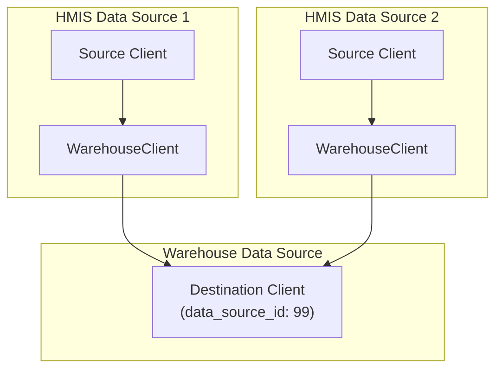

# Duplicate Client Identification Algorithm

The `IdentifyDuplicates` deduplicates client records by identifying and linking clients that represent the same person across different data sources.

## Architecture Overview

The system operates on a **source-destination architecture**:
- **Source clients**: Original client records from HMIS data sources
- **Destination clients**: Deduplicated warehouse records (stored in destination data source)
- **WarehouseClient**: Junction table linking source clients to their destination client

### Key Models
- **`GrdaWarehouse::Hud::Client`**: Source and destination client records
- **`GrdaWarehouse::WarehouseClient`**: Links source to destination clients
- **`GrdaWarehouse::ClientMatch`**: Tracks candidate matches for review
- **`GrdaWarehouse::ClientSplitHistory`**: Prevents re-merging manually split clients
- **`GrdaWarehouse::IdentifyDuplicatesLog`**: Tracks algorithm execution statistics

### Data Flow

## Two Main Operations

The system provides two distinct operations that handle different deduplication scenarios:

### Operation 1: `identify_duplicates` - Process New/Unprocessed Clients

**Purpose**: Handles newly imported or created clients that need to be linked to existing destinations or have new destinations created

**When it runs**:
- Automatically when new clients are created
- During data imports
- Via manual execution
- As part of the daily processing script

**What it does**:
1. Restores previously deleted destinations that still have active source clients
2. Finds source clients that haven't been processed yet
3. Matches them against existing destinations using deterministic matching criteria
4. Either links to existing destinations or creates new destination records
5. Updates destination records with enriched data from sources

### Operation 2: `match_existing!` - Merge Existing Destinations

**Purpose**: Re-evaluates existing source clients when their identifying information changes

**When it runs**:
- When client personally identifiable information is updated
- Via manual execution for reconciliation
- As part of the daily processing script

**What it does**:
1. Identifies destination clients that should now be considered the same person
2. Handles complex merge scenarios and chains
3. Respects system limits on destination client size
4. Performs merges with proper cleanup
5. Rebuilds affected service history records

### Why Two Separate Operations?

**Logical Separation**:
- **New client processing**: Handles incremental addition of clients over time, and additional bulk imports of client data.
- **Existing client reconciliation**: Handles changes to existing client records that are updated.  Sometimes an update to an existing source record causes a deterministic match to another existing client pair.

**Performance Benefits**:
- Avoids expensive re-evaluation of all relationships when processing new clients
- Separates costly merge operations from routine client processing
- Enables efficient batch processing of imports
- Prevents performance degradation as the system scales

## Matching Criteria

The system requires **2 of 3** exact matches across these normalized fields:

### Social Security Number
- Must pass validation checks
- Excludes obvious test values and placeholders

### Full Name
- Normalized to handle variations in formatting and accented characters
- Strips non-alphanumeric characters

### Date of Birth
- Must be reasonable (after 1920)
- Requires exact date match

## Configuration and Constraints

### System Controls
- Configuration to enable/disable automatic processing

### Safeguards
- Prevents concurrent execution
- Respects manual administrative decisions about client splits
- Maintains audit trails of operations

## Performance Optimizations

### Database Processing
- Pushes matching logic to the database level
- Uses efficient query structures for large datasets
- Minimizes object creation in application code

### Batch Operations
- Processes clients in manageable batches
- Limits operation sizes to prevent resource exhaustion
- Uses bulk operations where possible

### Memory Management
- Caches expensive lookups during processing
- Optimizes data structure access patterns
- Controls working set sizes

## Service History Impact

When clients are merged, the system:
1. Marks affected service history for rebuilding
2. Recreates service history with updated client relationships
3. Handles cleanup of orphaned records

## Monitoring and Error Handling

### Logging
- Tracks operation statistics and performance
- Integrates with error monitoring systems

### Safety Measures
- Handles missing or invalid data gracefully
- Uses database transactions for critical operations
- Provides alerts for edge cases and system limits
