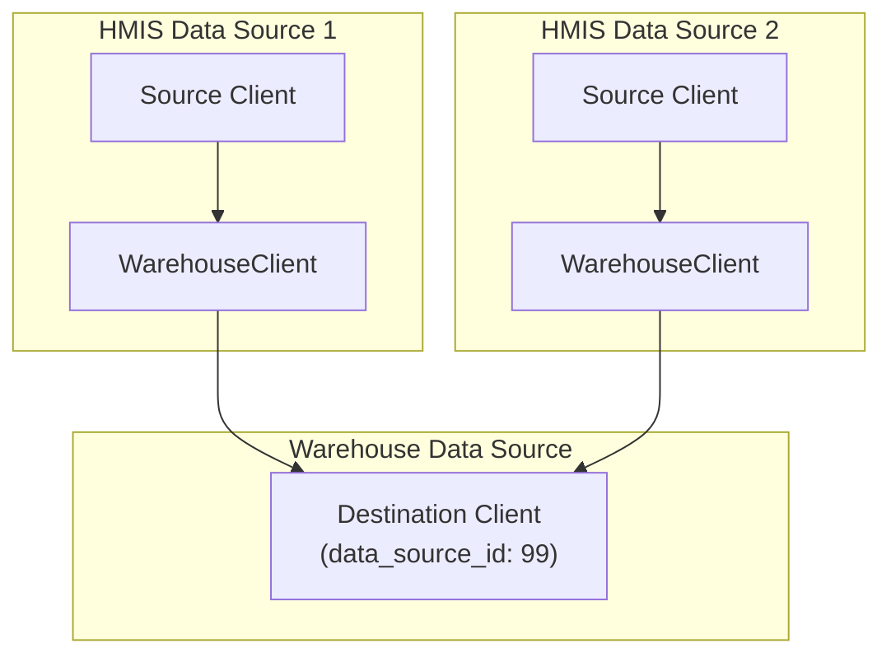

# Duplicate Client Identification Algorithm

The `IdentifyDuplicates` deduplicates client records by identifying and merging clients that represent the same person across different data sources.

## Architecture Overview

The system operates on a **source-destination architecture**:
- **Source clients**: Original client records from HMIS data sources
- **Destination clients**: Deduplicated warehouse records (stored in destination data source)
- **WarehouseClient**: Junction table linking source clients to their destination client

### Key Models
- **`GrdaWarehouse::Hud::Client`**: Source and destination client records
- **`GrdaWarehouse::WarehouseClient`**: Links source to destination clients
- **`GrdaWarehouse::ClientMatch`**: Tracks candidate matches for review
- **`GrdaWarehouse::ClientSplitHistory`**: Prevents re-merging manually split clients
- **`GrdaWarehouse::IdentifyDuplicatesLog`**: Tracks algorithm execution statistics

### Data Flow

## Two Main Operations

The system provides two distinct operations that handle different deduplication scenarios:

### Operation 1: `identify_duplicates` - Process New/Unprocessed Clients

**Purpose**: "We have new clients, where do they belong?"
**Entry Point**: `run!` method calls this automatically
**Triggers**:
- New client created: `after_create :warehouse_identify_duplicate_clients`
- Manual execution: Via admin interface or scheduled jobs calling `run!`
- Post-import processing: After HMIS CSV imports

**Process**:
1. **Restore Deleted Destinations**: Re-activates destination clients that were soft-deleted but still have active source clients
2. **Load Unprocessed Clients**: Finds source clients without WarehouseClient records
3. **Find Merge Candidates**: Uses exact matching on SSN, name, and DOB
4. **Match or Create**: Either links to existing destination or creates new one
5. **Update Destination**: Enriches destination client with source data (SSN, DOB, names)

### Operation 2: `match_existing!` - Merge Existing Destinations

**Purpose**: "PII changed, do relationships need updating?"
**Entry Point**: Must be called separately (not part of the main `run!` flow)
**Triggers**:
- Client updated: `after_update :warehouse_match_existing_clients` (if PII changed)
- Manual execution: Via admin interface or separate scheduled jobs calling `match_existing!` directly

**Process**:
1. **Find Merge Candidates**: Identifies destination clients that should be merged
2. **Group Merge Chains**: Handles complex merge scenarios (A→B, B→C becomes A→C)
3. **Split on Limits**: Ensures no destination exceeds MAX_SOURCE_CLIENTS (50)
4. **Perform Merges**: Uses `destination.merge_from(source)` with cleanup
5. **Update Service History**: Rebuilds affected service history records

### Why Two Separate Operations?

**Logical Separation**:
- **`identify_duplicates`**: Handles incremental processing of newly imported/created source clients
- **`match_existing!`**: Handles reconciliation when personally identifiable information changes

**Performance Benefits**:
1. **Avoids unnecessary work**: New clients don't trigger expensive re-evaluation of all existing destination relationships
2. **Separates expensive operations**: `match_existing!` involves complex merge chains and service history rebuilds - only runs when PII actually changes
3. **Batch efficiency**: New clients (often arriving during imports) can be processed together efficiently
4. **Prevents performance degradation**: Without this separation, every new client would require full relationship analysis across all destinations

## Matching Criteria

The system requires **2 of 3** exact matches across:

### 1. Social Security Number (SSN)
- Must be valid (passes `HudUtility2024.valid_social?`)
- Excludes obvious test values: '000000000', '111111111', '999xxxxxx'
- Excludes values with 'X' characters

### 2. Full Name (First + Last)
- Normalized: `lower(trim(unaccent(name)))`
- Strips non-alphanumeric characters
- Handles accented characters (José → jose)

### 3. Date of Birth (DOB)
- Must be after 1920
- Exact date match required

## Configuration and Constraints

### Configuration Options
- **`enable_auto_deduplication`**: Master switch for automatic processing
- **`auto_de_duplication_enabled`**: Controls automatic match processing
- **`auto_de_duplication_accept_threshold`**: Auto-accept similarity threshold
- **`auto_de_duplication_reject_threshold`**: Auto-reject similarity threshold

### Constraints and Safeguards
- **MAX_SOURCE_CLIENTS = 50**: Prevents any destination from having too many sources
- **Advisory Locking**: Prevents concurrent execution
- **Split History**: Respects manual administrative decisions
- **Auto-deduplication Toggle**: Can be disabled via configuration

## Performance Optimizations

### Database-Level Processing
- Uses PostgreSQL CTEs (Common Table Expressions) for matching
- Pushes filtering logic to database level
- Minimizes Ruby object creation

### Batch Processing
- Processes clients in batches using `find_in_batches`
- Limits merge operations to 500 pairs per batch
- Uses bulk import for warehouse client creation

### Memory Management
- Memoizes expensive lookups (`previous_candidate_matches`)
- Indexes lookups by client ID for O(1) access
- Limits working set size through batching

## Service History Impact

When clients are merged:
1. **Invalidation**: `client.invalidate_service_history` marks records for rebuild
2. **Rebuild**: `ServiceHistory::Add` recreates service history with new client IDs
3. **Cleanup**: `ClientCleanupJob` handles orphaned records

## Error Handling and Monitoring

### Logging
- Sentry integration for production error tracking
- Run statistics logged to `IdentifyDuplicatesLog`

### Safeguards
- Graceful handling of missing clients
- Transaction safety for critical operations
- Production alerts for edge cases (MAX_SOURCE_CLIENTS violations)
