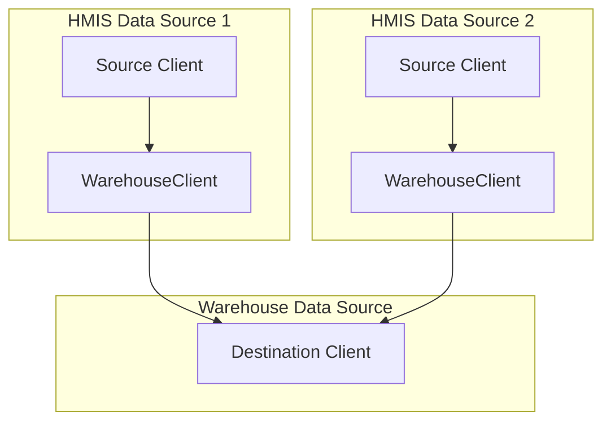

# Duplicate Client Identification Algorithm

The `IdentifyDuplicates` deduplicates client records by identifying and linking clients that represent the same person across different data sources.

## Architecture Overview

The system operates on a **source-destination architecture**:
- **Source clients**: Original client records from HMIS data sources
- **Destination clients**: Deduplicated warehouse records (stored in destination data source)
- **WarehouseClient**: Junction table linking source clients to their destination client

### Key Models
- **`GrdaWarehouse::Hud::Client`**: Source and destination client records
- **`GrdaWarehouse::WarehouseClient`**: Links source to destination clients
- **`GrdaWarehouse::ClientMatch`**: Tracks candidate matches for review
- **`GrdaWarehouse::ClientSplitHistory`**: Prevents re-merging manually split clients
- **`GrdaWarehouse::IdentifyDuplicatesLog`**: Tracks algorithm execution statistics

### Data Flow

## Two Main Operations

The system provides two distinct operations that handle different deduplication scenarios:

### Operation 1: `identify_duplicates` - Process New/Unprocessed Clients

**Purpose**: Handles newly imported or created clients that need to be linked to existing destinations or have new destinations created

**When `identify_duplicates` runs**:
- Automatically when new clients are created
- During data imports
- Via manual execution
- As part of the daily processing script

**What `identify_duplicates` does**:
1. Recovers orphaned records by finding and restoring any destination clients that were previously soft-deleted but are still referenced by active source clients. This prevents data loss and ensures consistency.
2. Identifies all source clients that have not yet been linked to a destination client in the warehouse. This is the pool of clients that will be processed.
3. For each unprocessed client, the system searches for a matching destination client by applying the **Matching Criteria** defined below.
4. If a match is found, the unprocessed source client is linked to the existing destination client. If no match is found, a new destination client is created from the source client's data and then linked.
5. When linking to an existing destination, the system enriches the destination record by filling in any missing SSN, DOB, FirstName, or LastName information from the source client.
6. Finalizes pending matches by automatically accepting any previously proposed client matches that are now confirmed to be exact duplicates based on the latest data.
7. Invalidates the service history for any clients that are matched to an existing destination, flagging it for future rebuilding.

### Operation 2: `match_existing!` - Merge Existing Destinations

**Purpose**: Identifies and merges existing destination clients that are duplicates of one another.

**When `match_existing!` runs**:
- When client personally identifiable information is updated
- Via manual execution for reconciliation
- As part of the daily processing script

**What `match_existing!` does**:
1. Finds potential duplicates by applying the **Matching Criteria** defined below, while also filtering out any client pairs that were previously manually split by an administrator.
2. Confirms candidate matches: If a pair of clients being merged was previously identified as a potential (non-exact) match, the system automatically updates the status of that candidate match to 'accepted', streamlining the review process.
3. Resolves merge chains: When client A matches B and B matches C, the system correctly identifies the entire transitive relationship. It groups clients to ensure they are all merged into a single, correct destination record.
4. Manages merge size: To maintain system stability, it respects a pre-defined limit on the number of source clients that can be merged into one destination. If a large group of clients are identified as matches, the system intelligently splits the merge. When a merge would exceed the maximum size, the system promotes one of the clients from the match group to become a new destination, ensuring that no single destination client becomes too large.
5. Executes the merge by transferring all associated data and records from one client to another. After the core merge operation, a separate background job handles cleanup tasks, such as removing the now-redundant client record and updating related data to ensure consistency.
6. Invalidates the existing service history for all clients involved in a merge. A background process is then initiated to rebuild a new, consolidated service history, ensuring all historical service events are accurately linked to the final destination client.

### Why Two Separate Operations?

**Logical Separation**:
- **New client processing**: Handles incremental addition of clients over time, and additional bulk imports of client data.
- **Existing client reconciliation**: Handles changes to existing client records that are updated.  Sometimes an update to an existing source record causes a deterministic match to another existing client pair.

**Performance Benefits**:
- Avoids expensive re-evaluation of all relationships when processing new clients
- Separates costly merge operations from routine client processing
- Enables efficient batch processing of imports
- Prevents performance degradation as the system scales

## Matching Criteria

The system requires **2 of 3** exact matches across these normalized fields:

### Social Security Number
- Must pass validation checks
- Excludes obvious test values and placeholders

### Full Name
- Normalized to handle variations in formatting and accented characters
- Strips non-alphanumeric characters

### Date of Birth
- Must be reasonable (after 1920)
- Requires exact date match

## Configuration and Constraints

### System Controls
- `enable_auto_deduplication`: Controls whether the system automatically identifies and merges duplicate client records

### Safeguards
- Advisory locks prevent concurrent execution
- Respects manual administrative decisions about client splits
- Maintains audit trails of operations

## Performance Optimizations

### Database-Level Processing
- **Efficient Matching**: Perform all matching logic in SQL to avoid the overhead of loading records into the application and comparing them in Ruby.
- **Bulk Operations**: Perform bulk inserts and updates for new destination clients and warehouse links. This reduces the number of individual database queries to allow for processing large client record sets.

### Batching and Memory Management
- **Batch Processing**: Both `identify_duplicates` and `match_existing!` process records in manageable chunks (e.g., using `find_in_batches` and `each_slice`) to keep the memory footprint low.
- **In-Memory Caching**: Expensive or frequently accessed records are memoized (such as the list of previously split clients)

## Monitoring and Error Handling

### Logging
- Tracks operation statistics and performance
- Sends alerts to Sentry

### Safety Measures
- Handles missing or invalid data gracefully
- Uses database transactions for critical operations
- Provides alerts for edge cases and system limits
