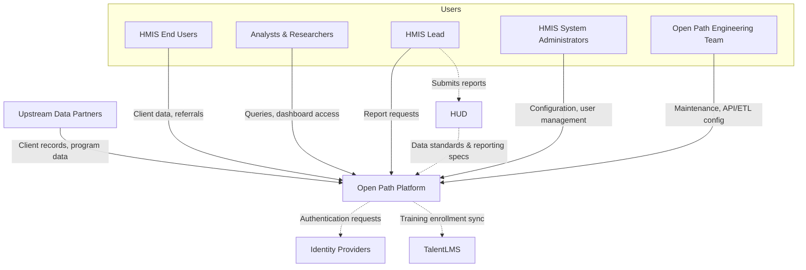

# 3 Context and Scope

[← Previous: 2 Architecture Constraints](02-constraints.md) | [Table of Contents](README.md) | [Next: 4 Solution Strategy →](04-solution-strategy.md)

This section defines the boundary between the Open Path Platform and its external actors — neighboring systems and users.

## 3.1 Business Context

The diagram below shows the platform as a "black box" in its surrounding environment (C4 Level 1).

### External Actors

| Partner | Inputs to Platform | Outputs from Platform |
| --- | --- | --- |
| **HMIS End Users** | Client demographics, enrollments, services, assessments; referral decisions. | Case records, coordinated entry status, client search results. |
| **HMIS Leads** | Report parameters, data quality review actions. | HUD-compliant reports (APR, CAPER, LSA, SPM); data quality dashboards. |
| **System Administrators** | User/role configuration, data source setup, reference data. | Audit logs, system status, import results. |
| **Analysts & Researchers** | Dashboard queries, filter criteria. | Aggregated analytics, operational dashboards, exportable datasets. |
| **Open Path Engineering Team** | API/ETL configuration, system maintenance actions. | System health metrics, job status, error logs. |
| **Upstream Data Partners** | HUD CSV exports, supplemental data (healthcare, justice), API referrals. | Import validation results, error notifications. |
| **Identity Providers** (Keycloak, Okta) | Authentication tokens, user identity claims. | Authentication requests, token refresh requests. |
| **HUD** | HMIS Data Standards, reporting specifications. | *(Indirect: HMIS Leads submit generated reports to HUD outside the platform.)* |
| **TalentLMS** | Training completion status. | User training enrollment data. |
| **Clients** | *(Indirect: data entered by proxies or via public forms.)* | *(No direct output — clients are data subjects, not system users.)* |

### Users

| User | Role | Responsibilities |
| --- | --- | --- |
| **HMIS End Users** | Front-line staff | Collect and enter client data (demographics, enrollments, services); manage housing referrals. |
| **HMIS Lead** | Oversight & Reporting | Oversee CoC-level operations, monitor data quality, and submit HUD reports. |
| **HMIS System Administrators** | System Management | Manage user access, training, system setup, and oversee data ingestion. |
| **Analysts & Researchers** | Data Consumers | Use consolidated warehouse data for community-wide analytics and strategic planning. |
| **Open Path Engineering Team** | Platform Operations | Configure external APIs, maintain ETL pipelines, and oversee system health. |
| **Clients** | Data Subjects | Individuals whose data is managed; interact with the platform via proxies or public forms. |

## 3.2 Technical Context

This table maps each external interface to its channel, protocol, and data format.

| Interface | Channel / Protocol | Data Format | Notes |
| --- | --- | --- | --- |
| HMIS Frontend → Warehouse | GraphQL over HTTPS | JSON | React SPA communicating with the Rails backend. |
| Warehouse Web UI | HTTPS | HTML (server-rendered) | Administrative interface for leads, admins, and the engineering team. |
| Upstream CSV Ingestion | S3 file deposit | HUD HMIS CSV | Partners deposit exports into designated S3 buckets; Warehouse imports on schedule. |
| Supplemental Data Ingestion | Airflow → S3 | Varies (CSV, JSON) | Airflow transforms bespoke source data before deposit to S3 for Warehouse pickup. |
| Public Forms | S3-hosted static HTML → Warehouse | Form POST | Anonymous data collection (e.g., PIT counts) submitted back to the platform. |
| Authentication | OAuth2 / OIDC | JWT | OAuth2-Proxy + Dex broker identity from upstream IDPs. See [5.2.3 Authentication](05-building-blocks/05-2-3-authentication.md). |
| Analytics | SQL (internal network) | Tabular (PostgreSQL) | DBT transforms warehouse data; Superset queries the analytics database. |
| CAS ↔ Warehouse | Direct PostgreSQL connection | SQL | Legacy integration; CAS reads/writes warehouse tables directly. See [5.2.2 CAS](05-building-blocks/05-2-2-cas.md). |
| TalentLMS | REST API over HTTPS | JSON | Sync user training status for compliance tracking. |
