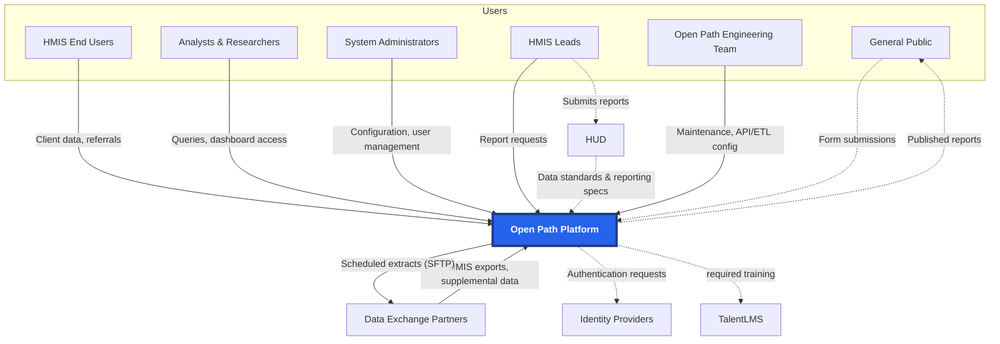

# 3 Context and Scope

[← Previous: 2 Architecture Constraints](02-constraints.md) | [Table of Contents](README.md) | [Next: 4 Solution Strategy →](04-solution-strategy.md)

This section defines the boundary between the Open Path Platform and its external actors — neighboring systems and users.

## 3.1 Business Context

The diagram below shows the platform as a "black box" in its surrounding environment (C4 Level 1).

```mermaid
flowchart TB
    subgraph users ["Users"]
        PUBLIC["General Public"]

        EU["HMIS End Users"]
        AR["Analysts & Researchers"]
        LEAD["HMIS Leads"]
        SA["System Administrators"]
        VENDOR["Open Path Engineering Team"]
    end

    OP["Open Path Platform"]

    PARTNERS["Data Exchange Partners"]
    IDP["Identity Providers"]
    HUD["HUD"]
    LMS["TalentLMS"]

    EU -- "Client data, referrals" --> OP
    AR -- "Queries, dashboard access" --> OP
    SA -- "Configuration, user management" --> OP
    LEAD -- "Report requests" --> OP
    LEAD -. "Submits reports" .-> HUD
    HUD -. "Data standards & reporting specs" .-> OP


    VENDOR -- "Maintenance, API/ETL config" --> OP
    PUBLIC -. "Form submissions" .-> OP

    PARTNERS -- "HMIS exports, supplemental data" --> OP
    OP -- "Scheduled extracts (SFTP)" --> PARTNERS
    OP -. "Authentication requests" .-> IDP
    OP -. "required training" .-> LMS

    OP -. "Published reports" .-> PUBLIC

    style OP fill:#2563eb,stroke:#1e3a8a,stroke-width:4px,color:#fff,font-weight:bold
```

### External Actors

| Partner | Inputs to Platform | Outputs from Platform |
| --- | --- | --- |
| **HMIS End Users** | Client demographics, enrollments, services, assessments; referral decisions. | Case records, coordinated entry status, client search results. |
| **Housing Providers & Partner Agencies** | Referral decisions, match responses. | Assigned clients and referrals they are responsible for; a durable record of referral decisions. Access is scoped to those responsibilities. |
| **HMIS Leads** | Report parameters, data quality review actions. | HUD-compliant reports (APR, CAPER, LSA, SPM); data quality dashboards. |
| **System Administrators** | User/role configuration, data source setup, reference data. | Audit logs, system status, import results. |
| **Analysts & Researchers** | Dashboard queries, filter criteria. | Aggregated analytics, operational dashboards, exportable datasets. |
| **Open Path Engineering Team** | API/ETL configuration, system maintenance actions. | System health metrics, job status, error logs. |
| **Data Exchange Partners** (contributing agencies; partner warehouses and state/agency reporting systems) | HUD CSV exports, supplemental data (healthcare, justice), API referrals. | Import validation results, error notifications; scheduled extracts. Outbound extracts are deployment-specific — none run in a default installation. |
| **General Public** | Anonymous form submissions (e.g., PIT counts, outreach surveys). | Published static reports, typically embedded in CoC or agency public websites; aggregate figures only, no client-level data. |
| **Identity Providers** (Keycloak, Okta) | Authentication tokens, user identity claims. | Authentication requests, token refresh requests. |
| **HUD** | HMIS Data Standards, reporting specifications. | *(No direct interface — see note below.)* |
| **TalentLMS** | Training completion status. | User training enrollment data. |

Clients are data subjects, not communication partners: their data reaches the platform through staff acting as proxies or through public forms, and they have no interface of their own.

User roles and their expectations of the architecture are listed in [Section 1.3 Stakeholders](01-introduction.md#13-stakeholders).

## 3.2 Technical Context

This table maps each external partner from 3.1 to the channel, protocol, and data format that carries its inputs and outputs.

| Interface (partner) | Channel / Protocol | Data Format | Notes |
| --- | --- | --- | --- |
| HMIS Frontend (HMIS End Users) | HTTPS, React SPA | HTML/JSON | Browser-based data entry and coordinated entry UI. |
| Warehouse Web UI (Leads, System Administrators, Open Path Engineering Team) | HTTPS | HTML (server-rendered) | Reporting, configuration, and administration interface. |
| Superset dashboards (Analysts & Researchers) | Behind the auth layer (OAuth2-Proxy / Dex) | HTML, tabular exports | Hosted dashboards over the analytics database; not public. |
| HMIS CSV ingestion (Data Exchange Partners) | S3 file deposit | HUD HMIS CSV | Partners deposit exports into designated S3 buckets; Warehouse imports on schedule. |
| Supplemental data ingestion (Data Exchange Partners) | Airflow → S3 | Varies (CSV, JSON) | Airflow transforms bespoke source data before deposit to S3 for Warehouse pickup. |
| Downstream extracts (Data Exchange Partners) | Scheduled job → SFTP upload to the partner | Zipped CSV; zipped pipe-delimited text | Warehouse pushes; the partner does not query the platform. One deployment sends a HUD CSV export plus per-domain extracts (clients/MCI, project crosswalk, postings, CE referrals, waitlists) in a daily group, with a 10-year full refresh at each quarter start. Another sends a weekly homelessness-verification file to a state Medicaid agency, with an error report returned on the same SFTP path. |
| Public forms (General Public) | S3-hosted static HTML → Lambda → S3 → Warehouse | Form POST (JSON) | Static HTML/JS forms submit to a Lambda function that writes submissions to S3; Warehouse imports on schedule. Used for anonymous data collection (e.g., PIT counts, outreach). |
| Published static reports (General Public) | Warehouse → public S3 bucket → HTTPS | Static HTML/JS, JSON | Aggregate reports published to a public bucket; read anonymously, usually via an `<iframe>` embed on a CoC or agency website. |
| Authentication (Identity Providers) | OAuth2 / OIDC | JWT | OAuth2-Proxy + Dex broker identity from upstream IDPs. See [5.2.3 Authentication](05-building-blocks/05-2-3-authentication.md). |
| TalentLMS | REST API over HTTPS | JSON | Sync user training status for compliance tracking. |

HUD has no technical interface: data standards arrive as published specifications, and Leads submit generated reports through HUD's own portals outside the platform.
