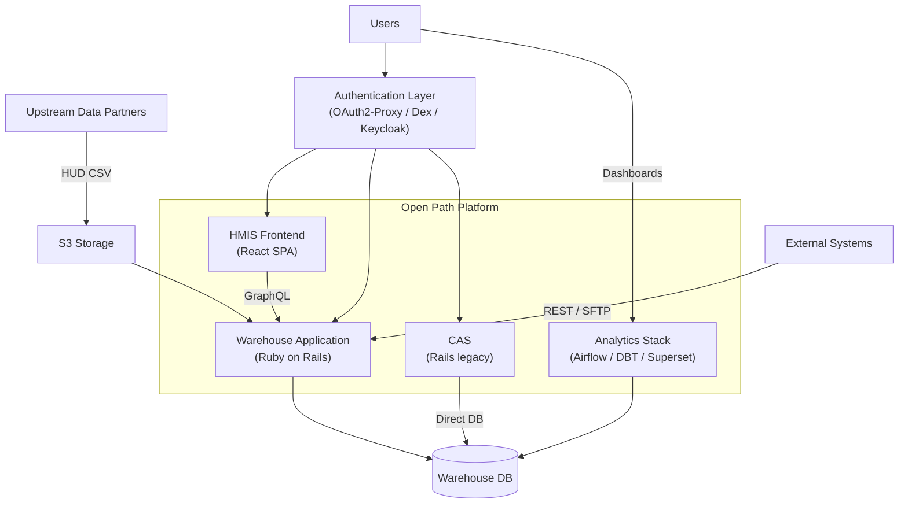

# 5 Building Block View

[← Previous: 4 Solution Strategy](../04-solution-strategy.md) | [Table of Contents](../README.md) | [Next: 6 Runtime View →](../06-runtime/06-0-runtime-view.md)

## 5.1 Overall System

The Open Path Platform consists of independently deployable containers organized around four concerns: interactive data management, batch ingestion and analytics, authentication, and legacy housing coordination.

### Why This Structure

The platform separates interactive use (HMIS Frontend, Warehouse Web UI) from batch processing (data ingestion, reporting, analytics) so that bulk imports and report generation do not block real-time data entry. Authentication is externalized so identity providers can be swapped without application changes. CAS remains a separate deployment for historical reasons; it is being evaluated for consolidation into the Warehouse.

### User Roles

See [Section 3.1](../03-context.md) for full role definitions. HMIS End Users access the HMIS Frontend; Leads, Admins, and Vendor Staff use the Warehouse Web UI; Analysts use Superset.

### Building Blocks

| Building Block | Responsibility | Details |
| --- | --- | --- |
| **HMIS Frontend** | Interactive data entry and coordinated entry UI for end users. React SPA in [greenriver/hmis-frontend](https://github.com/greenriver/hmis-frontend); backend API documented in [5.2.1 Warehouse](05-2-1-warehouse.md) (HMIS Module). | |
| **Warehouse Application** | Core monolith: GraphQL API, data ingestion, deduplication, HUD reporting, administration, and access control. | [5.2.1 Warehouse](05-2-1-warehouse.md) |
| **CAS (Legacy)** | Rule-based housing matching and multi-stakeholder referral workflows. | [5.2.2 CAS](05-2-2-cas.md) |
| **Authentication Layer** | Externalized identity brokering via OAuth2-Proxy, Dex, and Keycloak. | [5.2.3 Authentication](05-2-3-authentication.md) |
| **Analytics Stack** | ETL orchestration (Airflow), data transformation (DBT), and dashboards (Superset). | [5.2.4 Analytics](05-2-4-analytics.md) |
| **Warehouse Database** | Primary store for HMIS source tables and normalized warehouse records. | |
| **S3 Storage** | Ingestion boundary for HUD CSV exports; hosting for public forms and reports. | |

### Key Interfaces

| Interface | From → To | Mechanism |
| --- | --- | --- |
| HMIS API | HMIS Frontend → Warehouse | GraphQL over HTTPS |
| Auth flow | All UIs → Auth Layer → Applications | OAuth2 / OIDC with header-based trust |
| Data ingestion | Upstream Partners → S3 → Warehouse | File deposit + scheduled import |
| Inbound APIs | External Systems → Warehouse | REST / SFTP |
| CAS data sync | CAS → Warehouse DB | Direct PostgreSQL connection (legacy) |
| Analytics pipeline | Warehouse DB → DBT → Analytics DB → Superset | Scheduled SQL transformations |

## 5.2 Level 2

The following sub-sections open selected containers from the diagram above:

- **[5.2.1 Warehouse Application](05-2-1-warehouse.md)** — Internal module groupings of the core Rails monolith, including the driver catalog.
- **[5.2.2 CAS](05-2-2-cas.md)** — Internal components of the legacy matching system.
- **[5.2.3 Authentication](05-2-3-authentication.md)** — Components of the authentication and identity brokering layer.
- **[5.2.4 Analytics](05-2-4-analytics.md)** — The external analytics stack: Airflow, DBT, and Superset.

## Relationship to Feature Documentation

Detailed implementation documentation for individual features lives in [`docs/features/`](../../features/). Those documents describe *how* specific capabilities work at the code level (data flows, class structures, processing pipelines). This building block view describes *what* the system's major structural elements are and how they relate to each other at an architectural level. The two are complementary: feature docs provide depth, building block views provide structural context. Over time, feature docs may be migrated into Level 3 sub-sections of this view.

## Notes

- **Data Provenance:** The Warehouse preserves all source records alongside normalized data. See [2.3 Conventions](../02-constraints.md) for the source data integrity policy.
- **TalentLMS:** The Warehouse syncs user training completion with TalentLMS — a minor SaaS integration, not a core architectural boundary.
