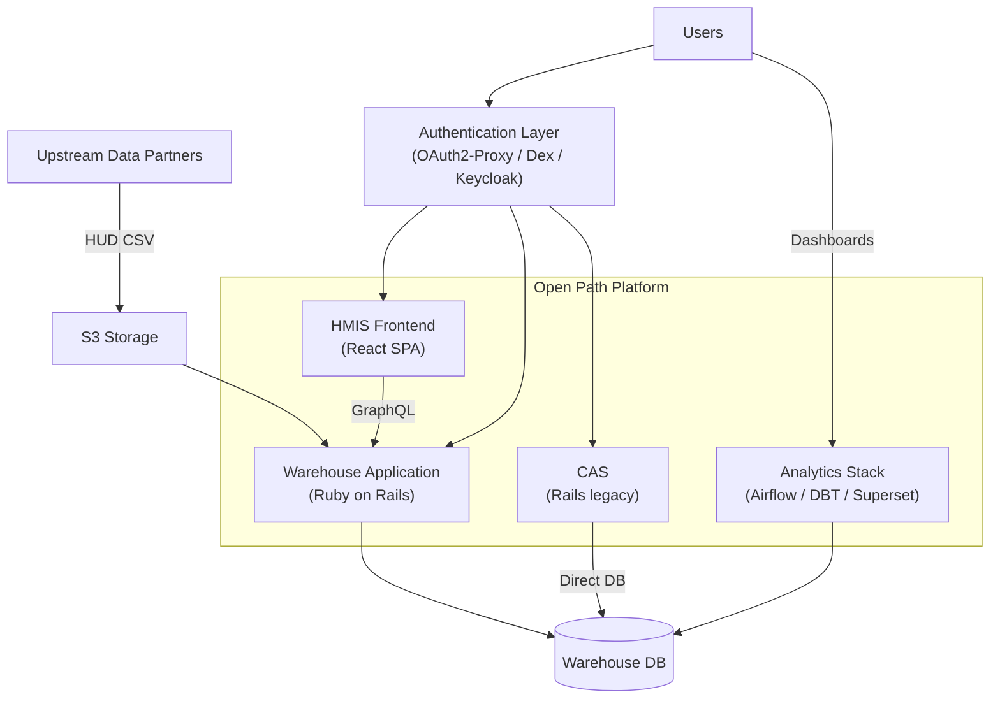

# 5 Building Block View

[← Previous: 4 Solution Strategy](../04-solution-strategy.md) | [Table of Contents](../README.md) | [Next: 6 Runtime View →](../06-runtime/06-0-runtime-view.md)

## Whitebox Overall System

The Open Path Platform consists of independently deployable containers organized around four concerns: interactive data management, batch ingestion and analytics, authentication, and legacy housing coordination.

### Why This Structure

The platform separates interactive use (HMIS Frontend, Warehouse Web UI) from batch processing (data ingestion, reporting, analytics) so that bulk imports and report generation do not block real-time data entry. Authentication is externalized so identity providers can be swapped without application changes. CAS remains a separate deployment for historical reasons; it is being evaluated for consolidation into the Warehouse.

### Building Blocks

| Building Block | Responsibility | Details |
| --- | --- | --- |
| **HMIS Frontend** | Interactive data entry and coordinated entry UI for end users. | [5.1 Core Operations](05-1-core-operations.md) |
| **Warehouse Application** | Core monolith: GraphQL API, data ingestion, deduplication, HUD reporting, administration, and access control. | [5.4 Warehouse Application](05-4-warehouse-application.md) |
| **CAS (Legacy)** | Rule-based housing matching and multi-stakeholder referral workflows. | [5.5 CAS Legacy](05-5-cas-legacy.md) |
| **Authentication Layer** | Externalized identity brokering via OAuth2-Proxy, Dex, and Keycloak. | [5.3 Authentication & Identity](05-3-authentication-identity.md) |
| **Analytics Stack** | ETL orchestration (Airflow), data transformation (DBT), and dashboards (Superset). | [5.2 Data Ingestion & Analytics](05-2-data-ingestion-analytics.md) |
| **Warehouse Database** | Primary store for HMIS source tables and normalized warehouse records. | |
| **S3 Storage** | Ingestion boundary for HUD CSV exports; hosting for public forms and reports. | |

### Key Interfaces

| Interface | From → To | Mechanism |
| --- | --- | --- |
| HMIS API | HMIS Frontend → Warehouse | GraphQL over HTTPS |
| Auth flow | All UIs → Auth Layer → Applications | OAuth2 / OIDC with header-based trust |
| Data ingestion | Upstream Partners → S3 → Warehouse | File deposit + scheduled import |
| CAS data sync | CAS → Warehouse DB | Direct PostgreSQL connection (legacy) |
| Analytics pipeline | Warehouse DB → DBT → Analytics DB → Superset | Scheduled SQL transformations |

## Detailed Views

The following sub-sections zoom into specific areas of the platform:

- **[5.1 Core Operations](05-1-core-operations.md)** — Container-level view of primary user interactions, application boundaries, and the CAS integration.
- **[5.2 Data Ingestion & Analytics](05-2-data-ingestion-analytics.md)** — Container-level view of the ETL pipeline, supplemental data processing, and the analytics stack.
- **[5.3 Authentication & Identity](05-3-authentication-identity.md)** — Component-level view of the authentication layer, identity brokering, and user management.
- **[5.4 Warehouse Application](05-4-warehouse-application.md)** — Component-level view of the core Rails monolith's internal structure.
- **[5.5 CAS Legacy](05-5-cas-legacy.md)** — Component-level view of the legacy matching system.

## Relationship to Feature Documentation

Detailed implementation documentation for individual features lives in [`docs/features/`](../../features/). Those documents describe *how* specific capabilities work at the code level (data flows, class structures, processing pipelines). This building block view describes *what* the system's major structural elements are and how they relate to each other at an architectural level. The two are complementary: feature docs provide depth, building block views provide structural context.

## Section Notes

- **Data Provenance:** The Warehouse Database tracks records back to their origin system. The Application normalizes these source records into a unified view while preserving source provenance.
- **Legacy Integration:** CAS is a legacy system that bypasses the Warehouse API, connecting directly to the database. It is being evaluated for consolidation into the modern Warehouse codebase.
