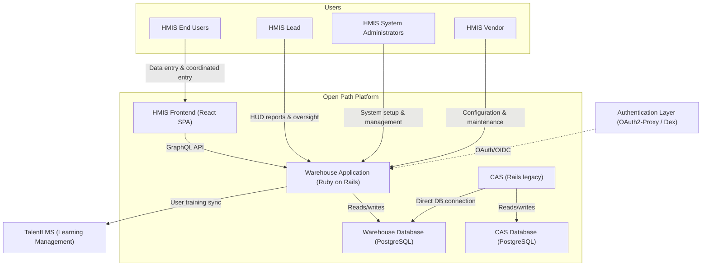

# 5.1 Core Operations

[← 5 Building Block View](05-0-building-blocks.md) | [Table of Contents](../README.md) | [Next: 5.2 Data Ingestion & Analytics →](05-2-data-ingestion-analytics.md)

This view focuses on primary user interactions, application boundaries, and the legacy CAS integration (C4 Level 2).

### Containers & Details
| Container | Technology | Responsibilities |
| --- | --- | --- |
| **HMIS Frontend** | React SPA | UI for data entry and coordinated entry; communicates with the Warehouse via GraphQL. |
| **Warehouse Application** | Ruby on Rails | Core monolith serving the web UI, GraphQL API, Inbound APIs, and HUD reporting. |
| **CAS (Legacy)** | Ruby on Rails | Legacy matching system. Connects directly to the Warehouse Database to read client/cohort data. |
| **Warehouse Database** | PostgreSQL | Primary store for HMIS data, source tables, and normalized records. |
| **CAS Database** | PostgreSQL | State for legacy housing matching and prioritization. |
