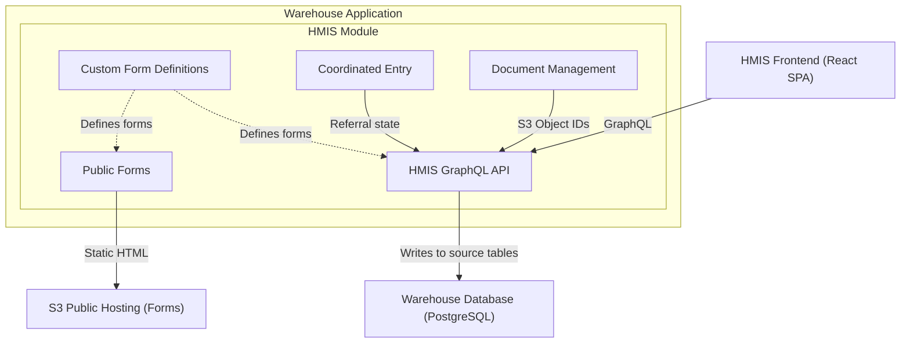
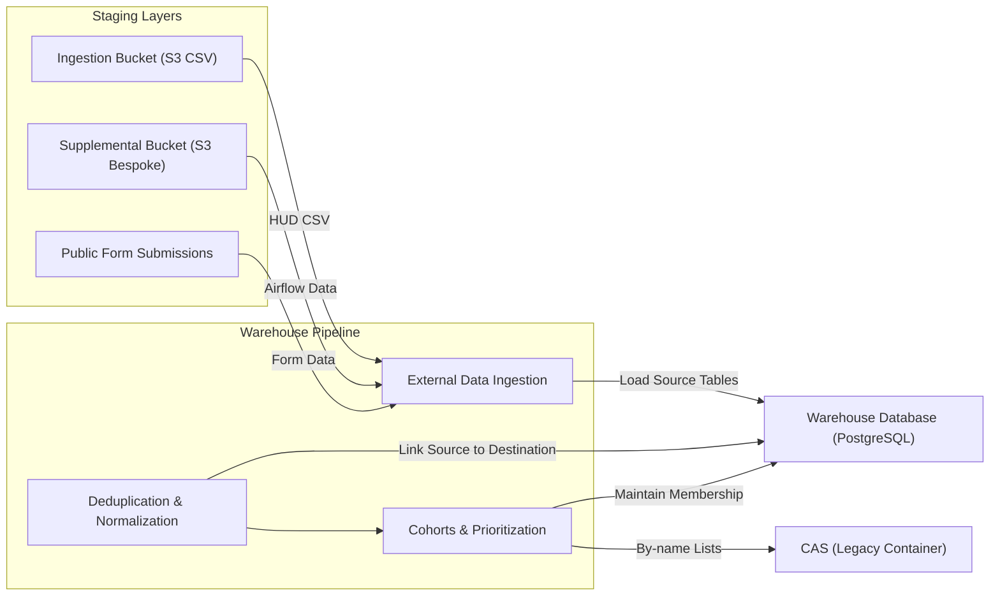
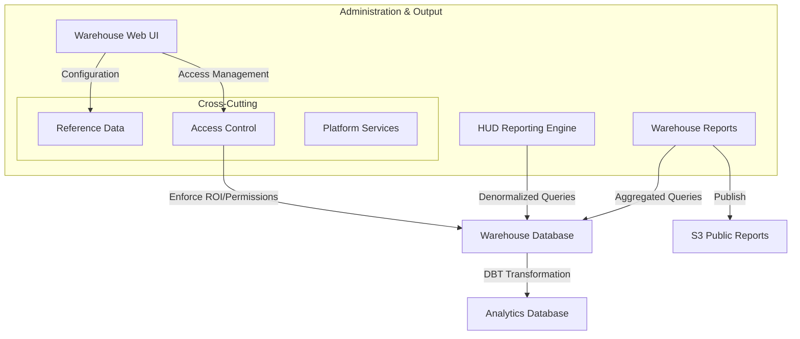

# 5.2.1 Warehouse Application

[← 5.1 Overall System](05-0-building-blocks.md) | [Table of Contents](../README.md) | [Next: 5.2.2 CAS →](05-2-2-cas.md)

This document opens the Warehouse Application container to show its internal module groupings.

## Technical Stack

- **Repository**: [greenriver/hmis-warehouse](https://github.com/greenriver/hmis-warehouse)
- **Framework**: Ruby on Rails
- **Language**: Ruby
- **Database**: PostgreSQL
- **Background Processing**: Delayed Job
- **View Layer**: HAML (Administrative UI)
- **API**: GraphQL (serving the HMIS Frontend)

## Internal Structure

The Warehouse is a Rails monolith that uses a **driver module pattern** for internal modularity. Each driver lives in `/drivers/[module]` and mirrors the standard Rails directory structure (`app/models/`, `app/controllers/`, etc.), keeping feature-specific logic isolated from the core.

The 88 drivers group into the functional areas shown below.

### HMIS & Data Collection

Data capture via the interactive frontend and public forms.

| Component | Responsibilities |
| --- | --- |
| **HMIS GraphQL API** | Serves the HMIS Frontend; manages direct data entry and service recording to HUD source tables. |
| **Custom Form Definitions** | Engine for configurable, HUD-compliant intake and assessment forms across interactive and public channels. |
| **Coordinated Entry (CE)** | Modern workflows for assessments, housing prioritization, and referral management. |
| **Public Forms** | Publishes static HTML forms to S3 for anonymous community data collection (e.g., PIT counts). |
| **Document Management** | Direct S3 client file storage and consent tracking with role-based access controls. |

### Warehouse Pipeline

Ingestion of external data and the core normalization and deduplication process.

| Component | Responsibilities |
| --- | --- |
| **External Data Ingestion** | ETL pipelines for validating and loading HUD CSV exports, supplemental non-HMIS data (e.g., from Airflow), and public form submissions into source tables. |
| **Deduplication & Normalization** | Cross-source fuzzy matching and linking of source records to unique warehouse client entities. |
| **Cohorts & Prioritization** | Maintenance of system cohorts (e.g., veterans) and custom by-name lists for housing matching. |

### Reporting, Analytics & Governance

Data output, administrative configuration, and access controls.

| Component | Responsibilities |
| --- | --- |
| **Warehouse Web UI** | Administrative interface for platform configuration, data governance, and reporting access. |
| **HUD Reporting** | Mandated reporting engine (APR, CAPER, LSA, SPM) using denormalized service history. |
| **Warehouse Reports** | Performance dashboards and operational reports; select reports are published to S3 for public access. |
| **Access Control** | Role-based and relationship-based permission system scoped to user groups. Enforces client ROI rules and multi-CoC data partitioning. |
| **Platform Services** | Audit logging, background job orchestration, and administrative tools. |

## Driver Catalog

Each driver is a self-contained Rails engine in `/drivers/[name]` with its own models, controllers, views, and specs. See [8.3 Driver Module Pattern](../08-concepts/08-3-driver-module-pattern.md) for the convention. The 88 drivers group into the functional areas below; architecturally significant drivers are listed individually, while the long tail is summarized.

### HMIS Module

| Driver | Purpose |
| --- | --- |
| `hmis` | Core HMIS GraphQL API, forms engine, coordinated entry workflows, document management. |
| `hmis_external_apis` | Inbound and outbound API integrations for external HMIS systems. |

### Data Ingestion

| Driver | Purpose |
| --- | --- |
| `hmis_csv_importer` | Primary HUD CSV import pipeline: loading, validation, and warehouse ingestion. |
| `hmis_supplemental` | Ingestion of supplemental (non-HUD) data from Airflow pipelines. |
| `hmis_data_quality_tool` | Data quality analysis and issue detection across imported data. |

~8 additional drivers provide HUD CSV format-specific support (2020 through 2026), schema migration between HUD CSV versions, and custom import pipelines for specific data partners.

### HUD Reporting

| Driver | Purpose |
| --- | --- |
| `hud_apr` | Annual Performance Report (APR). |
| `hud_spm_report` | System Performance Measures (SPM). |
| `hopwa_caper` | HOPWA CAPER report. |
| `hud_pit` | Point-in-Time (PIT) count report. |
| `hud_lsa` | Longitudinal System Analysis (LSA). |
| `hud_data_quality_report` | HUD Data Quality Report. |
| `hud_path_report` | PATH Annual Report. |
| `hud_hic` | Housing Inventory Count (HIC). |

### Warehouse Reports & Dashboards

~30 drivers providing operational dashboards, performance scorecards, data quality analysis, demographic reporting, and community-specific reports. Includes state- and community-specific report variants. Some reports are published to S3 for public access.

### Sub-Populations

8 filter modules that scope reports and analytics to specific client sub-populations (veterans, adults with children, child-only households, etc.). These are used as cross-cutting filters across multiple report drivers.

### Health Integration

7 drivers providing health assessment forms, treatment planning, and Medicaid data interchange capabilities.

### Platform & Administration

~12 drivers for access logging, permission auditing, CAS data synchronization, SMS notifications, and integration utilities (Superset, VI-SPDAT, test data generation).

## Level 3 (Future)

As individual module groups are documented in depth, Level 3 pages will be added as `05-3-N` files:

| Future Page | Content | Existing Feature Docs |
| --- | --- | --- |
| `05-3-1-hud-reporting.md` | HUD Reporting framework and individual report drivers | [`docs/features/hud-report-framework.md`](../../features/hud-report-framework.md) |
| `05-3-2-data-ingestion.md` | CSV import pipeline, supplemental ingestion, validation | [`docs/features/hmis-csv-importer.md`](../../features/hmis-csv-importer.md) |
| `05-3-3-hmis-module.md` | HMIS GraphQL API, forms engine, coordinated entry | |
