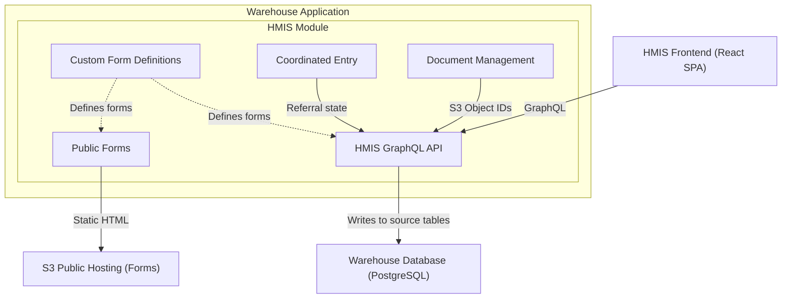
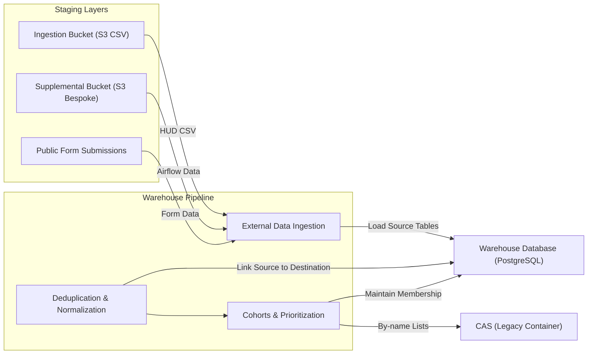
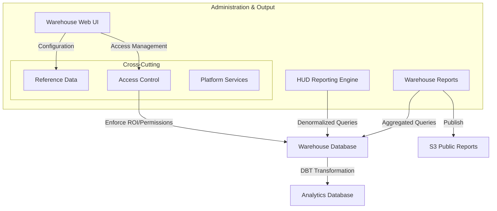

# 5.2.1 Warehouse Application

[← 5.1 Whitebox Overall System](05-0-building-blocks.md) | [Table of Contents](../README.md) | [Next: 5.2.2 CAS →](05-2-2-cas.md)

This document opens the Warehouse Application container to show its internal module groupings.

## Technical Stack

- **Framework**: Ruby on Rails
- **Language**: Ruby
- **Database**: PostgreSQL
- **Background Processing**: Delayed Job
- **View Layer**: HAML (Administrative UI)
- **API**: GraphQL (serving the HMIS Frontend)

## Internal Structure

The Warehouse is a Rails monolith that uses a **driver module pattern** for internal modularity. Each driver lives in `/drivers/[module]` and mirrors the standard Rails directory structure (`app/models/`, `app/controllers/`, etc.), keeping feature-specific logic isolated from the core.

The 88 drivers group into the functional areas shown below.

### HMIS & Data Collection

Data capture via the interactive frontend and public forms.

| Component | Responsibilities |
| --- | --- |
| **HMIS GraphQL API** | Serves the HMIS Frontend; manages direct data entry and service recording to HUD source tables. |
| **Custom Form Definitions** | Engine for configurable, HUD-compliant intake and assessment forms across interactive and public channels. |
| **Coordinated Entry (CE)** | Modern workflows for assessments, housing prioritization, and referral management. |
| **Public Forms** | Publishes static HTML forms to S3 for anonymous community data collection (e.g., PIT counts). |
| **Document Management** | Direct S3 client file storage and consent tracking with role-based access controls. |

### Warehouse Pipeline

Ingestion of external data and the core normalization and deduplication process.

| Component | Responsibilities |
| --- | --- |
| **External Data Ingestion** | ETL pipelines for validating and loading HUD CSV exports, supplemental non-HMIS data (e.g., from Airflow), and public form submissions into source tables. |
| **Deduplication & Normalization** | Cross-source fuzzy matching and linking of source records to unique warehouse client entities. |
| **Cohorts & Prioritization** | Maintenance of system cohorts (e.g., veterans) and custom by-name lists for housing matching. |

### Reporting, Analytics & Governance

Data output, administrative configuration, and access controls.

| Component | Responsibilities |
| --- | --- |
| **Warehouse Web UI** | Administrative interface for platform configuration, data governance, and reporting access. |
| **HUD Reporting** | Mandated reporting engine (APR, CAPER, LSA, SPM) using denormalized service history. |
| **Warehouse Reports** | Performance dashboards and operational reports; select reports are published to S3 for public access. |
| **Access Control** | Role-based and relationship-based permission system scoped to user groups. Enforces client ROI rules and multi-CoC data partitioning. |
| **Platform Services** | Audit logging, background job orchestration, and administrative tools. |

## Driver Catalog

Each driver is a self-contained Rails module in `/drivers/[name]` with its own models, controllers, views, and specs. The table below groups all 88 drivers by functional area.

### HMIS Module

| Driver | Purpose |
| --- | --- |
| `hmis` | Core HMIS GraphQL API, forms engine, coordinated entry workflows, document management. |
| `hmis_external_apis` | Inbound and outbound API integrations for external HMIS systems. |

### Data Ingestion

| Driver | Purpose |
| --- | --- |
| `hmis_csv_importer` | Primary HUD CSV import pipeline: loading, validation, and warehouse ingestion. |
| `hmis_csv_twenty_twenty` | HUD CSV 2020 format support. |
| `hmis_csv_twenty_twenty_two` | HUD CSV 2022 format support. |
| `hmis_csv_twenty_twenty_four` | HUD CSV 2024 format support. |
| `hmis_csv_twenty_twenty_six` | HUD CSV 2026 format support. |
| `hmis_supplemental` | Ingestion of supplemental (non-HUD) data from Airflow pipelines. |
| `hmis_data_quality_tool` | Data quality analysis and issue detection across imported data. |
| `custom_imports_boston_*` | Boston-specific custom data imports (assessments, contacts, services, community of origin). |
| `manual_hmis_data` | Manual data entry pipelines for non-CSV sources. |
| `eccovia_data` | Integration with the Eccovia HMIS platform. |
| `supplemental_enrollment_data` | Additional enrollment data from supplemental sources. |

### HUD CSV Version Migration

| Driver | Purpose |
| --- | --- |
| `hud_twenty_twenty_to_twenty_twenty_two` | Schema migration: HUD CSV 2020 → 2022. |
| `hud_twenty_twenty_two_to_twenty_twenty_four` | Schema migration: HUD CSV 2022 → 2024. |
| `hud_twenty_twenty_four_to_twenty_twenty_six` | Schema migration: HUD CSV 2024 → 2026. |

### HUD Reporting

| Driver | Purpose |
| --- | --- |
| `hud_apr` | Annual Performance Report (APR). |
| `hud_spm_report` | System Performance Measures (SPM). |
| `hopwa_caper` | HOPWA CAPER report. |
| `hud_pit` | Point-in-Time (PIT) count report. |
| `hud_lsa` | Longitudinal System Analysis (LSA). |
| `hud_data_quality_report` | HUD Data Quality Report. |
| `hud_path_report` | PATH Annual Report. |
| `hud_hic` | Housing Inventory Count (HIC). |

### Warehouse Reports & Dashboards

| Driver | Purpose |
| --- | --- |
| `boston_project_scorecard` | Boston-specific project performance scorecard. |
| `boston_reports` | Boston-specific operational reports. |
| `project_scorecard` | General project performance scorecard. |
| `performance_measurement` | CoC performance measurement dashboards. |
| `performance_metrics` | System-wide performance metrics. |
| `ce_performance` | Coordinated entry performance tracking. |
| `system_pathways` | System pathway analysis and visualization. |
| `longitudinal_spm` | Longitudinal SPM tracking across reporting periods. |
| `all_neighbors_system_dashboard` | All Neighbors system-level dashboard. |
| `built_for_zero_report` | Built for Zero community reporting. |
| `homeless_summary_report` | Homelessness summary statistics. |
| `destination_report` | Exit destination analysis. |
| `disability_summary` | Disability demographics summary. |
| `income_benefits_report` | Income and benefits tracking report. |
| `prior_living_situation` | Prior living situation analysis. |
| `core_demographics_report` | Core demographics reporting. |
| `data_source_report` | Data source quality and coverage reporting. |
| `start_date_dq` | Start date data quality analysis. |
| `project_pass_fail` | Project data quality pass/fail scoring. |
| `inactive_client_report` | Identification of inactive client records. |
| `zip_code_report` | Geographic distribution by zip code. |
| `census_tracking` | Census-based demographic tracking. |
| `claims_reporting` | Claims and billing reporting. |
| `client_documents_report` | Client document status reporting. |
| `client_location_history` | Client location history tracking. |
| `hap_report` | Housing Assistance Payments report. |
| `override_summary` | Data override audit summary. |
| `public_reports` | Publicly accessible report generation and S3 publishing. |
| `analysis_tool` | Ad-hoc data analysis tools. |
| `financial` | Financial reporting and tracking. |

### Sub-Populations

| Driver | Purpose |
| --- | --- |
| `veterans_sub_pop` | Veteran client sub-population filtering and scoping. |
| `non_veterans_sub_pop` | Non-veteran sub-population. |
| `adults_with_children_sub_pop` | Adults with children household sub-population. |
| `adults_with_children_twentyfive_plus_hoh_sub_pop` | Adults with children, HoH 25+ sub-population. |
| `adults_with_children_youth_hoh_sub_pop` | Adults with children, youth HoH sub-population. |
| `adult_only_households_sub_pop` | Adult-only household sub-population. |
| `child_only_households_sub_pop` | Child-only household sub-population. |
| `clients_sub_pop` | General client sub-population base. |

### Health Integration

| Driver | Purpose |
| --- | --- |
| `health_comprehensive_assessment` | Comprehensive health assessment forms. |
| `health_flexible_service` | Flexible health service tracking. |
| `health_ip_followup_report` | IP follow-up health reporting. |
| `health_pctp` | Patient-Centered Treatment Planning. |
| `health_qa_factory` | Health module QA and test data generation. |
| `health_thrive_assessment` | THRIVE health assessment. |
| `medicaid_hmis_interchange` | Medicaid-HMIS data interchange. |

### Massachusetts-Specific

| Driver | Purpose |
| --- | --- |
| `ma_reports` | Massachusetts state-specific reports. |
| `ma_yya_report` | MA Young Adult (YYA) report. |
| `ma_yya_followup_report` | MA YYA follow-up report. |

### Texas-Specific

| Driver | Purpose |
| --- | --- |
| `tx_client_reports` | Texas-specific client reporting. |

### Platform & Administration

| Driver | Purpose |
| --- | --- |
| `access_logs` | User access and activity logging. |
| `client_access_control` | Client-level access control rules. |
| `cas_access` | CAS-specific access control integration. |
| `cas_ce_data` | CAS coordinated entry data sync. |
| `user_directory_report` | User directory and account reporting. |
| `user_permission_report` | User permission audit reporting. |
| `text_message` | SMS notification integration. |
| `service_scanning` | Service scanning and barcode integration. |
| `superset` | Superset analytics integration and configuration. |
| `vispdats` | VI-SPDAT assessment integration. |
| `synthetic_ce_assessment` | Synthetic CE assessment data generation. |
| `datalab_testkit` | Test data generation toolkit. |

## Level 3 (Future)

As individual module groups are documented in depth, Level 3 pages will be added as `05-3-N` files:

| Future Page | Content | Existing Feature Docs |
| --- | --- | --- |
| `05-3-1-hud-reporting.md` | HUD Reporting framework and individual report drivers | [`docs/features/hud-report-framework.md`](../../features/hud-report-framework.md) |
| `05-3-2-data-ingestion.md` | CSV import pipeline, supplemental ingestion, validation | [`docs/features/hmis-csv-importer.md`](../../features/hmis-csv-importer.md) |
| `05-3-3-hmis-module.md` | HMIS GraphQL API, forms engine, coordinated entry | |
