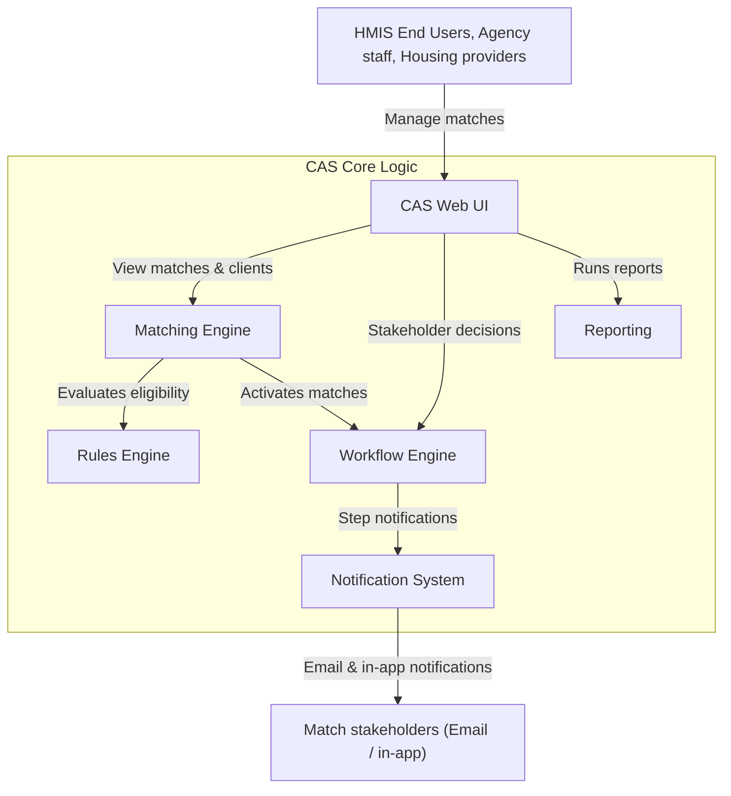
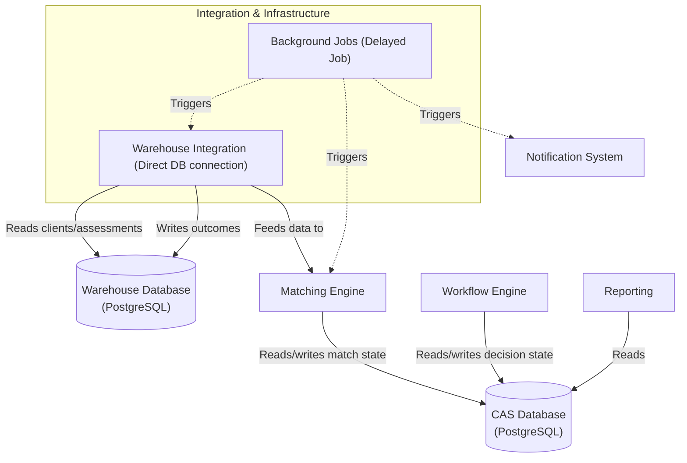

# 5.2.2 CAS (Legacy)

[← 5.2.1 Warehouse Application](05-2-1-warehouse.md) | [Table of Contents](../README.md) | [Next: 5.2.3 Authentication →](05-2-3-authentication.md)

This document opens the CAS (Coordinated Access System) container to show its internal components. CAS is a legacy application currently being evaluated for consolidation into the modern Warehouse codebase.

## Technical Stack

- **Repository**: [greenriver/boston-cas](https://github.com/greenriver/boston-cas)
- **Framework**: Ruby on Rails
- **Language**: Ruby 3.x
- **Database**: PostgreSQL
- **Background Processing**: Delayed Job

## Component Diagrams

### Functional Flow

How users interact with the system and how matches move from evaluation through to notification.

### Data Integration & Infrastructure

External dependencies, background processes, and data persistence.

## Components & Responsibilities

| Component | Responsibilities | Source Location |
| --- | --- | --- |
| **CAS Web UI** | Interfaces for stakeholders to manage clients, opportunities, and referrals. Supports direct entry for non-HMIS clients. | `app/controllers/` |
| **Matching Engine** | Rule-based algorithm that periodically pairs eligible clients with available housing vacancies. | `app/models/matching/` |
| **Rules Engine** | Configurable eligibility logic (age, veteran status, etc.) used to prioritize clients. | `app/models/rules/` |
| **Workflow Engine** | State machine managing the referral lifecycle through multi-stakeholder approval steps. | `app/models/match_routes/` |
| **Notification System** | Email and in-app alerts for stakeholders at each step of the referral workflow. | `app/models/notifications/` |
| **Reporting** | Internal reporting on matches, decisions, and system performance. | `app/models/reporting/` |
| **Warehouse Integration** | Background sync of client/cohort data from the Warehouse and outcomes back. | `app/models/warehouse/` |

**Primary Data Flow:**
1. **Data Sync:** Client and cohort data are synced from the Warehouse Database via direct connection.
2. **Matching:** The **Matching Engine** evaluates eligible clients using the **Rules Engine**.
3. **Referral:** Matches progress through the **Workflow Engine**, with stakeholders alerted by the **Notification System**.
4. **Outcome:** Placements and completions are written back to the Warehouse Database.

## Key Component Details

### Warehouse Integration

CAS connects directly to the Warehouse Database (bypassing the API), creating a tight data-layer coupling. This is a primary driver for planned consolidation into the Warehouse Application's modern Coordinated Entry component.

### Domain Engines

- **Matching Engine**: Runs periodically via **Delayed Job** to evaluate all eligible clients against vacancies.
- **Workflow Engine**: Uses configurable "match routes" to define referral pathways and stakeholder approval steps.
- **Rules Engine**: Composable logic combined with AND/OR rules to determine program-specific eligibility.
