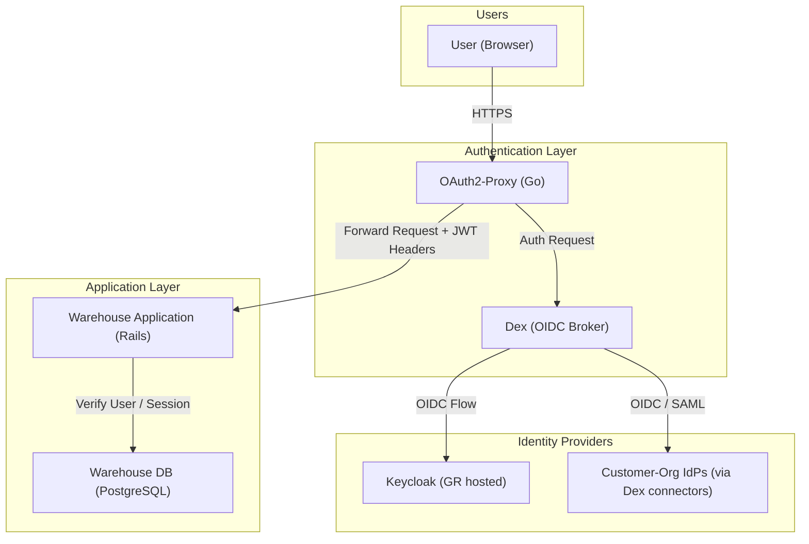

# 5.2.3 Authentication & Identity

[← 5.2.2 CAS](05-2-2-cas.md) | [Table of Contents](../README.md) | [Next: 5.2.4 Analytics →](05-2-4-analytics.md)

This document opens the Authentication Layer container to show its internal components.

> **Transition note:** This section describes the target SSO architecture. Some deployments are still in the process of migrating from Devise-based local authentication to the Keycloak / Dex / OAuth2-Proxy stack described here. See [D-1 in Section 11](../11-risks.md) for status.

## Component Diagram

## Components

| Component | Technology | Responsibilities |
| --- | --- | --- |
| **OAuth2-Proxy** | Go | Reverse proxy that handles JWT validation and session management. Injects user headers into upstream requests. |
| **Dex** | Go / OIDC | Identity broker that normalizes multiple authentication sources into a single OIDC flow. Customer-org IdPs attach as additional Dex connectors. |
| **Keycloak** (Internal Staff IdP) | Java / PostgreSQL | Primary Identity Provider for internal staff user management and credential storage. |

## Key Interaction: Token-Based Trust

The Warehouse Application does not perform its own authentication challenge — credential handling is delegated to the IdP via Dex. Rather than trusting forwarded headers as a primary control, it validates the Dex-issued token; forwarded headers (`X-Forwarded-User`, `X-Forwarded-Groups`) are convenience hints. The validation mechanics, header handling, and session policy are crosscutting security concerns documented in [§8.2 Security](../08-concepts/08-2-security.md); network isolation between the proxy and the Warehouse is described in [§7 Deployment View](../07-deployment-view.md).
