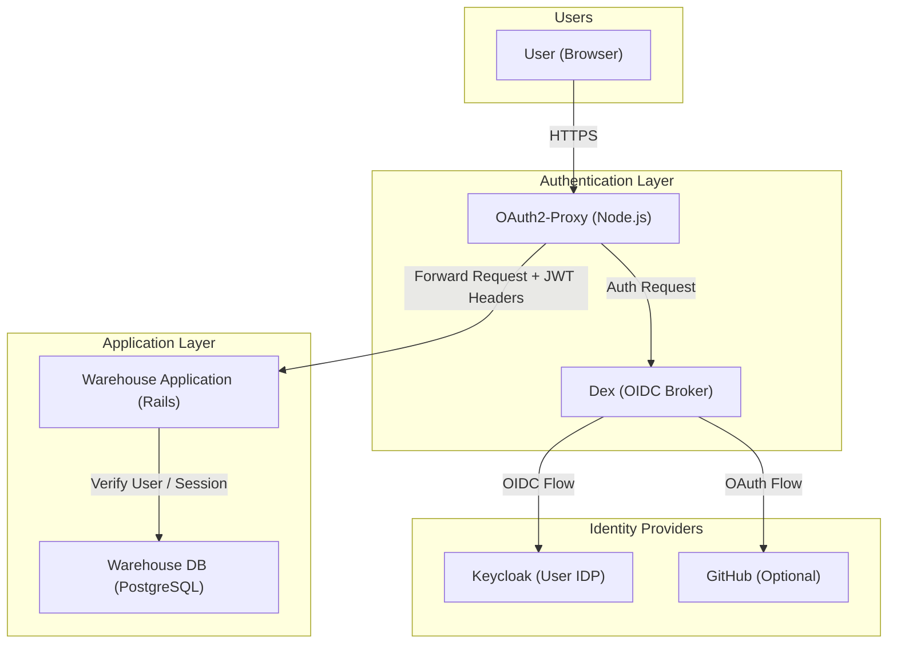

# 5.2.3 Authentication & Identity

[← 5.2.2 CAS](05-2-2-cas.md) | [Table of Contents](../README.md) | [Next: 5.2.4 Analytics →](05-2-4-analytics.md)

This document opens the Authentication Layer container to show its internal components.

## Component Diagram

## Components

| Component | Technology | Responsibilities |
| --- | --- | --- |
| **OAuth2-Proxy** | Node.js | Reverse proxy that handles JWT validation and session management. Injects user headers into upstream requests. |
| **Dex** | Go / OIDC | Identity broker that normalizes multiple authentication sources (Keycloak, GitHub, etc.) into a single OIDC flow. |
| **Keycloak** | Java / PostgreSQL | Primary Identity Provider (IDP) for user management and credential storage. |

## Key Interaction: Header-Based Trust

The Warehouse Application does not perform its own authentication challenge. It trusts the `X-Forwarded-User` and `X-Forwarded-Groups` headers provided by the OAuth2-Proxy. The proxy ensures that these headers are only injected after a successful cryptographic validation of the JWT issued by Dex.
