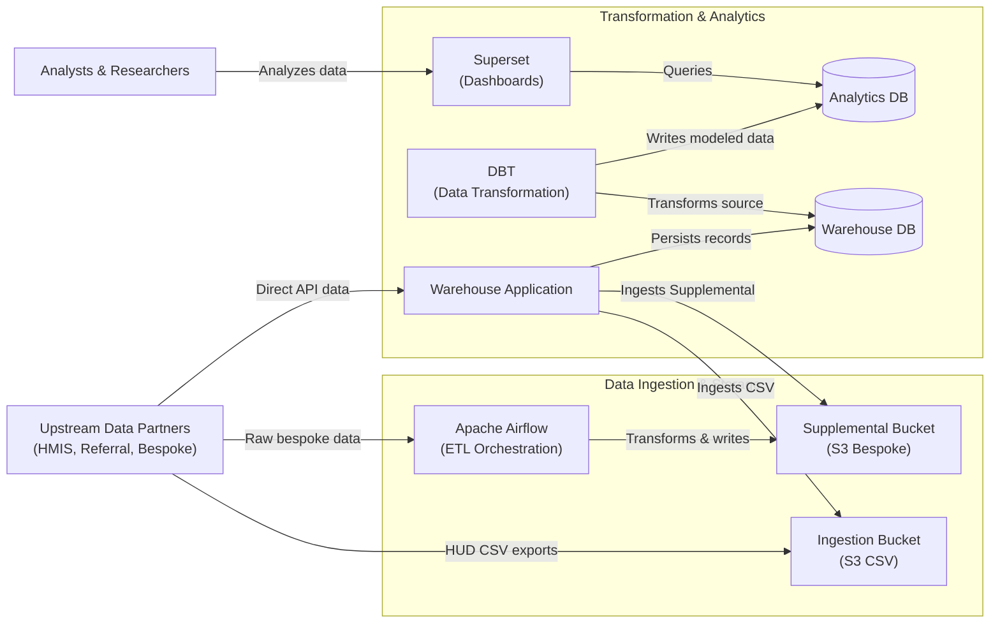

# 5.2.4 Analytics Stack

[← 5.2.3 Authentication](05-2-3-authentication.md) | [Table of Contents](../README.md) | [Next: 6 Runtime View →](../06-runtime/06-0-runtime-view.md)

This document opens the Analytics Stack to show how external data is ingested, transformed, and made available for community dashboards. The source repositories for this stack (Superset configuration, DBT models) are private.

## Components

| Component | Technology | Responsibilities |
| --- | --- | --- |
| **Apache Airflow** | Apache Airflow | Orchestrates ETL pipelines for supplemental (non-HMIS) data sources (e.g., criminal justice). |
| **DBT** | dbt | Runs scheduled transformations of warehouse data into analytics-ready datasets. |
| **Superset** | Apache Superset | Hosted dashboards for community-specific operational reporting. |
| **Ingestion Bucket** | S3 | Shared boundary where external providers deposit HUD CSV exports. |
| **Supplemental Bucket** | S3 | Storage for transformed non-HMIS data processed by Airflow. |
| **Analytics Database** | PostgreSQL | Optimized store for Superset queries, populated by DBT. |

## Relationship to the Warehouse

The Warehouse Application is the primary consumer of data from the ingestion and supplemental buckets — the import pipeline itself is a Warehouse module (see [5.2.1 Warehouse Application](05-2-1-warehouse.md), Data Ingestion section). This page focuses on the external infrastructure that surrounds that pipeline: Airflow for orchestration, DBT for transformation, and Superset for visualization.
