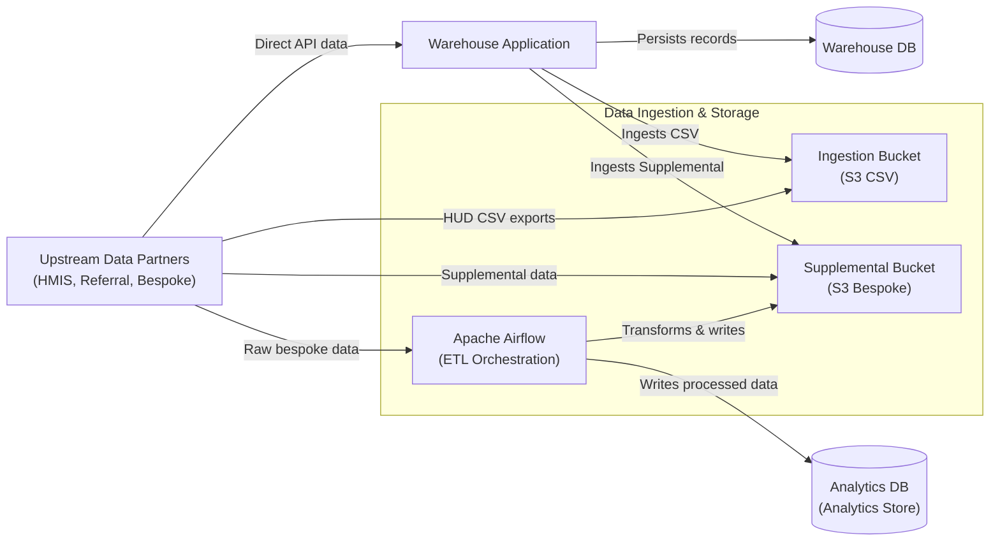
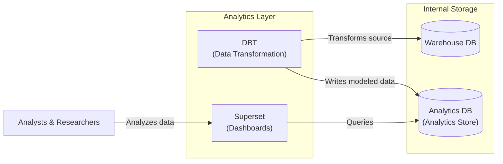

# 5.2.4 Analytics Stack

[← 5.2.3 Authentication](05-2-3-authentication.md) | [Table of Contents](../README.md) | [Next: 6 Runtime View →](../06-runtime/06-0-runtime-view.md)

This document opens the Analytics Stack to show how external data is ingested, transformed, and made available for community dashboards. The source repositories for this stack (Superset configuration, DBT models) are private.

## Data Ingestion & Collection

This view focuses on the "Inbound" path. Data partners provide files or API access, which are then orchestrated by Airflow or the Warehouse Application and stored in raw formats or the initial warehouse database.

## Modeling & Analytics

This view focuses on the "Outbound" path. Once data is in the internal databases, DBT transforms it into analytics-ready models, which are then visualized via Superset.

## Components

| Component | Technology | Responsibilities |
| --- | --- | --- |
| **Apache Airflow** | Apache Airflow | Orchestrates ETL pipelines for supplemental (non-HMIS) data sources. |
| **DBT** | dbt | Runs scheduled transformations of warehouse data into analytics-ready datasets. |
| **Superset** | Apache Superset | Hosted dashboards for community-specific operational reporting. |
| **Ingestion Bucket** | S3 | Shared boundary where external providers deposit HUD CSV exports. |
| **Supplemental Bucket** | S3 | Storage for transformed non-HMIS data processed by Airflow or the warehouse. |
| **Analytics Database** | PostgreSQL | Central hub for data flowing out of the ecosystem. Populated by DBT and Airflow. May also be referred to as the "Analytics Store" |

## Relationship to the Warehouse

The Warehouse Application is the primary consumer of data from the ingestion and supplemental buckets. While the import pipeline is a Warehouse module, the external infrastructure (Airflow, DBT, Superset) provides the heavy lifting for non-standard data types and high-performance reporting.
