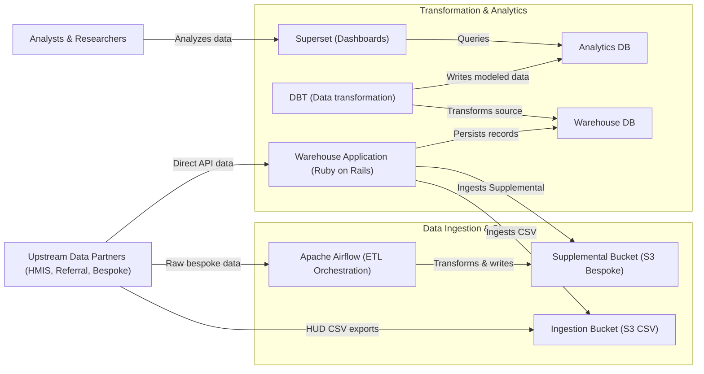

# 5.2 Data Ingestion & Analytics

[← 5.1 Core Operations](05-1-core-operations.md) | [Table of Contents](../README.md) | [Next: 5.3 Authentication & Identity →](05-3-authentication-identity.md)

This view focuses on the ETL pipeline, supplemental data processing, and the community analytics stack (C4 Level 2).

### Containers & Details
| Container | Technology | Responsibilities |
| --- | --- | --- |
| **Apache Airflow** | Apache Airflow | Orchestrates ETL pipelines for "Supplemental HMIS Data" (e.g., criminal justice). |
| **DBT** | dbt | Runs scheduled transformations of warehouse data into analytics-ready datasets. |
| **Superset** | Apache Superset | Hosted dashboards for community-specific operational reporting. |
| **Ingestion Bucket** | S3 | Shared boundary where external providers deposit HUD CSV exports. |
| **Supplemental Bucket** | S3 | Storage for transformed non-HMIS data processed by Airflow. |
| **Analytics Database** | PostgreSQL | Optimized store for Superset queries, populated by DBT. |
