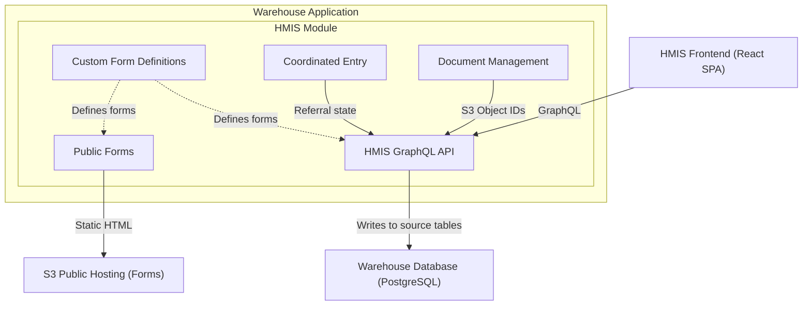
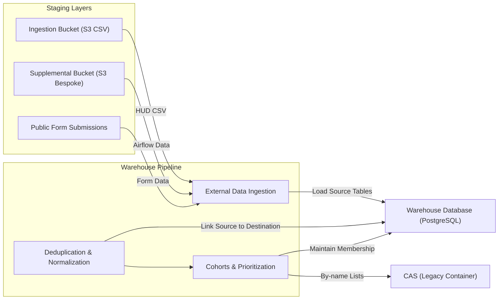
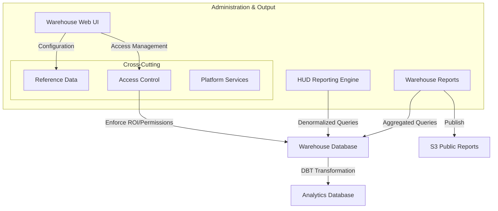

# 5.4 Warehouse Application

[← 5.3 Authentication & Identity](05-3-authentication-identity.md) | [Table of Contents](../README.md) | [Next: 5.5 CAS Legacy →](05-5-cas-legacy.md)

This document shows the internal components of the Warehouse Application container.

## Technical Stack
- **Framework**: Ruby on Rails
- **Language**: Ruby
- **Database**: PostgreSQL
- **Background Processing**: Delayed Job
- **View Layer**: HAML (for Administrative UI)
- **API**: GraphQL (serving the HMIS Frontend)

## HMIS & Data Collection
This area focuses on how data is captured via the interactive frontend and public forms.

### Components & Details
| Component | Responsibilities |
| --- | --- |
| **HMIS GraphQL API** | Serving the HMIS Frontend; manages direct data entry and service recording to HUD source tables. |
| **Custom Form Definitions** | Engine for configurable, HUD-compliant intake and assessment forms across interactive and public channels. |
| **Coordinated Entry (CE)** | Modern workflows for assessments, housing prioritization, and referral management. |
| **Public Forms** | Publishes static HTML forms to S3 for anonymous community data collection (e.g., PIT counts). |
| **Document Management** | Direct S3 client file storage and consent tracking with role-based access controls. |

## Warehouse Pipeline (Processing)
This area focuses on the ingestion of external data and the core normalization and deduplication process.

### Components & Details
| Component | Responsibilities |
| --- | --- |
| **External Data Ingestion** | ETL pipelines for validating and loading HUD CSV exports, supplemental non-HMIS data (e.g., from Airflow), and public form submissions into source tables. |
| **Deduplication & Normalization** | Cross-source fuzzy matching and linking of source records to unique warehouse client entities. |
| **Cohorts & Prioritization** | Maintenance of system cohorts (e.g., veterans) and custom by-name lists for housing matching. |

## Reporting, Analytics & Governance
This area focuses on data output, administrative configuration, and access controls.

### Components & Details
| Component | Responsibilities |
| --- | --- |
| **Warehouse Web UI** | Administrative interface for platform configuration, data governance, and reporting access. |
| **HUD Reporting** | Mandated reporting engine (APR, CAPER, LSA, SPM) using denormalized service history. |
| **Warehouse Reports** | Performance dashboards and operational reports; select reports are published to S3 for public access. |
| **Access Control** | Role-based and relationship-based permission system scoped to user groups. Enforces client ROI rules and multi-CoC data partitioning. |
| **Platform Services** | Authentication, audit logging, background job orchestration, and administrative tools. |
