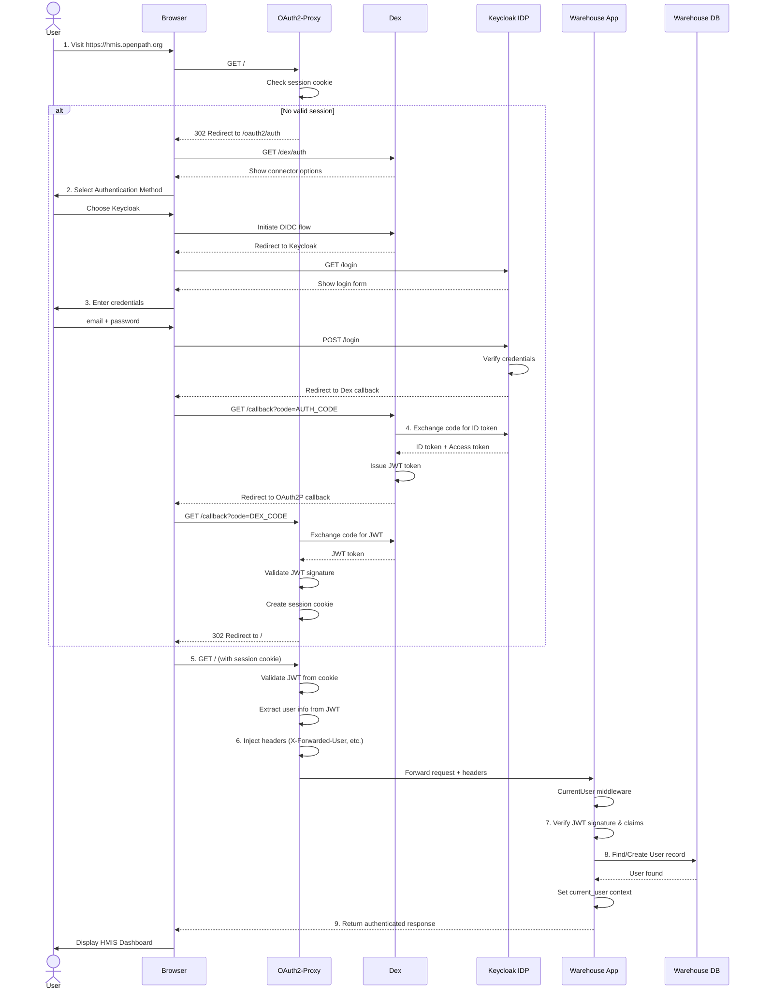

# 6.1 Login Flow

[← 6 Runtime View](06-0-runtime-view.md) | [Table of Contents](../README.md) | [Next: 6.2 HUD CSV Import →](06-2-data-sync.md)

This scenario describes the process of a user authenticating with the Open Path Platform using the distributed identity layer.

## Scenario Description
A user attempts to access the HMIS Warehouse. The request is intercepted by the authentication layer, which brokers the identity request through Dex to a configured Identity Provider (Keycloak). Upon successful authentication, a JWT is issued and injected into the request headers for the Warehouse Application to consume.

## Involved Building Blocks
- **User (Browser)**: The client initiating the request.
- **[Authentication Layer](../05-building-blocks/05-2-3-authentication.md)**: OAuth2-Proxy and Dex working together to validate and broker identity.
- **[Keycloak](../05-building-blocks/05-2-3-authentication.md)**: The primary Identity Provider (IDP).
- **[Warehouse Application](../05-building-blocks/05-2-1-warehouse.md)**: The Rails backend that authorizes the user based on the provided JWT claims.

## Sequence Diagram

## Notable Aspects
1. **Header-Based Identity**: The Warehouse Application trusts the `X-Forwarded-User` and other headers because it is situated behind the OAuth2-Proxy, which is responsible for the cryptographic validation of the JWT.
2. **Transparent Refresh**: (See Section 8.x for details) The OAuth2-Proxy can automatically refresh tokens before they expire, providing a seamless user experience.
3. **Just-In-Time (JIT) Provisioning**: The Warehouse Application creates a local `User` record upon the first successful login if one does not already exist, using the claims provided in the JWT.
