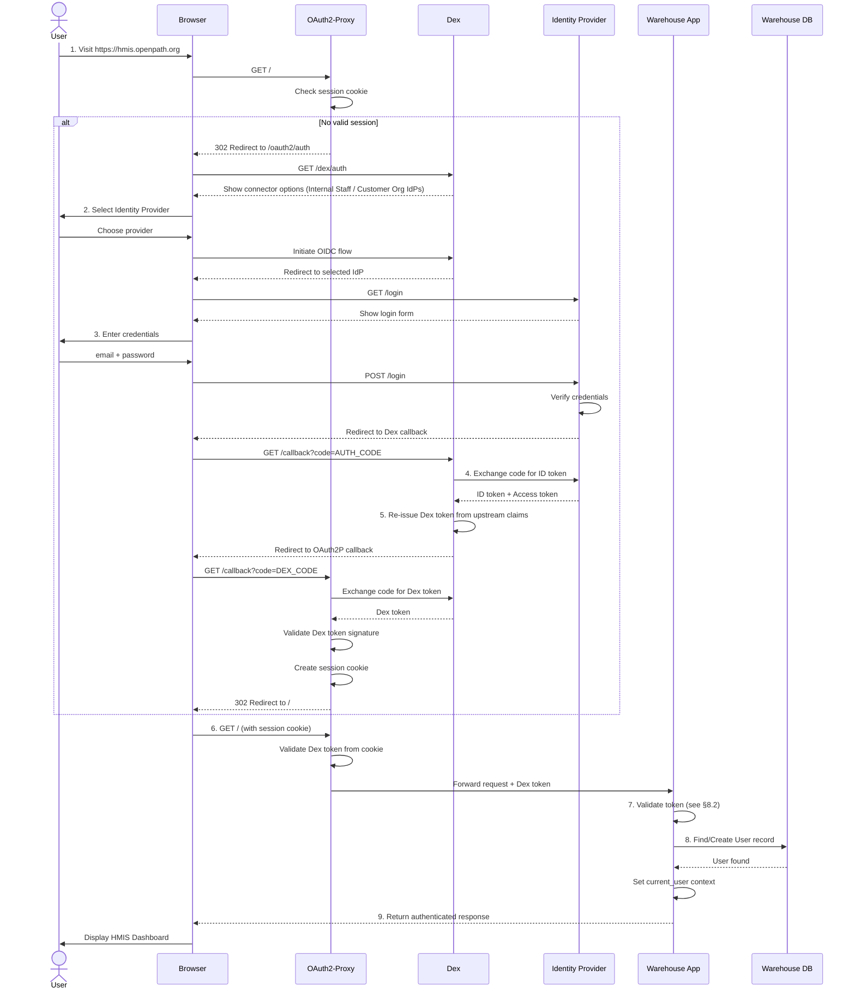
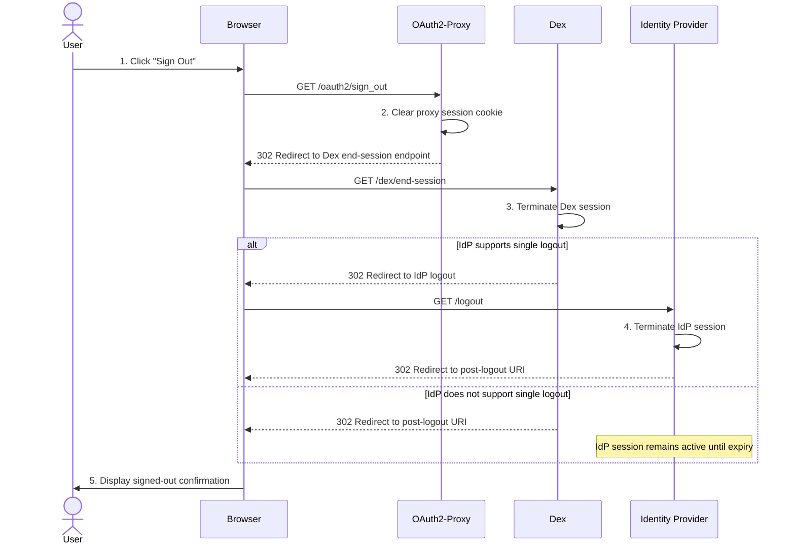

# 6.1 Authentication: Login & Logout

[← 6 Runtime View](06-0-runtime-view.md) | [Table of Contents](../README.md) | [Next: 6.2 HUD CSV Import →](06-2-data-sync.md)

This scenario describes the process of a user authenticating with the Open Path Platform using the distributed identity layer.

## Scenario Description
A user attempts to access the HMIS Warehouse. The request is intercepted by the authentication layer, which brokers the identity request through Dex to a configured Identity Provider. Dex re-issues its own token from the upstream IdP credentials; this Dex-issued token is what ultimately reaches the Warehouse Application via OAuth2-Proxy.

## Involved Building Blocks
- **User (Browser)**: The client initiating the request.
- **[Authentication Layer](../05-building-blocks/05-2-3-authentication.md)**: OAuth2-Proxy and Dex working together to validate and broker identity.
- **[Identity Providers](../05-building-blocks/05-2-3-authentication.md)**: Keycloak (Internal Staff IdP), customer-org IdPs, or GitHub — connected as Dex connectors.
- **[Warehouse Application](../05-building-blocks/05-2-1-warehouse.md)**: The Rails backend that validates the Dex-issued token and provisions/authorizes the user.

## Sequence Diagram

## Notable Aspects
1. **Token-Based Identity**: The Warehouse validates the Dex-issued token forwarded by OAuth2-Proxy rather than trusting headers as a primary control. The validation mechanics and header handling are documented in [§8.2 Security](../08-concepts/08-2-security.md); proxy-to-Warehouse network isolation in [§7 Deployment](../07-deployment-view.md).
2. **Transparent Refresh**: OAuth2-Proxy refreshes tokens before expiry for session continuity. Lifetime/refresh policy: [§8.2 Security](../08-concepts/08-2-security.md); revocation-propagation risk: [§11 Risks](../11-risks.md).
3. **JIT Provisioning**: On first login the Warehouse provisions a local User from token claims. The claim-to-permission and agency-isolation model is described in [§5.2.1 Warehouse](../05-building-blocks/05-2-1-warehouse.md) / [§8.2 Security](../08-concepts/08-2-security.md).
4. **Three Session Layers**: A successful login establishes sessions at the IdP, Dex, and OAuth2-Proxy. Tearing down all three is architecturally significant — see [Logout](#logout-scenario) below.

---

## Logout Scenario

A login creates sessions at three layers: the Identity Provider, Dex, and OAuth2-Proxy. Logout must tear down all three to prevent stale sessions from granting unintended access. OAuth2-Proxy initiates RP-initiated logout through Dex, which propagates session termination to the originating IdP.

### Sequence Diagram

### Notable Aspects
1. **Propagation Gap**: Not all IdPs support RP-initiated or back-channel logout. When propagation fails, the IdP session persists until its own expiry — a user who re-authenticates within that window will not be prompted for credentials. This is noted as a risk in [§11 Risks](../11-risks.md).
2. **No Warehouse Involvement**: The Warehouse Application has no active role in the logout sequence. Its session state is derived entirely from the proxy cookie; once that cookie is cleared, subsequent requests are unauthenticated.
