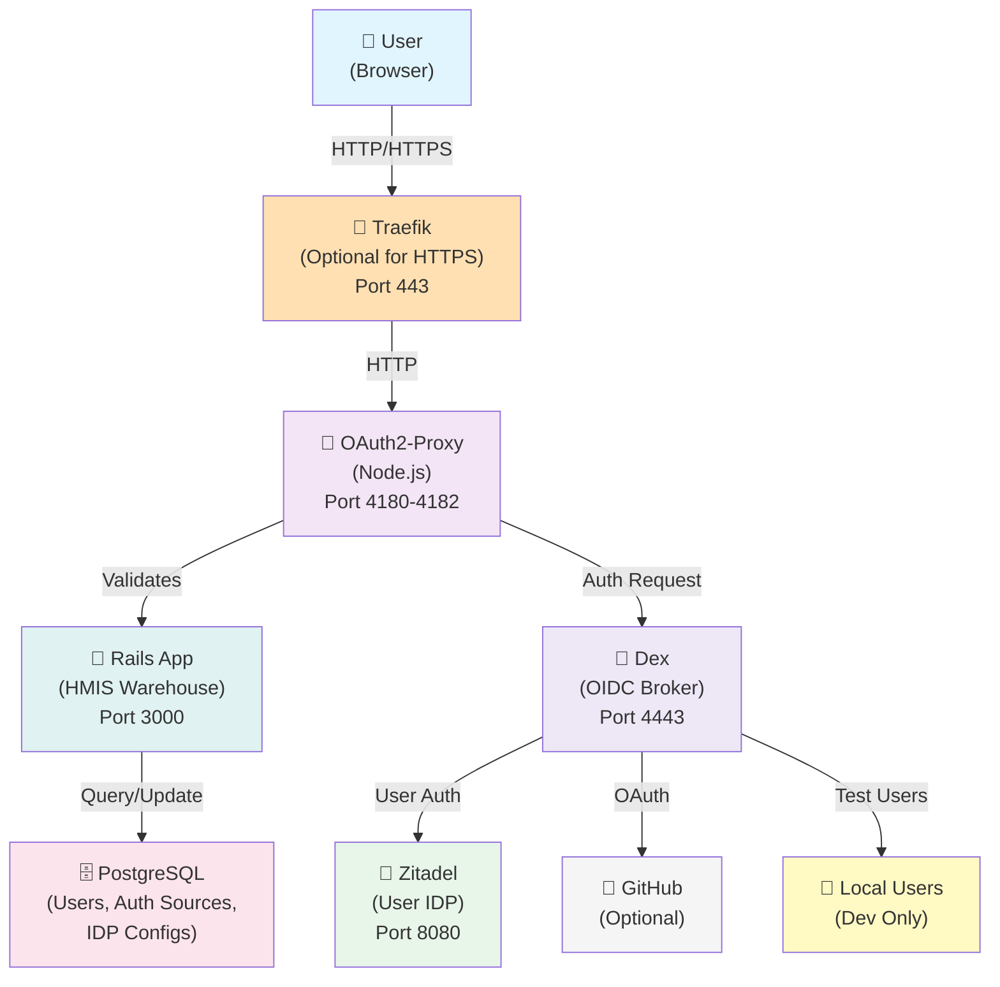
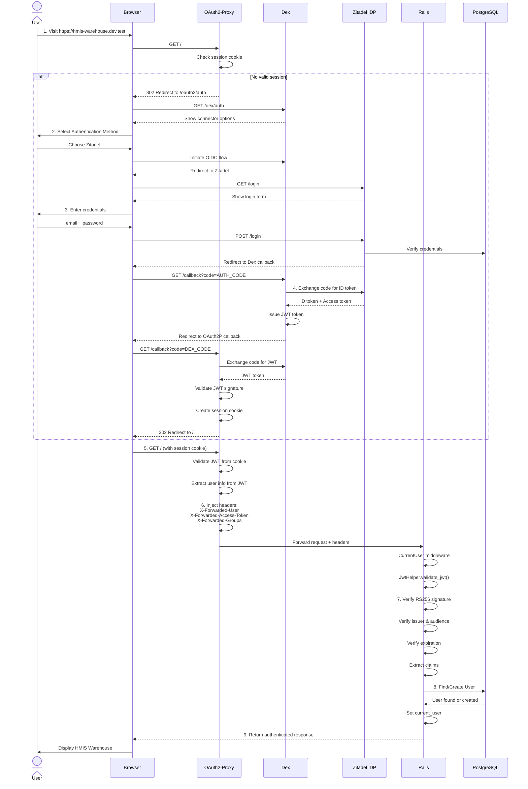
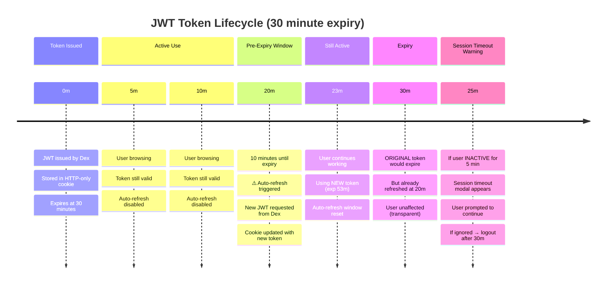
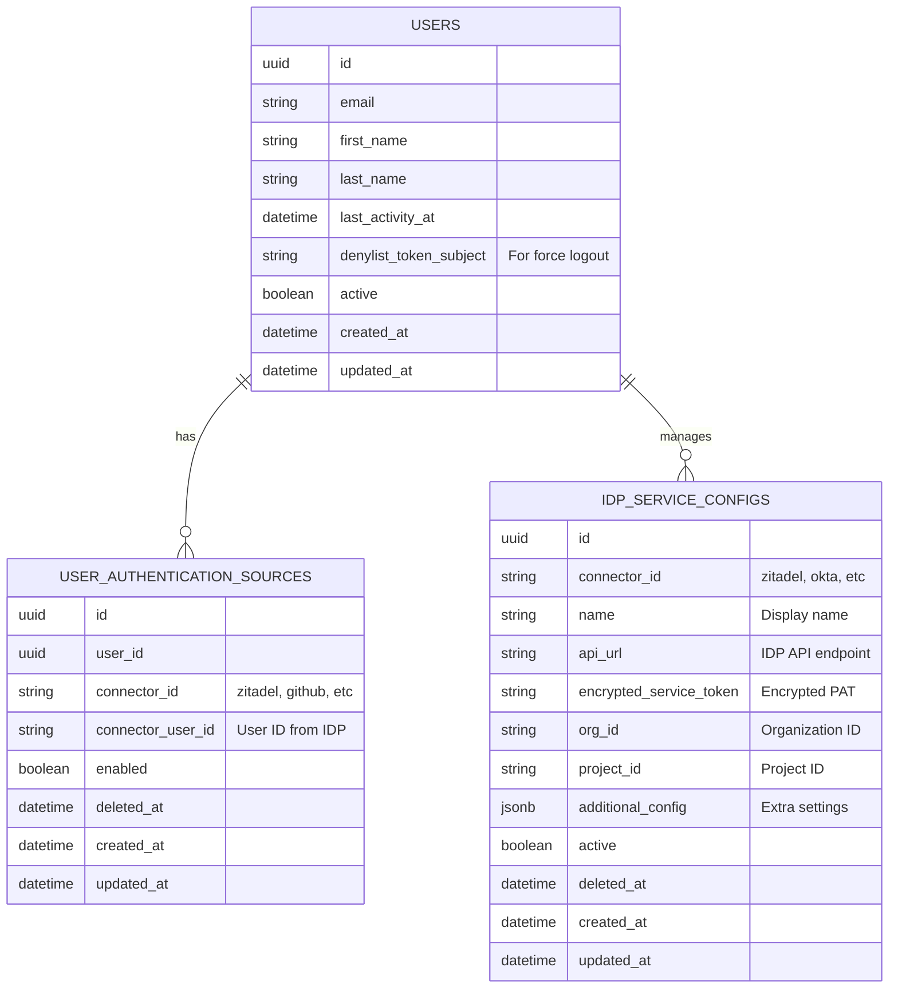
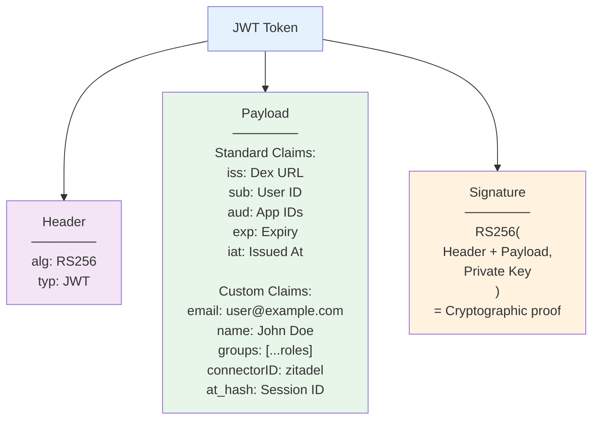
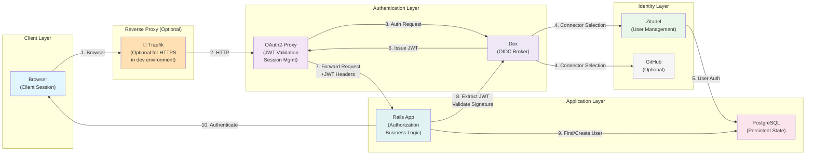
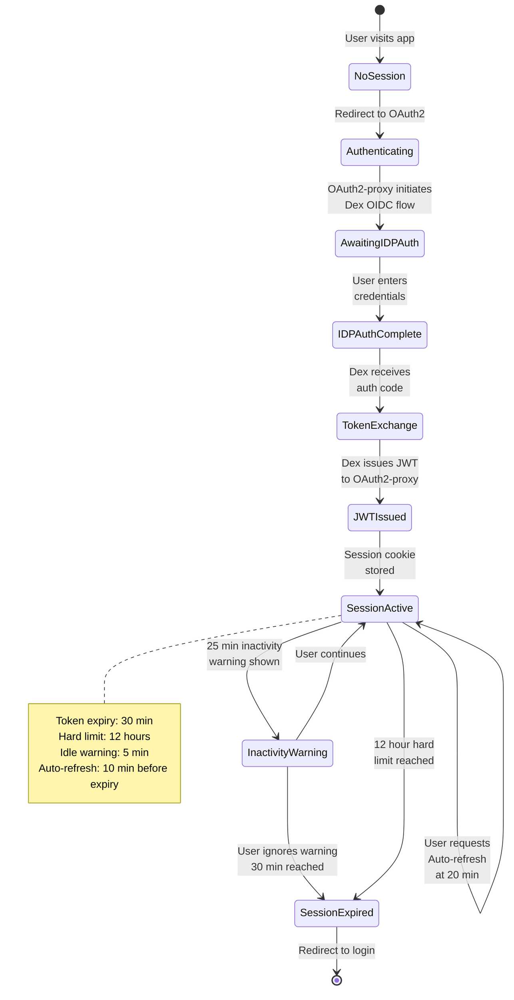
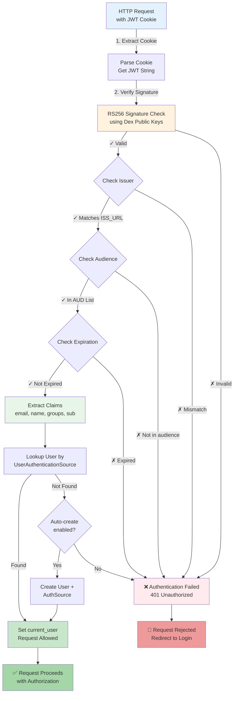

# Authentication Architecture - Mermaid Diagrams

## System Architecture Diagram

## OAuth2 Authentication Flow

## Token Lifecycle and Auto-Refresh

## Data Models

## JWT Token Structure and Claims

## Component Interaction Diagram

## Session Management State Machine

## Request Validation Pipeline

