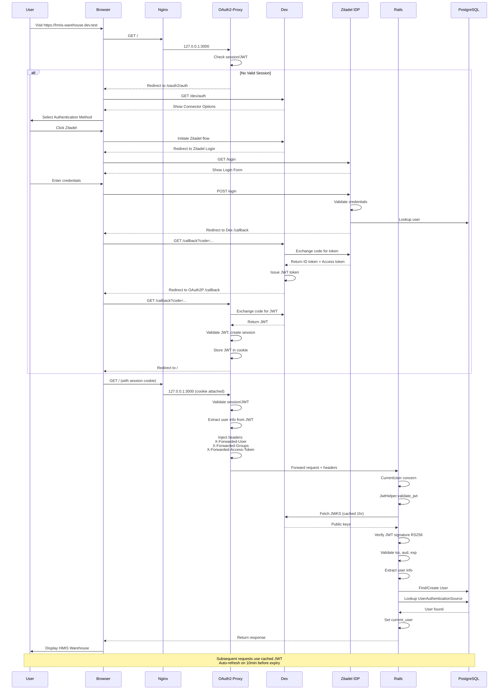

## Authentication Architecture

This document describes the OAuth2 + JWT authentication system used by the HMIS Warehouse application.

### System Overview

The application uses a modern, federated authentication architecture:

```
┌─────────────┐
│    User     │
└──────┬──────┘
       │
       ▼
┌──────────────────────────┐
│ Traefik (Optional)       │  (For HTTPS in dev)
│ or Load Balancer (Prod)  │
└──────────┬───────────────┘
           │
       ▼
┌──────────────────────┐
│ OAuth2-Proxy Layer   │  (Reverse Proxy + Auth)
│ - Session mgmt       │
│ - JWT validation     │
│ - Header injection   │
└──────────┬───────────┘
           │
    ┌──────┴──────┐
    ▼             ▼
┌────────┐    ┌─────────────────────────────┐
│ DEX    │───▶│ Authentication Connectors   │
│ (OIDC  │    │ ├─ Zitadel (Primary IDP)  │
│ Broker)│    │ ├─ GitHub (Optional)       │
│        │    │ └─ Local Test Users        │
└────────┘    └──────────┬──────────────────┘
                         │
                         ▼
                   ┌───────────────┐
                   │   Zitadel     │
                   │ (User Manager)│
                   └───────────────┘
```

### C4 System Context Diagram

```
┌─────────────────────────────────────────────────────────────┐
│                   HMIS Warehouse System                     │
│                                                             │
│  ┌──────────────────────────────────────────────────────┐   │
│  │           HMIS Warehouse Application                 │  │
│  │  ├─ Users: Case Managers, Administrators             │  │
│  │  ├─ Manages: Homelessness records, services          │  │
│  │  └─ Tracks: Client outcomes, housing stability       │  │
│  └──────────────────────────────────────────────────────┘  │
│                                                            │
└────────────────┬────────────────────────┬──────────────────┘
                 │                        │
     ┌───────────▼──────────┐    ┌────────▼──────────┐
     │   OAuth2-Proxy       │    │   Dex (OIDC)      │
     │  ════════════════    │    │  ═════════════    │
     │ Session management   │    │ Federation broker │
     │ JWT validation       │    │ Multiple IDPs     │
     │ Header injection     │    │                   │
     └──────────┬───────────┘    └────────┬──────────┘
                                          │
                     ┌────────────────────┴─────────────────┐
                     ▼                                      ▼
         ┌──────────────────────┐          ┌─────────────────────┐
         │    Zitadel IDP       │          │  GitHub OAuth       │
         │  ════════════════    │          │  ════════════════   │
         │ User management      │          │  Optional auth      │
         │ Password storage     │          │  for developers     │
         │ 2FA, recovery codes  │          └─────────────────────┘
         └──────────────────────┘

Note: Traefik (optional) or a Load Balancer sits in front of
OAuth2-Proxy for SSL termination in production or local HTTPS.
```

### C4 Container Diagram

```
┌─────────────────────────────────────────────────────────────────┐
│                   HMIS Warehouse Application                    │
│                                                                 │
│  ┌─────────────┐  ┌──────────────┐  ┌────────────────────────┐  │
│  │   Browser   │  │ OAuth2-Proxy │  │  Rails Application     │  │
│  │             │──│  (Node.js)   │──│  ├─ JwtHelper          │  │
│  │ User access │  │              │  │  ├─ CurrentUser        │  │
│  │ HMIS app    │  │ ┌──────────┐ │  │  ├─ SessionsCtrl       │  │
│  │             │  │ │ Sessions │ │  │  └─ IDP Services       │  │
│  │             │  │ ├─ Cookies │ │  │                        │  │
│  │             │  │ ├─ JWT Val │ │  │ PostgreSQL Database    │  │
│  │             │  │ └─ Headers │ │  │ ├─ Users               │  │
│  │             │  │ Redirects  │ │  │ ├─ Auth Sources        │  │
│  │             │  │ to Dex     │ │  │ └─ IDP Configs         │  │
│  └─────────────┘  └──────────┬─┘ │  └────────────────────────┘  │
│         │                    │   │                              │
└─────────┼────────────────────┼───┴──────────────────────────────┘
          │                    │
          ▼                    ▼
    ┌──────────────────────────────────┐
    │         Dex (OIDC Broker)        │
    │  ├─ Token issuance               │
    │  ├─ Connector selection          │
    │  └─ Session management           │
    └──────────────┬─────────────┬─────┘
                   │             │
        ┌──────────▼──┐   ┌──────▼──────────┐
        │  Zitadel    │   │  GitHub OAuth   │
        │  IDP        │   │  (Optional)     │
        │ User auth   │   │                 │
        │ Management  │   │                 │
        └─────────────┘   └─────────────────┘
```

### Authentication Flow Sequence Diagram



### JWT Token Structure

```
Header:
{
  "alg": "RS256",
  "typ": "JWT"
}

Payload (Dex issued):
{
  "iss": "https://dex.dev.test/dex",
  "sub": "CgnzaXRhZGVsEgZzdWItaWQ=",
  "aud": ["hmis-warehouse", "hmis-frontend"],
  "exp": 1705123456,
  "iat": 1705119856,
  "at_hash": "abc123...",
  "email": "user@example.com",
  "email_verified": true,
  "name": "John Doe",
  "groups": ["case-managers"],
  "connectorID": "zitadel",
  "connectorData": "..."
}

Signature:
RS256(base64url(header) + "." + base64url(payload), private_key)
```

### Component Responsibilities

#### 1. OAuth2-Proxy
- **Purpose**: Authentication gateway and session management
- **Responsibilities**:
  - Intercept unauthenticated requests
  - Redirect to Dex for login
  - Validate JWT tokens
  - Manage session cookies
  - Inject user headers into upstream requests
  - Auto-refresh tokens (10 min before expiry)
  - Track session activity for timeout
- **Port**: 4180 (warehouse), 4181 (HMIS), 4182 (HMIS API)
- **Session Duration**: 12 hours hard limit, 30 min idle warning

#### 2. Dex (OIDC Broker)
- **Purpose**: Federation layer connecting Rails to multiple IDPs
- **Responsibilities**:
  - Display connector selection UI
  - Broker OIDC flows with configured connectors
  - Issue JWT tokens to OAuth2-proxy
  - Manage OIDC client credentials
  - Provide JWKS endpoint for token validation
  - Handle token refresh requests
- **Port**: 4443
- **Token Expiry**: 30 minutes (ID token)
- **Connectors**: Zitadel, GitHub, local test users

#### 3. Zitadel (User Identity Provider)
- **Purpose**: User management and identity assertion
- **Responsibilities**:
  - User authentication (email/password)
  - Password reset and recovery
  - 2FA/MFA management
  - User profile management
  - API-based user management
  - OIDC identity assertion
- **Port**: 8080
- **Features**: Multi-org support, audit logs, user sessions

#### 4. Rails Application
- **Purpose**: Business logic and user authorization
- **Responsibilities**:
  - Validate JWT tokens (signature, issuer, audience, expiry)
  - Extract user info from JWT
  - Find or create User records
  - Track user authentication sources
  - Implement application-level authorization
  - Manage user sessions and activity
  - Support forced logouts via token denylist
- **Dependencies**: JWT validation, current_user middleware
- **Database**: Stores User, UserAuthenticationSource, optional IDP configs

### Security Considerations

1. **Token Validation**
   - RS256 signature verification using public keys from JWKS
   - Issuer validation (matches configured ISS_URL)
   - Audience validation (must be in configured audience list)
   - Expiration validation
   - JWKS cached for 1 hour (acceptable trust window)

2. **Session Management**
   - JWT stored in HTTP-only cookie (secure by default in production)
   - 30-minute hard timeout (Dex token expiry)
   - 12-hour session limit (OAuth2-proxy)
   - Automatic refresh 10 minutes before expiry
   - Session activity tracking

3. **Cross-Site Protections**
   - Cookie domain set to `.dev.test` (shared across apps)
   - SameSite=Lax for cookie protection
   - CSRF tokens in forms (Rails default)

4. **User Linking**
   - Multiple authentication sources supported per user
   - Tracks connector_id + connector_user_id mapping
   - Email-based fallback (if enabled)
   - Manual user linking capability

### Configuration Management

#### Environment Variables (Required)
```bash
# JWT Validation
ISS_URL=https://dex.dev.test/dex
JWKS_URL=http://dex:4443/dex/keys
JWT_ALGORITHM=RS256
IDP_AUD=hmis-warehouse,hmis-frontend,superset
JWT_SECRET=<for encryption>

# Zitadel Connector
ZITADEL_API_URL=http://op-zitadel.dev.test:8080
ZITADEL_IDP_CLIENT_ID=<client-id>
ZITADEL_IDP_CLIENT_SECRET=<client-secret>

# Optional: Service account for user management
ZITADEL_SERVICE_USER_TOKEN=<personal-access-token>
ZITADEL_ORG_ID=<organization-id>
ZITADEL_PROJECT_ID=<project-id>
```

#### Database Configuration (Optional)
Store Zitadel credentials in `idp_service_configs` table instead of environment:
```ruby
Idp::ServiceConfig.create!(
  connector_id: 'zitadel',
  name: 'Zitadel Production',
  api_url: ENV['ZITADEL_API_URL'],
  service_token: '<encrypted-token>',
  org_id: '<org-id>',
  project_id: '<project-id>',
  active: true
)
```

### User Creation and Linking

#### Automatic User Creation
When `idp/auto_create_user` is enabled:
1. JWT arrives with user info
2. `JwtUser` looks up `UserAuthenticationSource`
3. If not found, searches by email
4. If still not found, creates new User + source
5. Sets current_user


### References

- [OAuth2-Proxy Documentation](https://oauth2-proxy.github.io/oauth2-proxy/)
- [Dex OIDC Provider](https://dexidp.io/)
- [Zitadel Documentation](https://zitadel.com/docs)
- [JWT Best Practices](https://tools.ietf.org/html/rfc8725)
- [OIDC Specification](https://openid.net/specs/openid-connect-core-1_0.html)
