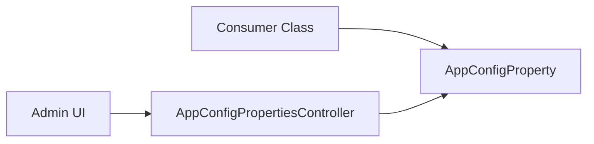

# App Config Property

App Config Property provides a key-value store for application-level configurations managed through the database. This system provides a database-backed alternative to environment variables for management by developers and support staff.

## Use Cases

The property store supports several configuration patterns:

- **Feature Flags**: Enabling or disabling specific modules or UI components (e.g., `hopwa_caper/atc_tab_enabled`).
- **External Integration Settings**: Storing service URLs or configuration keys for external APIs (e.g., `external_forms/presign_url`).
- **Business Logic Toggles**: Modifying application behavior without code changes (e.g., `hmis_external_apis/legacy_referrals/keep_source_enrollment_open`).
- **Operational Controls**: Managing background tasks or system maintenance processes (e.g., `purge_soft_deleted_records`).
- **Metadata Mapping**: Defining custom field names or identifiers used across different modules.

## Architecture

- `AppConfigProperty`: ActiveRecord model representing a single configuration entry.
- `Admin::AppConfigPropertiesController`: Controller for administrative CRUD operations on configuration properties.

## Integration

Configurations are accessed by querying the `AppConfigProperty` table. Usage patterns typically include:

- Scoping keys with prefixes (e.g., `feature_name/property_name`).
- Casting values to appropriate types at the point of use.

## Example

The `HopwaCaper` module uses this feature to manage feature flags and field identifiers.

