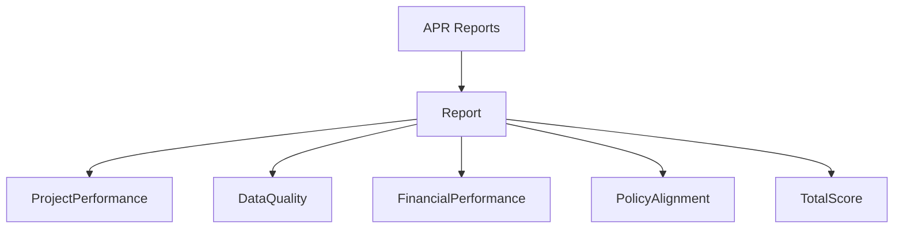

# Boston Project Scorecard

The Boston Project Scorecard evaluates HMIS projects against performance metrics defined by the Boston CoC. It generates scored reports for individual projects or project groups based on APR data and manual assessments.  It is updated as necessary, and logic for prior versions is not preserved.

## Architecture

The scorecard uses a modular report model that combines automated metrics from APR reports with manually-entered assessments. Reports progress through a workflow with multiple reviewers and export to PDF.

## Report Model

`BostonProjectScorecard::Report` is the central model, composed of the following concern modules:

- **Header**: Project identification and reviewer assignment
- **ProjectPerformance**: Housing placements, income increases, days to lease-up
- **DataQuality**: PII, UDE, and income/housing error rates from APR
- **FinancialPerformance**: Invoicing practices, cost efficiency, budget utilization; also defines `project_type_score` (Q14) used in policy alignment scoring
- **PolicyAlignment**: Subpopulation targeting, substance use treatment services, supportive services requirements, utilization rate, and monitoring outcomes
- **TotalScore**: Weighted score calculation across all categories

Each concern module defines scoring methods that return point values based on configured thresholds.

## Workflow

Reports progress through four states:

1. **pending**: Initial creation
2. **pre-filled**: After `run_and_save!` completes APR-based metrics
3. **ready**: Primary reviewer completes form, sent to secondary reviewer
4. **completed**: Secondary reviewer approves, archived HTML stored

State transitions are controlled by the controller's `advance_workflow` and `rewind_workflow` methods. Email notifications are sent at the `ready` and `completed` transitions.

Field locking varies by state and user role via `locked?(field, user)`.

## Data Sources

### Automated Metrics

The `run_and_save!` method generates two APR reports (see [HUD Report Framework](hud-report-framework.md)):

1. **Primary APR**: For the specified date range, all questions
2. **Comparison APR**: For the prior year, Question 22 only (lease-up comparison)

Metrics are extracted from APR cells using `answer(report, table, cell)` and stored as report attributes. The report queries specific APR questions:

- **Q5a**: Total clients served
- **Q6a/b/c**: Data quality error rates
- **Q8b**: Utilization rates (quarterly average across B2–B5)
- **Q19a1/a2**: Income increases (stayers and leavers)
- **Q22c**: Days to lease-up
- **Q23c**: Housing outcomes

The PII error rate cell varies by APR generator year. In FY2026+, gender data was removed from the APR, causing the total PII error percentage to shift from cell F7 to F6. The `pii_error_cell` method handles this via `include_gender_data?`.

### Manual Assessments

Manual fields are defined in `controlled_parameters` and `controlled_array_parameters`. These include:

- Financial data (contracted budget, amount spent, returned funds)
- Policy practices (housing first, barrier mitigation)
- Qualitative assessments (invoicing timeliness, materials submission)

## Scoring

Each concern module provides value and score methods. Score methods return point values or `nil` (when not applicable).

`TotalScore` aggregates scores from all categories and applies weights:

### Point Totals by Project Type

| Section | RRH (type 13) | PSH (types 3, 9, 10) | Other |
|---|---|---|---|
| Project System Performance Measures | 60 | 60 | 48 |
| HMIS Data Quality | 15 | 15 | 15 |
| Project Financial Performance | 20 | 20 | 18 |
| Alignment with CoC/HUD Policy Priorities | 34 | 37 | 31 |
| **Total** | **129** | **132** | **112** |

When both Q19a and Q19b are marked "Not Applicable", the Policy Alignment available is reduced by 3 for all project types (e.g. 31 → 28 for Other, 34 → 31 for RRH).

### Section Weights

- Project System Performance Measures: 50%
- HMIS Data Quality: 5%
- Project Financial Performance: 20%
- Alignment with CoC/HUD Policy Priorities: 25%

The `total_score_weighted_score` method calculates the final score as a percentage of available points multiplied by category weights per category and then sums the categories.

### Policy Alignment Notes

- **Q14** (`project_type_score`): 6 pts for PSH, 3 pts for RRH, 0 for other types
- **Q19a/Q19b** (`no_concern_score`/`materials_concern_score`): Mutually exclusive; Q19a takes priority if both are set to a non-N/A value. Both return `nil` (excluded from score) when marked "Not Applicable".
- `practices_housing_first_score` and `vulnerable_subpopulations_served_score` are defined on the model for form display purposes but are not included in the aggregate policy alignment score.

## Controller

`BostonProjectScorecard::WarehouseReports::ScorecardsController` handles:

- **Index/Create**: Select projects or project groups, queue background jobs
- **Show**: Display completed scorecard with PDF export option
- **Edit/Update**: Modify unlocked fields based on workflow state
- **Complete/Rewind**: Advance or revert workflow state

Project and project group selection is filtered by viewability permissions.

## Background Processing

Report generation runs via `WarehouseReports::GenericReportJob` which invokes `run_and_save!`. APR generation is synchronous within the job (not queued separately).

## PDF Export

`BostonProjectScorecard::DocumentExports::ScorecardExport` renders the report to PDF using the `show_pdf` template. The export includes a hash of the report data in the query string to invalidate cached PDFs when reports are edited.

## Project Types

Scoring logic differs by project type:

- **RRH (type 13)**: Uses exits to permanent housing metric (Q1a); +3 pts Q14; +2 pts financial efficiency threshold
- **PSH (types 3, 9, 10)**: Uses stayers or exits to permanent housing metric (Q1b); +6 pts Q14; +2 pts financial efficiency threshold
- **Other types**: Q1a/Q1b and efficiency (Q11) not applicable and return `nil`

Project type is automatically detected from the project or project group during `run_and_save!`.
