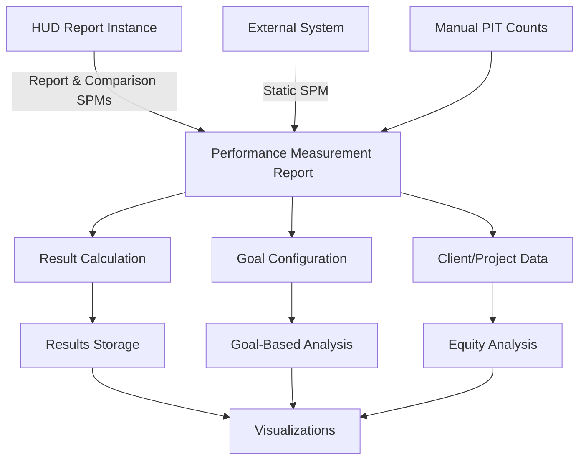
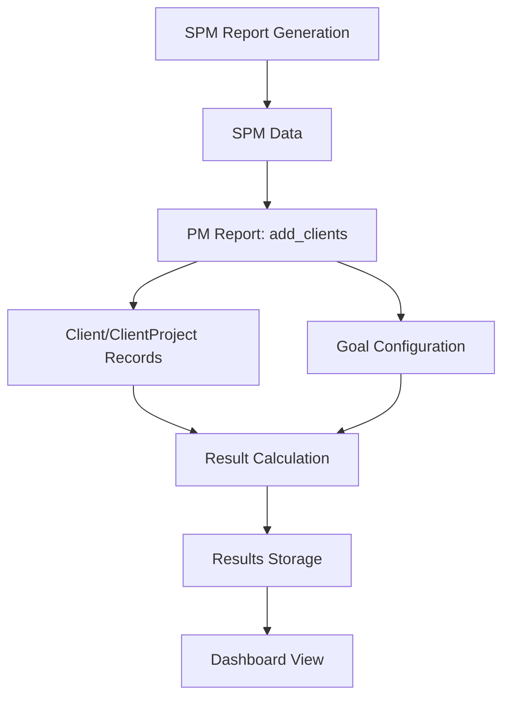

# Performance Measurement Dashboard

A comprehensive system for tracking, analyzing, and visualizing HUD System Performance Measures (SPM) with extended capabilities for longitudinal analysis and equity considerations.

## Overview

The Performance Measurement Dashboard extends the standard HUD System Performance Measures framework to provide:

- **Longitudinal Analysis** - Track performance changes over time
- **Goal-Based Comparisons** - Measure progress against defined targets
- **Equity Analysis** - Break down metrics by demographic characteristics
- **External Data Integration** - Compare with “static” SPM data from external systems

The report records persist performance data independent of the underlying SPM reports, allowing for historical analysis even if original reports are deleted.

The report is a summary view based primarily on SPM calculations, providing a one-year snapshot with a comparison period (default: prior fiscal year). The report can be run in two modes, controlled by the active Performance Measurement goal configuration:

- **Privileged “run for CoC” mode** - When the default goal is configured to always run for the CoC, the SPM report generation and data extraction are executed as the system user (ensuring CoC-wide scope), and the report filter options are limited accordingly.
- **User-scoped mode** - When “always run for CoC” is disabled, the report uses the requesting user for report generation and permits additional filter options (project/project group/data source). Regardless of mode, client-level drill-downs are always constrained by the viewer’s project access.

## High-Level System Architecture



## Detailed Data Flow



## Key Components

### Entry Points (Routes)

The Performance Measurement dashboard is a “warehouse report” style UI under the driver routes:

- **Reports**
  - `performance_measurement/warehouse_reports/reports` (index/create/show/update/destroy)
  - `performance_measurement/warehouse_reports/reports/:report_id/details/:key` (metric detail)
  - `performance_measurement/warehouse_reports/reports/:report_id/clients/:key/:project_id` (client drill-down; also supports `.xlsx`)
  - `performance_measurement/warehouse_reports/reports/:id/equity_analysis` (optional tab)
  - `performance_measurement/warehouse_reports/reports/:id/provider_comparisons` (optional tab; also supports `.xlsx`)
- **Goal configuration + external inputs**
  - `performance_measurement/warehouse_reports/goal_configs` (list/edit goals)
  - `performance_measurement/warehouse_reports/goal_configs/:goal_config_id/pit_counts` (manual PIT counts)
  - `performance_measurement/warehouse_reports/goal_configs/:goal_config_id/static_spms` (manual Static SPM inputs)

Reports are generated asynchronously via `WarehouseReports::GenericReportJob`, which calls `PerformanceMeasurement::Report#run_and_save!` (universe creation, capacity extraction, and result calculation).

### Reports and Filtering

The system starts with a filter configuration that defines the scope of analysis:

- Date range (enforced to one year in the controller by setting `start = end - 1.year + 1.day`)
- Comparison period (default: `:prior_fiscal_year`)
- CoC code (single CoC per report)
- Project types (defaults to the current HUD SPM project type set)
- Optional dimensional filters (project IDs, project groups, data sources) when project options are enabled by goal configuration

### Data Model

The core data model consists of:

- **Report** - The central entity that organizes all performance data
- **Goal** - Defines targets for performance metrics
- **Result** - Stores calculated metrics at system and project levels
- **Client/ClientProject/Project** - Store detailed data for drill-down analysis
- **PitCount** - Optional manual PIT counts used for PIT-date metrics
- **StaticSpm** - Optional external “static” SPM inputs used for the comparison period of selected metrics

### Metric Types

The report supports two primary types of metrics:

- **System-Level Metrics** - CoC-wide metrics (some incorporate PIT counts and/or Static SPM values for the comparison period)
- **Project-Level Metrics** - Metrics calculated per project where applicable (and only for project types where the metric is meaningful)

### Authorization and drill-down behavior

- **Report visibility**: `PerformanceMeasurement::Report.visible_to(user)` governs which report records a user can see.
- **Client drill-downs**: the client list/export endpoints require client access permission and are constrained to projects the viewer can access (a user can only drill down into “My Projects”).
- **Optional tabs**: Equity analysis and provider comparisons are controlled by goal configuration flags and may be hidden (for example, in published versions).

### Publishing and exports

Reports can be published as static HTML, including a “summary-only” HTML variant. Some report views also support exports (for example, client drill-downs and provider comparisons as `.xlsx`).

## Implementation Details

### SPM Report Generation

- The system first generates a standard HUD System Performance Measures report
- This creates SPM data for Measures 1, 2, 3, 4, 5, and 7 via the current HUD SPM generator
- Data includes clients, enrollments, episodes, returns, etc.
- Two variants are run: **reporting** and **comparison**. The comparison range is driven by the filter’s comparison range and may optionally be backed by a matching Static SPM record

### PM Report Data Import (`add_clients`)

The `add_clients` method in `PerformanceMeasurement::Report` is the critical bridge between SPM data and the Performance Measurement system:

- Retrieves SPM data (enrollments, episodes, returns)
- Maps this data to PM-specific fields and clients
- Creates `Client` and `ClientProject` records
- Augments SPM-derived data with additional warehouse-derived calculations (for example, service history derived “days in bed” fields)
- Adds “summary” client flags that are derived from already-collected data

### Configuration-driven Processing

The system uses several configuration hashes that define what data is extracted:

| Configuration | Purpose |
|--------------|---------|
| `spm_fields` | Maps SPM measures to PM client fields |
| `extra_calculations` | Adds data not directly from SPMs (warehouse-derived) |
| `summary_calculations` | Derives additional metrics from collected data |
| `detail_hash` | Defines metrics that will be calculated |

### Project Capacity Extraction (`add_capacities`)

After the universe is created, the report calculates project capacities using HUD inventory records:

- For each project and each period (reporting/comparison), the report computes an average bed capacity per night.
- Days with zero inventory are excluded from the average to correctly handle seasonal projects.

### Result Calculation Process

Once client data is stored, the `ResultCalculation` module creates the actual metrics:

- For each metric defined in `detail_hash`, `PerformanceMeasurement::ResultCalculation` has a method with the same name that returns a `PerformanceMeasurement::Result`
- Calculations read from deduplicated client data and/or `ClientProject` rows keyed by `for_question` (used to support client drill-downs)
- Results are computed at both system-level and project-level when applicable
- If a comparison Static SPM exists for the report’s comparison range, selected metrics use Static SPM values for the comparison period rather than re-running comparison calculations from client-level data
- Results are stored in `Result` records (existing results for the report are replaced transactionally)

## Mapping Between Systems

### SPM to PM Client Fields

The data flow from SPM to PM happens in these key steps:

- **SPM Report Generation**: Creates SPM enrollments/episodes/returns with data from HMIS
- **PM Data Extraction**: Uses `spm_fields` to map SPM members to PM client fields and supporting `ClientProject` rows

```ruby
spm_fields.each do |parts|
  cells = parts[:cells]  # e.g., [['1a', 'D3']]
  cells.each do |cell|
    members = cell_members(spec[:report], *cell)
    members.each do |member|
      # Maps data from SPM member to PM client fields
      # Creates PM Client, ClientProject records
    end
  end
end
```

- **Extra Data Computation**: Adds more data not in SPMs via `extra_calculations`
- **Summary Field Derivation**: Uses `summary_calculations` to derive additional fields

### Client Fields to Metrics

After client data is stored, the system:

- Uses `detail_hash` to define the metric catalog (titles, grouping, goal wiring, and drill-down fields)
- Uses `ResultCalculation` methods (one per metric key) to compute `Result` rows at system- and project-level
- Uses `ClientProject` rows (`for_question`, `period`, `project_id`) to support drill-down membership and per-project numerator/denominator construction where needed

## Static SPM Support

The dashboard supports comparing against externally-generated SPMs through `PerformanceMeasurement::StaticSpm`:

- Static SPM values are stored per goal configuration and date range (`report_start`, `report_end`)
- When a Static SPM exists that matches the report’s comparison range, selected metrics use Static SPM values for the comparison period
- Only a known set of SPM table/cell combinations are supported (see `PerformanceMeasurement::StaticSpm::KNOWN_SPM_CELLS`)

## PIT Count Support

For PIT-date “people count” metrics, communities can store manual PIT counts (`PerformanceMeasurement::PitCount`) per goal configuration. When present, PIT counts override the derived PIT counts for those metrics.

## Maintenance Considerations

When maintaining this system, pay attention to:

- **SPM Specification Changes** - HUD periodically updates SPM definitions and underlying generator behavior
- **Metric Catalog** - The `detail_hash` in `PerformanceMeasurement::Details` defines metric properties, grouping, and goal wiring
- **Metric Calculations** - `PerformanceMeasurement::ResultCalculation` implements the calculation methods (one per metric key) and comparison behavior
- **Static SPM + PIT Inputs** - Ensure supported cells/tables remain aligned with the metrics that use them
- **Capacity logic** - Bed utilization depends on inventory ranges and how seasonal inventory is handled
