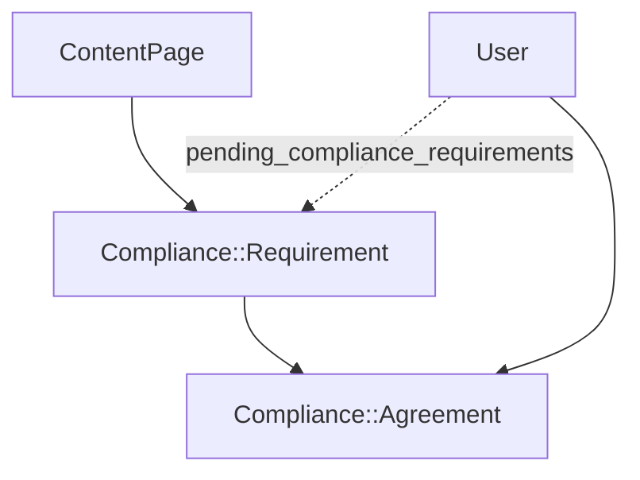

# Compliance Requirements

Content pages with optional policy requirements that users must agree to before accessing the application.

## Architecture



**Three-layer structure:**

| Model | Purpose |
|-------|---------|
| `GrdaWarehouse::ContentPage` | Versioned content (terms, policies, help pages) |
| `GrdaWarehouse::Compliance::Requirement` | Links content to enforcement rules |
| `GrdaWarehouse::Compliance::Agreement` | Records user acceptance with revision tracking |

Content pages can exist without requiring agreement (help pages, about pages). Requirements are separate from content—changing which page is shown does not require content changes.

## Entry Points

### Admin Controllers

- `Admin::ContentPagesController` — CRUD for content pages
- `Admin::ComplianceRequirementsController` — CRUD with activate/deactivate actions

### Public Controllers

- `ContentPagesController` — Public viewing at `/pages/:slug` (no auth required)
- `ComplianceAgreementsController` — Agreement flow at `/compliance_agreement`

### Enforcement

`ApplicationController#require_compliance_agreement!` runs after authentication and training checks. Redirects users with pending requirements to the agreement page. Skipped for setup controllers (sessions, accounts, training, compliance_agreements, content_pages).

```ruby
# app/controllers/application_controller.rb
before_action :require_compliance_agreement!
```

## Key Model Methods

### User

```ruby
user.pending_compliance_requirements  # Returns active requirements without valid agreement
user.compliance_agreements            # All recorded agreements
```

### Requirement

```ruby
Requirement.pending_for_user(user)  # Requirements needing agreement
Requirement.active                  # Only enforced requirements
```

### Agreement

Agreements become invalid when:
- Requirement revision increases beyond the agreed revision
- `expires_at` passes (set from `expires_after_days` on requirement)

```ruby
Agreement.not_expired  # Unexpired agreements
Agreement.for_user(user).for_requirement(requirement)
```

## Routes

```ruby
# Admin (within admin namespace)
resources :content_pages do
  get :preview, on: :member
end
resources :compliance_requirements, except: [:show] do
  post :activate, on: :member
  post :deactivate, on: :member
end

# Public
resources :content_pages, only: [:show], param: :slug, path: 'pages'
resource :compliance_agreement, only: [:show, :create]
```

## Agreement Flow

1. User authenticates and passes 2FA/training checks
2. `require_compliance_agreement!` checks for pending requirements
3. If pending, user redirects to `/compliance_agreement`
4. User views content and checks agreement checkbox
5. On submit, `Compliance::Agreement` records the requirement revision and expiration
6. User returns to the home page

Multiple requirements are presented one at a time in position order.

## Re-agreement Triggers

| Trigger | Mechanism |
|---------|-----------|
| Content update | Admin bumps requirement `revision` |
| Time-based | `expires_after_days` sets `expires_at` on agreement |
| Manual | Admin deactivates/reactivates requirement |

## Example Configuration

### Terms of Service & Privacy Policy

To configure a mandatory Terms of Service agreement and an Privacy Policy link in the footer:

1.  **Create Content Pages**: Navigate to `Warehouse Admin > Configuration > Content Pages`.
    - Create a "Terms of Service" page with the slug `tos`.
    - Create a "Privacy Policy" page with the slug `privacy_policy`.

2.  **Create Compliance Requirement**: Navigate to `Warehouse Admin > Configuration > Compliance Requirements`.
    - Create a new "Terms of Service" requirement.
    - Link it to the `tos` content page you created. This forces users to agree before proceeding.

3.  **Create Footer Links**: Navigate to `Warehouse Admin > Configuration > Links`.
    - Create a footer link to the "Privacy Policy" with the relative URL `/pages/privacy_policy`.
    - You can optionally add a link to the Terms of Service in the footer as well.

## Related Files

- `app/models/grda_warehouse/content_page.rb`
- `app/models/grda_warehouse/compliance/requirement.rb`
- `app/models/grda_warehouse/compliance/agreement.rb`
- `app/controllers/compliance_agreements_controller.rb`
- `app/controllers/content_pages_controller.rb`
- `app/controllers/admin/content_pages_controller.rb`
- `app/controllers/admin/compliance_requirements_controller.rb`
