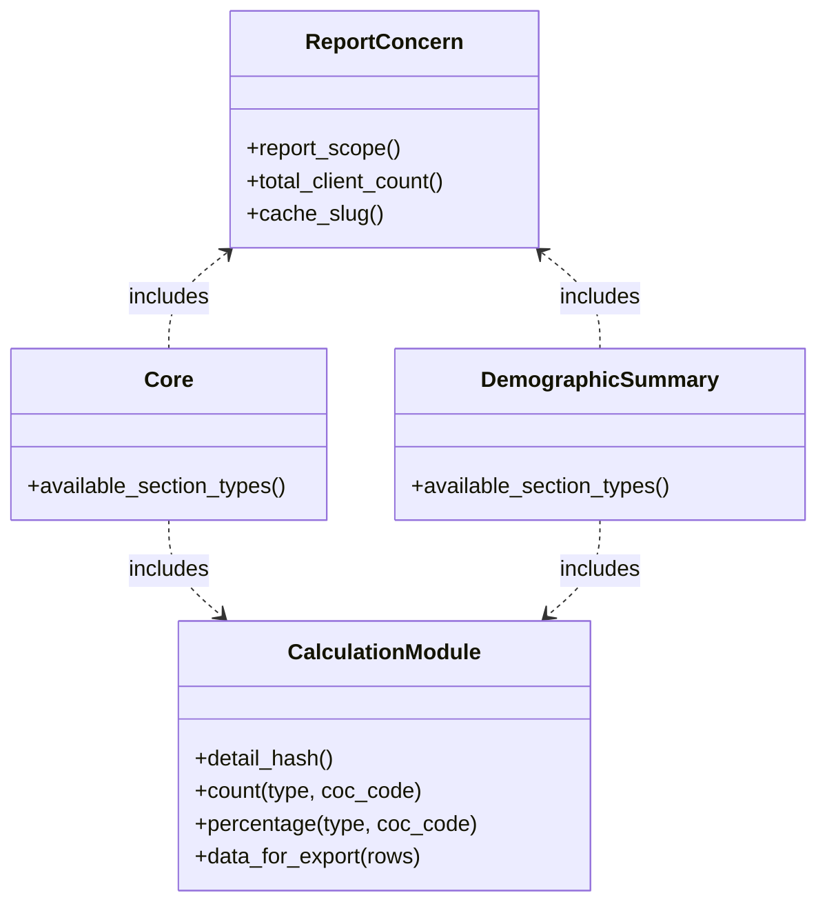

# Core Demographics Report

The `core_demographics_report` driver contains two related warehouse reports — **Core Demographics** and **Demographic Summary** — that aggregate client demographic data across a user-defined date range and project selection.

Both reports are located under `drivers/core_demographics_report`.

## Two Reports

| | Core Demographics | Demographic Summary |
|---|---|---|
| Class | `CoreDemographicsReport::Core` | `CoreDemographicsReport::DemographicSummary::Report` |
| Controller | `CoreDemographicsReport::WarehouseReports::CoreController` | `CoreDemographicsReport::WarehouseReports::DemographicSummaryController` |
| URL prefix | `core_demographics_report/warehouse_reports/core` | `core_demographics_report/warehouse_reports/demographic_summary` |
| Extra sections | Disabilities, Relationships, DV, Prior Living | Chronic, Unsheltered, High Acuity, Newly Entering Homelessness, Outcomes |

Core Demographics focuses on client-level demographics. Demographic Summary adds population-level indicators (chronic homelessness, unsheltered status, outcomes).

## Architecture

Both report classes are plain Ruby objects (not ActiveRecord models). They are instantiated with a `Filters::FilterBase` and compose all behavior through `ActiveSupport::Concern` modules.

### `ReportConcern`

The shared base, included first in both report classes. It provides:

- `report_scope` — applies the filter to `GrdaWarehouse::ServiceHistoryEnrollment.entry`, the base scope for all calculations
- KPI counts: `total_client_count`, `hoh_count`, `household_count`, `project_count`
- Authorization checks: `can_see_client_details?`, `can_view_client_disability?`
- `mask_small_population` — rounds small counts into privacy brackets when enabled
- `cache_slug` — derived from filter attributes, used as part of all `Rails.cache` keys

### Calculation Modules

Each `*_calculations.rb` file covers one demographic dimension. All follow the same interface:

- `{category}_detail_hash` — a hash mapping string keys (e.g., `"age_18..24"`) to drilldown configuration (`title`, `headers`, `columns`, `scope`)
- `{category}_count(type, coc_code)` — masked client count for a given breakdown
- `{category}_percentage(type, coc_code)` — percentage of total
- `{category}_data_for_export(rows)` — appends formatted rows to the export hash

Both reports: `AgeCalculations`, `GenderCalculations`, `SexCalculations`, `RaceCalculations`, `EthnicityCalculations`, `RaceEthnicityCalculations`, `HouseholdTypeCalculations`.

Core only: `DisabilityCalculations`, `RelationshipCalculations`, `DvCalculations`, `PriorCalculations`.

Demographic Summary-only: `ChronicCalculations`, `UnshelteredCalculations`, `HighAcuityCalculations`, `FirstTimeCalculations` (Newly Entering Homelessness), `OutcomeCalculations`.

### `Details` and `DetailsColumn`

`Details` aggregates all `*_detail_hash` methods and exposes `detail_scope_from_key`, `header_for`, and `columns_for`. `DetailsColumn` is a `Struct` that applies `PiiDisplay` policy per-row when rendering drilldown tables.

### `Projects`

Provides `enrollment_detail_hash` (one entry per project in scope) and project-level counts.

## Comparison Mode

Both reports support a comparison period. When one is selected, the controller instantiates a second report object with a separate filter. The view renders both side by side using the same calculation modules.

## Caching

Every expensive computation is memoized in two layers:

1. Instance variables
2. `Rails.cache` keyed by class name, `cache_slug`, and method name

Some sections are expensive enough that they may not be ready on first request. These use a `section_ready?` guard — the controller returns HTTP 202 and the view re-polls via AJAX until the cached result is available.

## Rendering Flow

1. `index.haml` renders the filter panel, hero KPI counts, and iterates `available_section_types`.
2. Each section loads via XHR. Most render inline; expensive sections use the `section_ready?` polling described above.
3. `background_render_action` defines endpoints that enqueue background jobs to render and cache sections. Demographic Summary has a separate background action for its detail sections.
4. Clicking a count cell navigates to `details`, which renders a drilldown table via `detail_scope_from_key(key)`.

## Data Relationships

| Data | Source |
|---|---|
| Base enrollment scope | `GrdaWarehouse::ServiceHistoryEnrollment` |
| Client demographics (DOB, Race, Gender) | `GrdaWarehouse::Hud::Client` via `she.client` |
| Enrollment attributes (RelationshipToHoH, DisablingCondition) | `GrdaWarehouse::Hud::Enrollment` via `she.enrollment` |
| Disabilities | `GrdaWarehouse::Hud::Disability`, filtered on `IndefiniteAndImpairs = 1` |
| Chronic homelessness | `GrdaWarehouse::ChEnrollment.chronically_homeless` |
| Household composition | Derived in-memory from enrollment household and age data |
| Project info | `GrdaWarehouse::Hud::Project` joined through the enrollment |

## Exports

Both reports support PDF and Excel exports via document export classes under `document_exports/`. Excel exports include CoC-level breakdowns for Demographic Summary.

## File Locations

- Models: `drivers/core_demographics_report/app/models/core_demographics_report/`
- Controllers: `drivers/core_demographics_report/app/controllers/core_demographics_report/warehouse_reports/`
- Views: `drivers/core_demographics_report/app/views/core_demographics_report/warehouse_reports/`
- Shared view partials: `.../views/.../shared/`
- Routes: `drivers/core_demographics_report/config/routes.rb`
