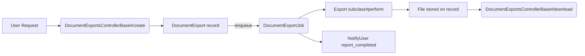

# Document Export Pipeline

## Overview
The DocumentExport pipeline provides a consistent way to generate downloadable files asynchronously, store them with metadata, and deliver authenticated downloads to users. Each export is represented by a `GrdaWarehouse::DocumentExport` record that tracks status, file data, and download URLs. Drivers register their own export subclasses while sharing the common job, controller, and cleanup infrastructure.

## Core Components
- `GrdaWarehouse::DocumentExport`
  ActiveRecord model that persists export metadata, file bytes (`file_data`), MIME type, and status.
- `DocumentExportBehavior` concern
  Adds status helpers, lifecycle utilities (`with_status_progression`), expiration scopes, and default filenames.
- `DocumentExportsControllerBase`
  JSON API for creating exports, polling status, and downloading completed files through authenticated endpoints.
- `DocumentExportJob` + `DocumentExportJobBehavior`
  Background job that loads an export record, calls its `perform`, and notifies the requester when complete.
- `NotifyUser.report_completed`
  Email notification that references `export.download_url`, keeping download links authenticated.
- `PruneDocumentExportsJob`
  Periodic cleanup that deletes expired export rows based on `DocumentExportBehavior::EXPIRES_AFTER`.

## Execution Flow
1. Client POSTs to `DocumentExportsController#create` with `type` and `query_string`.
2. Controller either reuses a recent completed export or persists a new record with `status: pending` and enqueues `DocumentExportJob`.
3. Job fetches the export via `not_expired.with_current_version.where(id: ...)`.
4. `export.perform` runs inside `with_status_progression`, writing `file_data`, `filename`, and `mime_type`.
5. When complete, the job calls `NotifyUser.report_completed(export.user_id, OpenStruct.new(title:, url: download_url))`.
6. User polls `document_export_path(id)` until `downloadUrl` is present, then hits `download_document_export_path(id)` which streams the stored bytes after an authorization check.

## Creating a New Export
1. **Subclass** `GrdaWarehouse::DocumentExport` (e.g., `GrdaWarehouse::Cohorts::DocumentExports::CohortExcelExport`).
2. **Implement**:
   - `authorized?` to gate downloads. Note: Exports are designed to be shareable—users can share download links with others who have appropriate permissions. Only check user permissions, not ownership of the underlying report/data.
   - `perform` to build the file (Axlsx, PDF, etc.) and assign `filename`, `file_data`, and `mime_type`.
   - `download_title` (optional) for notification copy.
3. **Register** the class in `DocumentExportsControllerBase#valid_document_export_classes`.
4. **Enqueue** the export from your feature (controller, job, or service) by creating the record and calling `DocumentExportJob.perform_later(export_id: export.id)` or a driver-specific job.
5. **Provide UI** hooks for polling and download using the JSON payload from `DocumentExportsControllerBase`.

## Maintenance
- `PruneDocumentExportsJob` removes expired exports using `DocumentExportBehavior.expired`.
- Exports can implement `regenerate?` to control cache reuse.
- Health drivers mirror this structure via `Health::DocumentExport` and `Health::DocumentExportJob`.

## Key Files
- `app/models/concerns/document_export_behavior.rb`
- `app/models/grda_warehouse/document_export.rb`
- `app/models/concerns/document_export_job_behavior.rb`
- `app/controllers/document_exports_controller_base.rb`
- `app/jobs/document_export_job.rb`
- `app/jobs/prune_document_exports_job.rb`
- Driver-specific subclasses under `drivers/**/document_exports/`
