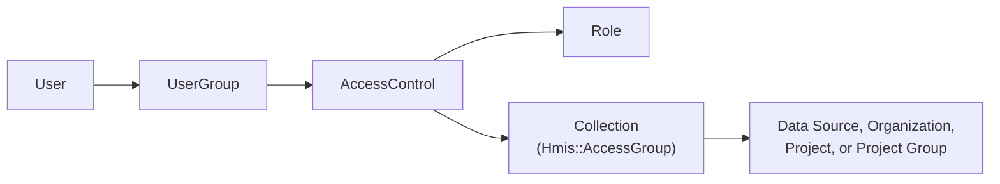

# HMIS Permissions

The HMIS uses a scoped RBAC (Role-Based Access Control) system that is structurally similar to, but entirely separate from, [warehouse permissions](warehouse-permissions.md). Each grant combines a role (the actions), a collection of entities (the targets), and a user group (the recipients). Unlike the warehouse, the HMIS has no legacy permissions path — every grant goes through `Hmis::AccessControl`.

Everything in the HMIS is additionally scoped to a single data source. A user's permissions apply only within the HMIS they are currently signed into, even if the same account has access to another HMIS installation in the same warehouse. See [Multi-HMIS Support](../architecture/multi-hmis-support.md).

## Core Concepts

Every permission check answers three questions:

1. **What can this user do?** (defined by a Role)
2. **Which entities does it apply to?** (defined by a Collection)
3. **Is the entity in the data source the user is currently using?** (defined by `user.hmis_data_source_id`)

The first two are joined through an `Hmis::AccessControl`, which binds a Role, a Collection, and a UserGroup into a single grant.



A user's effective permissions for an entity are the union of every Role reachable from that entity's Collections — with the important exception of [permission requirements](#permission-requirements), which are evaluated per-role in some code paths.

## Models

### AccessControl

`drivers/hmis/app/models/hmis/access_control.rb`

The central join record. Each row connects exactly one Role, one Collection, and one UserGroup. A user receives the permissions defined by the Role, scoped to the entities in the Collection, if they belong to the UserGroup.

### Role

`drivers/hmis/app/models/hmis/role.rb`

A Role is a set of boolean permission flags stored as columns on the `hmis_roles` table. `Hmis::Role.permissions_with_descriptions` is the source of truth for every permission and its metadata:

| Key | Purpose |
|---|---|
| `description` | Admin-facing explanation shown in the role editor |
| `administrative` | Whether the permission is considered administrative |
| `access` | `:viewable` and/or `:editable`; drives `Role.permissions_for_access` |
| `category` / `sub_category` | Grouping in the role editor UI |
| `requirements` | Other permissions this one depends on (see below) |

Adding a permission requires a migration: define it in `permissions_with_descriptions`, then call `::Hmis::Role.ensure_permissions_exist` in the migration to add the column.

### Collection (`Hmis::AccessGroup`)

`drivers/hmis/app/models/hmis/access_group.rb`

A Collection groups the entities a grant applies to. **Naming is inconsistent in the code**: the class is `Hmis::AccessGroup`, the table is `hmis_access_groups`, the foreign key on `GroupViewableEntity` is `collection_id`, and the admin UI calls them Collections. A rename to `Collection` is pending.

Collections may contain Data Sources, Organizations, Projects, and Project Groups (`Hmis::ProjectGroup`). Project resolution is inclusive: a project is covered if it appears in the Collection directly, or if its organization, data source, or a project group containing it appears.

### UserGroup

`drivers/hmis/app/models/hmis/user_group.rb`

A named set of users, with membership tracked by `Hmis::UserGroupMember`. Users receive permissions from every AccessControl attached to their UserGroups — `Hmis::User#access_controls` is defined `through: :user_groups`.

### GroupViewableEntity

`drivers/hmis/app/models/hmis/group_viewable_entity.rb`

Polymorphic join table associating a `(collection_id, entity_type, entity_id)` triple. Its `includes_entity` / `includes_any_entity_in_data_source` scopes implement the inclusive project resolution described above.

`Hmis::GroupViewableEntityProject` is a read-only database view that expands each row into the projects it covers, so project-level access can be resolved in SQL without walking associations.

### UserAccessControl

`drivers/hmis/app/models/hmis/user_access_control.rb`

Records a direct user-to-AccessControl assignment and appears in admin audit history. Note that permission evaluation does not read it — users reach AccessControls through UserGroups.

## Permission Requirements

Some permissions are meaningless on their own. `can_view_enrollment_details`, for example, grants nothing unless the user can also see the project and the client. These dependencies are declared with `requirements` in `permissions_with_descriptions`:

```ruby
can_view_enrollment_details: {
  requirements: [:can_view_project, :can_view_clients],
  # ...
},
can_edit_enrollments: {
  requirements: [:can_view_enrollment_details],
  # ...
},
```

**Declare only direct requirements.** Resolution is recursive, so `can_edit_enrollments` transitively requires `can_view_project` and `can_view_clients` without restating them. Restating them adds a second place to keep in sync and no enforcement.

### How requirements are enforced

`Hmis::AuthPolicies::ContextLoaders::HmisPermissionLoader` builds a user's permission set, then drops any permission whose requirement chain is not fully satisfied (`requirements_met?`). A permission with an unmet requirement is not merely ignored — it is absent from the set, so every policy predicate reading that set behaves as if it was never granted.

This means requirements are enforced everywhere policies are used, and the granularity depends on which `UserContext` method is involved:

| Method | Behavior |
|---|---|
| `UserContext#project_permissions(project_id)` | Requirements enforced per-project. A user with `can_edit_enrollments` at project A and `can_view_enrollment_details` at project B gets neither at either project. |
| `UserContext#global_permissions` | Requirements enforced across the whole data source. The split-role case above *would* report `can_edit_enrollments`, which is why global permissions are only used for coarse UI decisions and never to authorize a specific record. |

### Requirements and `mode: :all` scopes

ActiveRecord scopes that resolve access (`User#entities_with_permissions`, `Project.with_access`) match Role columns directly and **do not** resolve requirements. When a scope needs a permission's full dependency chain, pass the flattened set with `mode: :all`:

```ruby
Hmis::Hud::Project.with_access(user, *Hmis::Role.required_permissions_for(:can_view_enrollment_details), mode: :all)
```

`Hmis::Role.required_permissions_for(permission)` returns the permission plus all of its transitive requirements, and is the correct way to avoid restating a chain at the call site.

Note the semantic difference from policy evaluation, which is intentional:

- The permission loader unions permissions across every Role the user holds in the relevant Collections, then checks requirements against that union.
- `mode: :all` requires every listed permission on a **single** Role.

So a user holding `can_view_enrollment_details` from one role and `can_view_clients` from another passes the policy check but is excluded by the scope. A role that grants enrollment visibility without client visibility is treated as an incomplete grant rather than something to be completed from an unrelated role.

Because of this, adding a requirement to an existing permission can silently remove access from roles that don't already grant the new prerequisite. `rails driver:hmis:audit_enrollment_visibility_requirements` is a read-only audit that reports roles granting enrollment visibility with unmet requirements, along with how many of their users hold the missing permissions through a different role (i.e. whose access actually changes).

## How Permission Checks Work

### Policies (preferred)

`user.policy_for(resource, policy_type: :hmis_project).can_view_enrollment_details?`

Policy classes in `drivers/hmis/app/models/hmis/auth_policies/` are the intended API for authorization. They answer domain questions rather than exposing raw permission flags, they enforce requirements, and they verify the resource belongs to the user's current data source. Policies share a per-request `UserContext` that memoizes permission sets and batches database access through context loaders, so repeated checks do not re-query.

See [HMIS Authorization Policy Architecture](../../drivers/hmis/app/models/hmis/auth_policies/README.md) for the component breakdown and instructions for adding a policy.

### Entity scopes

For filtering records rather than checking one resource:

- `Entity.viewable_by(user)` — entities the user can view, directly or by inheritance. This is what most queries should use.
- `Hmis::Hud::Project.with_access(user, *permissions, **kwargs)` — projects where the user has the given permissions. Note this includes projects the user cannot otherwise view (it does not imply `can_view_project`).
- `User#entities_with_permissions(model, *permissions, **kwargs)` — the lower-level primitive; returns only **directly** granted entities and is normally used to build the scopes above.
- `User#viewable_projects`, `viewable_organizations`, etc. — direct grants only, used to assemble `viewable_by`.

An entity is **directly viewable** when a Collection the user reaches through an AccessControl references it and the attached Role grants a viewable permission. It is **inherited** when one of its parents is directly viewable: a Project is viewable through its Organization, Data Source, or a Project Group containing it; an Organization is viewable through its Data Source.

#### Allowed kwargs

| arg | value | default | notes |
|---|---|---|---|
| `mode` | `:any` or `:all` | `:any` | Whether any one of the permissions is sufficient, or all are required on the same Role. See [Requirements and `mode: :all` scopes](#requirements-and-mode-all-scopes). |

### Global boolean flags (avoid in new code)

`Hmis::User` defines `can_<permission>`, `can_<permission>?`, and `can_<permission>_for?(entity)` for every permission, plus `permission?`, `permissions?`, and `permissions_for?`. The flag forms answer "does this user have X anywhere?", ignoring both entity scope and data source, which makes them unsafe in a multi-HMIS installation. They also bypass requirement resolution. Prefer a policy predicate.

### Entity access loaders

`Hmis::BaseAccessLoader` subclasses (`ClientAccessLoader`, `ProjectAccessLoader`, `OrganizationAccessLoader`, `DataSourceAccessLoader`) resolve one permission for many entities at once, which makes them suitable for GraphQL batch loading. `Hmis::EntityAccessLoaderFactory` maps an arbitrary record to the right loader by walking associations toward a Client, Project, Organization, or Data Source — the entity types that can carry permissions.

These loaders check a single permission against Role columns and do not resolve requirements. They back the legacy `can_<permission>_for?` path and `GraphqlPermissionChecker`.

### GraphQL

Three layers of authorization apply to the GraphQL API:

- **Type-level**: `self.authorized?(object, ctx)` on a type, typically delegating to a policy. `HmisSchema::Enrollment` uses this to require either limited or full enrollment visibility.
- **Field-level**: `Types::BaseField` accepts `authorize_with:` (a lambda receiving user and object) or the deprecated `permissions:` kwarg, which routes through `GraphqlPermissionChecker`. Unauthorized fields resolve to `null` rather than erroring. `HmisSchema::Enrollment` overrides `self.field` to require `can_view_enrollment_details` for all full-access fields, and defines `summary_field` for the subset visible with `can_view_limited_enrollment_details`.
- **Access objects**: the nested `access { ... }` objects the frontend uses to decide what to render. New fields should use `bool_field` with a memoized `policy` helper; the legacy `can`, `composite_perm`, and `root_can` helpers expose raw permissions and are not data-source safe. See [ADR 0006](../adr/0006-policy-based-graphql-access-fields.md).

Resolvers and mutations should authorize explicitly with `access_denied!` unless a policy predicate passes, rather than relying on a scope to return nothing.

## Caching

Permission data is cached per request, not globally:

- `UserContext` is memoized on the user (`Hmis::User#policy_context`) and memoizes its permission sets and loaders, so a request resolves each project's permissions once.
- `Hmis::User#load_effective_permissions` populates the global boolean flags into an instance variable on first use.
- `Hmis::User#cached_viewable_project_ids` is the exception: it uses `Rails.cache` with a one-minute expiry.

Because caching is request-scoped, permission changes take effect on the next request without explicit invalidation.

## Admin Interface

HMIS permissions are administered from the warehouse UI under `HmisAdmin::` controllers (`drivers/hmis/app/controllers/hmis_admin/`), all gated by `require_hmis_admin_access!`, which requires the `can_administer_hmis` permission:

| Controller | Manages |
|---|---|
| `HmisAdmin::RolesController` | Roles and their permission flags |
| `HmisAdmin::GroupsController` | Collections and their entities |
| `HmisAdmin::UserGroupsController` | UserGroups and membership |
| `HmisAdmin::AccessControlsController` | AccessControl records |
| `HmisAdmin::AccessOverviewsController` | Read-only view of who has access to what |
| `HmisAdmin::ProjectGroupsController` | HMIS Project Groups |

Roles, Collections, UserGroups, and AccessControls are versioned with `paper_trail` and implement `describe_changes`, which powers the `*_audits_controller` history views.

## Related Documentation

- [HMIS Authorization Policy Architecture](../../drivers/hmis/app/models/hmis/auth_policies/README.md) — policies, `UserContext`, and context loaders
- [Warehouse Permissions](warehouse-permissions.md) — the parallel system on the warehouse side
- [Warehouse Auth Policies](warehouse-auth-policies.md) — policy pattern in the warehouse
- [Multi-HMIS Support](../architecture/multi-hmis-support.md) — how requests bind to a data source, and why permissions are data-source scoped
- [Data Sources](data-sources.md)
- [ADR 0006: Policy-Based GraphQL `access` Fields](../adr/0006-policy-based-graphql-access-fields.md) — why access fields delegate to policies
- [ADR 0002: PII Management Strategy](../adr/0002-pii-management-strategy.md) — access control as part of the broader PII strategy
- [Security concepts](../architecture/08-concepts/08-2-security.md)
- [Developer FAQ](../developer/faq.md) — includes guidance on choosing between policies and permission flags
