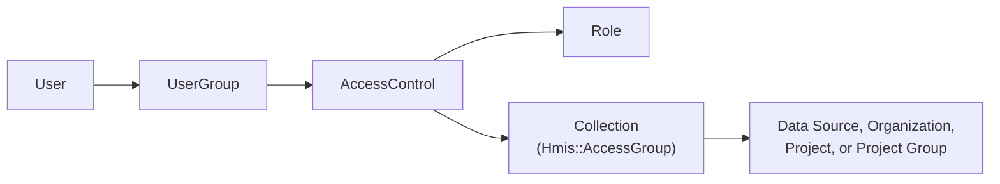

# HMIS Permissions

The HMIS uses a scoped RBAC (Role-Based Access Control) system that is structurally similar to, but entirely separate from, [warehouse permissions](../warehouse/warehouse-permissions.md). Each grant combines a role (the actions), a collection of entities (the targets), and a user group (the recipients). Unlike the warehouse, the HMIS has no legacy permissions path — every grant goes through `Hmis::AccessControl`.

Everything in the HMIS is additionally scoped to a single data source. A user's permissions apply only within the HMIS they are currently signed into, even if the same account has access to another HMIS installation in the same warehouse. See [Multi-HMIS Support](multi-hmis-support.md).

## Core Concepts

Every permission check answers three questions:

1. **What can this user do?** (defined by a Role)
2. **Which entities does it apply to?** (defined by a Collection)
3. **Is the entity in the data source the user is currently using?** (defined by `user.hmis_data_source_id`)

The first two are joined through an `Hmis::AccessControl`, which binds a Role, a Collection, and a UserGroup into a single grant.



A user's effective permissions for an entity are the union of every Role reachable from that entity's Collections — with the important exception of [permission requirements](#permission-requirements), which are evaluated per-role in some code paths.

A Collection covers an entity when it lists that entity or one of its parents: a Project is covered through its Organization, its Data Source, or a Project Group containing it, and an Organization through its Data Source. Coverage on its own grants nothing — it only determines which entities the attached Role applies to, so a Project is viewable only if a Role reached that way grants `can_view_project`.

## Models

### AccessControl

`drivers/hmis/app/models/hmis/access_control.rb`

The central join record. Each row connects exactly one Role, one Collection, and one UserGroup. A user receives the permissions defined by the Role, scoped to the entities in the Collection, if they belong to the UserGroup.

### Role

`drivers/hmis/app/models/hmis/role.rb`

A Role is a set of boolean permission flags stored as columns on the `hmis_roles` table. `Hmis::Role.permissions_with_descriptions` is the source of truth for every permission and its metadata:

| Key | Purpose |
|---|---|
| `description` | Admin-facing explanation shown in the role editor |
| `administrative` | Whether the permission is considered administrative |
| `access` | `:viewable` and/or `:editable`; drives `Role.permissions_for_access` |
| `category` / `sub_category` | Grouping in the role editor UI |
| `requirements` | Other permissions this one depends on (see below) |

Adding a permission requires a migration: define it in `permissions_with_descriptions`, then call `::Hmis::Role.ensure_permissions_exist` in the migration to add the column.

### Collection (`Hmis::AccessGroup`)

`drivers/hmis/app/models/hmis/access_group.rb`

A Collection groups the entities a grant applies to. **Naming is inconsistent in the code**: the class is `Hmis::AccessGroup`, the table is `hmis_access_groups`, the foreign key on `GroupViewableEntity` is `collection_id`, and the admin UI calls them Collections. A rename to `Collection` is pending.

Collections may contain Data Sources, Organizations, Projects, and Project Groups (`Hmis::ProjectGroup`). Project resolution is inclusive: a project is covered if it appears in the Collection directly, or if its organization, data source, or a project group containing it appears.

### UserGroup

`drivers/hmis/app/models/hmis/user_group.rb`

A named set of users, with membership tracked by `Hmis::UserGroupMember`. Users receive permissions from every AccessControl attached to their UserGroups — `Hmis::User#access_controls` is defined `through: :user_groups`.

### GroupViewableEntity

`drivers/hmis/app/models/hmis/group_viewable_entity.rb`

Polymorphic join table associating a `(collection_id, entity_type, entity_id)` triple. Its `includes_entity` / `includes_any_entity_in_data_source` scopes implement the inclusive project resolution described above.

`Hmis::GroupViewableEntityProject` is a read-only database view that expands each row into the projects it covers, so project-level access can be resolved in SQL without walking associations.

### UserAccessControl

`drivers/hmis/app/models/hmis/user_access_control.rb`

Records a direct user-to-AccessControl assignment and appears in admin audit history. Note that permission evaluation does not read it — users reach AccessControls through UserGroups.

## Permission Requirements

Some permissions are meaningless alone: `can_view_enrollment_details` grants nothing unless the user can also see the project and the client. Dependencies are declared with `requirements` in `permissions_with_descriptions`, and **only direct requirements belong there** — resolution is recursive, so `can_edit_enrollments` declares one requirement and inherits the rest of the chain through it:

```ruby
can_edit_enrollments: {
  requirements: [:can_view_enrollment_details], # which itself requires can_view_project and can_view_clients
  # ...
},
```

`HmisPermissionLoader` drops any permission whose chain isn't fully granted, so an unmet requirement leaves the permission absent from the set and every policy predicate behaves as if it was never granted. `UserContext#project_permissions` evaluates this per project; `UserContext#global_permissions` evaluates it across the whole data source, where a chain split across projects can over-report — which is why it only informs coarse UI decisions.

Scopes get the same answer, because `Project.with_access` resolves permissions through `UserContext` rather than matching Role columns. Name only the permission you need — its requirements come along:

```ruby
Hmis::Hud::Project.with_access(user, :can_view_enrollment_details) # implies project and client visibility
```

## How Permission Checks Work

Three questions come up in practice, each with a preferred tool:

| Question | Tool |
|---|---|
| May this user act on this record? | instance policy — `policy_for(record, policy_type:)` |
| Which records may this user see? | `viewable_by` scope |
| Could this user do this at all, anywhere in the data source? | global policy — `policy_for(SomeClass, policy_type:)` |

The first two are complementary rather than alternatives: most code scopes the query to find a record, then asks the policy whether the action is allowed.

### Policies (preferred, for a single record)

`user.policy_for(resource, policy_type: :hmis_project).can_view_enrollment_details?`

Policy classes in `drivers/hmis/app/models/hmis/auth_policies/` are the intended API for authorization. They answer domain questions rather than exposing raw permission flags, they enforce requirements, and they verify the resource belongs to the user's current data source. Policies share a per-request `UserContext` that memoizes permission sets and batches database access through context loaders, so repeated checks do not re-query.

See [HMIS Authorization Policy Architecture](hmis-auth-policies.md) for the component breakdown and instructions for adding a policy.

### `viewable_by` entity scopes (preferred, for multiple records)

`Hmis::Hud::Project.viewable_by(current_user)`

Use `viewable_by` any time you filter a list of records down to what a user may see. Also use it when looking up a **single** record by ID, even when a policy check follows. The scope restricts results to the user's current data source and to the entities reachable through their Collections, which is what keeps a record from another HMIS — or from outside the user's access entirely — from being loaded in the first place. A policy check on an already-loaded record authorizes the action, not the lookup, so it is not a substitute.

Combining the two is the standard pattern for acting on one record:

```ruby
record = Hmis::Hud::Project.viewable_by(current_user).find_by(id: id)
access_denied! unless record && policy_for(record, policy_type: :hmis_project).can_delete?
```

`viewable_by` only answers "can this user see this record?" It never implies permission to edit or delete, which is why the policy check is still required.

### Global policies (for "can they do this at all?")

`policy_for(Hmis::StaffAssignment, policy_type: :staff_assignment).can_index?`

Passing a **class** rather than a record returns the policy's `Global` variant (see `Hmis::AuthPolicies::ResourcePolicy`), which answers whether the user could do something *somewhere* in the current data source. Reach for it when:

- **Deciding what to show at all** — whether a navigation item, dashboard section, or admin area is available. `Types::HmisSchema::RootQueryAccess` is built entirely from global policies, and `UserDashboard` uses `can_index?` to decide whether the staff assignment section appears.
- **There is no record yet** — `can_create?` before building a record, or a bulk mutation that operates on many.
- **Short-circuiting work** — `Hmis::Hud::Client.viewable_by` returns `none` unless the global policy grants `can_view?`, and pick lists skip building options the user could never use.

Because a global policy reads `UserContext#global_permissions`, it must never authorize an action on a specific record: it can report a permission the user holds at one project while the record in question belongs to another. The schema follows this split — fields on `QueryAccess` are global, and anything about a specific record belongs on that record's access object.

### Global boolean flags (legacy, avoid in new code)

`Hmis::User` defines `can_<permission>`, `can_<permission>?`, and `can_<permission>_for?(entity)` for every permission, plus `permission?`, `permissions?`, and `permissions_for?`. The flag forms answer "does this user have X anywhere?", ignoring both entity scope and data source, which makes them unsafe in a multi-HMIS installation. The `_for?` forms are entity-scoped (they resolve through `Hmis::BaseAccessLoader` subclasses), but check a single raw permission and bypass requirement resolution. Prefer a policy predicate in all of these cases: a global policy for "anywhere in this data source" questions, an instance policy for a specific record.

### GraphQL

Schema-level patterns (where to put `viewable_by`, `authorized?`, resolver checks, access objects, pagination preloads) are documented in [Application Code Patterns and Conventions — GraphQL](../../code_patterns_and_conventions.md#graphql). This section is the permission-model view of the same API.

Four conventions apply to the GraphQL API:

- **Resolving records**: fields and mutations that look up or filter records do so through a `viewable_by` scope, so visibility is enforced by the query itself rather than by a later check.
- **Object-level**: `self.authorized?(object, ctx)` on a type, typically delegating to a policy. This is a secondary guard that raises an exception if unauthorized.
- **Field-level**: `Types::BaseField` accepts `authorize_with:` (a lambda receiving user and object) or the deprecated `permissions:` kwarg, which routes through `GraphqlPermissionChecker`. Unauthorized fields resolve to `null` rather than erroring. See `HmisSchema::Enrollment` for an example, which differentiates between `field` and `summary_field`.
- **Access objects**: the nested `access { ... }` objects the frontend uses to decide what to render. New fields should use `bool_field` with a memoized `policy` helper; the legacy `can`, `composite_perm`, and `root_can` helpers expose raw permissions and are not data-source safe. See [ADR 0006](../../adr/0006-policy-based-graphql-access-fields.md).
- **`current_permission?` (legacy, avoid in new code)**: `current_permission?(permission:, entity:)` from `GraphqlApplicationHelper` checks one raw permission against one entity through `GraphqlPermissionChecker`, and is what the deprecated `permissions:` kwarg and `can` access-object helper use under the hood. It bypasses requirement resolution and reads as a permission flag rather than a domain question. It is being phased out in favor of instance policy checks — don't add new usages, and replace them when touching nearby code.

## Caching

Permission data is cached per request, not globally:

- `UserContext` is memoized on the user (`Hmis::User#policy_context`) and memoizes its permission sets and loaders, so a request resolves each project's permissions once.
- `Hmis::User#load_effective_permissions` populates the global boolean flags into an instance variable on first use.
- `Hmis::User#cached_viewable_project_ids` is the exception: it uses `Rails.cache` with a one-minute expiry.

Because caching is request-scoped, permission changes take effect on the next request without explicit invalidation.

## Admin Interface

HMIS permissions are administered from the warehouse UI under `HmisAdmin::` controllers (`drivers/hmis/app/controllers/hmis_admin/`), all gated by `require_hmis_admin_access!`, which requires the `can_administer_hmis` permission:

| Controller | Manages |
|---|---|
| `HmisAdmin::RolesController` | Roles and their permission flags |
| `HmisAdmin::GroupsController` | Collections and their entities |
| `HmisAdmin::UserGroupsController` | UserGroups and membership |
| `HmisAdmin::AccessControlsController` | AccessControl records |
| `HmisAdmin::AccessOverviewsController` | Read-only view of who has access to what |
| `HmisAdmin::ProjectGroupsController` | HMIS Project Groups |

Roles, Collections, UserGroups, and AccessControls are versioned with `paper_trail` and implement `describe_changes`, which powers the `*_audits_controller` history views.

## Related Documentation

- [Application Code Patterns and Conventions — GraphQL](../../code_patterns_and_conventions.md#graphql) — where authorization belongs in schema code
- [HMIS Authorization Policy Architecture](hmis-auth-policies.md) — policies, `UserContext`, and context loaders
- [Warehouse Permissions](../warehouse/warehouse-permissions.md) — the parallel system on the warehouse side
- [Warehouse Auth Policies](../warehouse/warehouse-auth-policies.md) — policy pattern in the warehouse
- [Multi-HMIS Support](multi-hmis-support.md) — how requests bind to a data source, and why permissions are data-source scoped
- [Data Sources](../warehouse/data-sources.md)
- [ADR 0006: Policy-Based GraphQL `access` Fields](../../adr/0006-policy-based-graphql-access-fields.md) — why access fields delegate to policies
- [ADR 0002: PII Management Strategy](../../adr/0002-pii-management-strategy.md) — access control as part of the broader PII strategy
- [Security concepts](../../architecture/08-concepts/08-2-security.md)
- [Developer FAQ](../../developer/faq.md) — includes guidance on choosing between policies and permission flags
