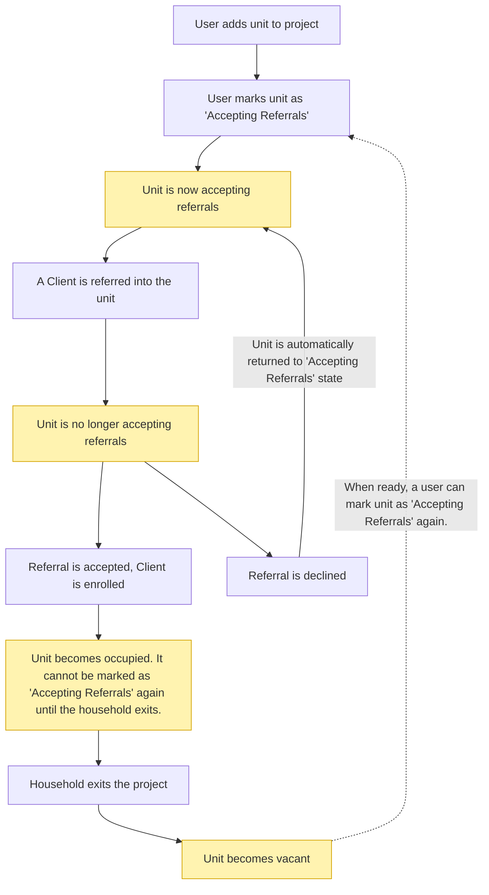

# HMIS Units

Units in HMIS represent a generic unit of capacity in a project. A unit is a resource that can be provided to a household or individual being served by the program. Units can represent physical or virtual resources such as apartments, rooms, shelter beds, vouchers, or units of service capacity.

## Key Concepts

- **Optional Usage**: A project can use units, but it doesn't have to. Units are an optional feature that projects can enable to track capacity and availability.

- **Required for CE Referrals**: If a project supports CE referrals (either receiving Direct referrals or Waitlist referrals), it **must** use units. This is because referrals are associated to CE Opportunities which are tied to Units.

- **Separate from HUD Inventory**: HMIS Units are completely separate from HUD Inventory records (which also have a units field). HUD Inventory tracks bed and unit inventory for reporting purposes, while HMIS Units are used for operational capacity tracking, CE referrals, and unit occupancy management.

- **Capacity and Availability Tracking**: Units are primarily used for tracking project utilization.

  Units can be in various states:
  - **Vacant**: Unit is unoccupied.
  - **Vacant and Accepting Referrals** [CE Only]: Unit is unoccupied, and has been marked as available to accept referrals. The Unit has an associated open Opportunity.
  - **Occupied**: Currently occupied by one or more enrollments. A Unit cannot be occupied by more than one household at a time.

- **Household Unit Occupancy**: A household can occupy more than one unit. Each enrollment in the household has its own unit occupancy record. This design allows for:
  - Multiple units per household for larger families
  - Individual tracking of each household member's unit assignment

  When a household member exits, their unit occupancy is released. If all household members have exited, the unit becomes vacant.

## Direct Enrollment into Units

For projects that enroll clients directly (without CE referrals), the unit occupancy workflow follows these steps:

- **Unit Creation**: User adds a unit to the project. The unit starts in a vacant state.

- **Initial Enrollment**: User enrolls a client into the project, directly selecting a unit from the list of vacant units. The selected unit becomes occupied.

- **Adding Household Members**: When adding additional household members to the project, users can select from:
  - Vacant units, or
  - Units already assigned to the household

- **Unit Assignment Changes**: If configured, unit assignment can be changed directly from the enrollment dashboard. This allows users to reassign enrollments to different units as needed.

- **Household Member Exits**: When a household member exits, their unit occupancy is released. If they were the last enrollment occupying that unit, the unit becomes vacant again and can be assigned to another client.

## CE Unit Occupancy Workflow

The following diagram illustrates the unit occupancy workflow in the context of a project that has **Coordinated Entry Referrals** enabled. This is a simplified diagram for a non-technical audience.

## Unit Groups

Units must be organized into Unit Groups. Unit Groups:

- Group related units together (e.g., all units of the same type)
- Configure workflow templates for referrals
- Manage eligibility requirements and priority schemes for matching clients to units
- Link units to candidate pools for waitlist-based referrals

## Related Code

- **Unit Model:** `drivers/hmis/app/models/hmis/unit.rb`
- **Unit Occupancy Model:** `drivers/hmis/app/models/hmis/unit_occupancy.rb`
- **CE Opportunity Model:** `drivers/hmis/app/models/hmis/ce/opportunity.rb`
- **CE Referral Model:** `drivers/hmis/app/models/hmis/ce/referral.rb`
- **CE Processing Overview:** `drivers/hmis/app/models/hmis/ce/README_FOR_CE_PROCESSING.md`

