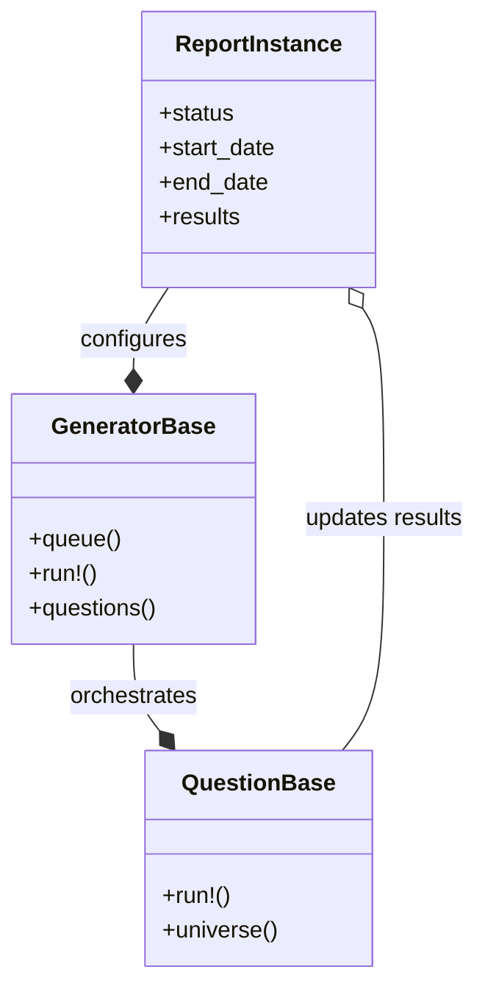

# HUD Report Framework

The HUD Report Framework provides a standardized structure for generating compliance reports (APR, CAPER, SPM, etc.) from HMIS data. It manages the report lifecycle, data aggregation, and result storage, allowing individual report drivers to focus on specific business logic and calculations.

## Architecture

The framework relies on three core components:

1.  **Report Instance**: Represents a single execution of a report. It stores configuration (dates, projects, CoCs) and tracks the state of the run.
2.  **Generator**: The orchestrator for a specific report type (e.g., `HudApr::Generators::Fy2026::Generator`). It defines the report's structure, including which questions or measures to run.
3.  **Question/Measure**: Encapsulates the logic for a single section of the report. It handles data retrieval, calculation, and result formatting.

## Report Structure

### Generators
Generators extend `HudReports::GeneratorBase`. They serve as the entry point and configuration hub for a report family.

A generator is responsible for:
- Defining the report title and fiscal year.
- Listing the `questions` (sections) that comprise the report.
- Providing report-level scopes (e.g., default project types).

### Questions and Measures
Questions (or Measures in SPM) extend `HudReports::QuestionBase`. Each class corresponds to a specific table or section in the final report.

A question is responsible for:
- Defining the "universe" of data relevant to that section.
- Calculating aggregates (counts, averages, medians).
- Storing results into specific "cells" (row/column coordinates).

## Data Processing Pipeline

The reporting process follows a linear pipeline:

1.  **Initialization**: A `ReportInstance` is created with user-provided parameters (date range, project selection).
2.  **Queuing**: The Generator queues a background job (`Reporting::Hud::RunReportJob`).
3.  **Execution**: The job instantiates the Generator and iterates through the defined questions.
4.  **Data Gathering**:
    - Questions fetch raw HMIS data (Enrollments, Clients, Services).
    - Data is filtered by report parameters (CoC, Date Range).
    - Derived attributes (e.g., Age, Chronic Status) are calculated.
5.  **Snapshotting**: Complex reports often create intermediate "snapshot" records (e.g., `AprClient`, `SpmEnrollment`) to cache calculated values for performance.
6.  **Aggregation**: The question logic aggregates the data into the required format.
7.  **Completion**: Results are saved to the `ReportInstance`, and the report is marked as complete.

## Data Management

### Universes and Cells
The framework uses the concept of a "Universe" to define the set of records (Clients or Enrollments) that apply to a specific report section or cell.

- **Universe**: A collection of records that meet specific criteria (e.g., "All adults in Emergency Shelter").
- **Cell**: A specific data point in the report output (e.g., "Question 5, Row 1, Column A").

Questions populate cells by associating a universe with a specific cell identifier. This allows the system to support "drill-down" functionality, where users can see the specific clients behind a number.

### Snapshot Models
To improve performance and consistency, many reports use snapshot models. Instead of recalculating complex logic (like "Chronic Homelessness status on entry") for every question, the report calculates it once and stores it in a temporary or report-specific table.

Examples include:
- **APR/CAPER**: Uses `AprClient` to store age, household type, and disability status for the report period.
- **SPM**: Uses `SpmEnrollment` to normalize enrollment data across different project types.

These models act as a stable foundation for the various questions in the report.

When a report uses snapshot models, the `HudReports::ReportInstance#snapshot_status` field can be used to coordinate long-running snapshot generation across retries. Generators or measures should:

- mark the snapshot as `pending` or `started` before building snapshot records,
- delete any partial snapshot records if a previous run was interrupted, and
- mark the snapshot as `completed` once the snapshot universe has been fully generated.

## Supported Reports

The framework supports the following HUD reports:
- **APR** (`/app/drivers/hud_apr`)
- **CAPER** (`/app/drivers/hopwa_caper`)
- **Data Quality** (`/app/drivers/hud_data_quality_report`)
- **HIC** (`/app/drivers/hud_hic`)
- **LSA** (`/app/drivers/hud_lsa`)
- **PATH** (`/app/drivers/hud_path_report`)
- **PIT** (`/app/drivers/hud_pit`)
- **SPM** (`/app/drivers/hud_spm_report`)
