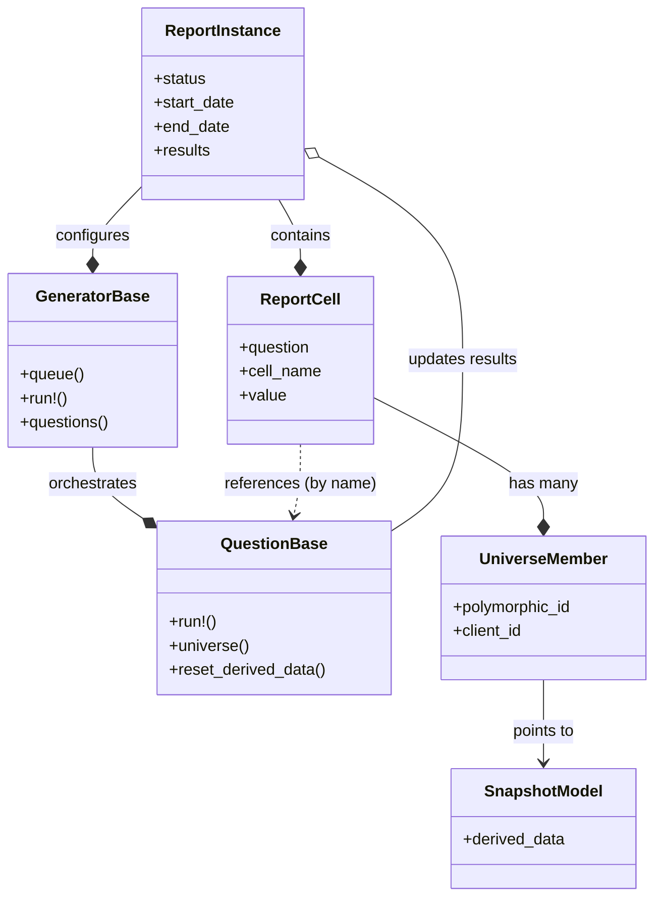

# HUD Report Framework

The HUD Report Framework generates compliance reports (APR, CAPER, SPM, etc.) from HMIS data. It handles report lifecycle, data aggregation, and result storage. Individual report drivers implement specific business logic and calculations.

## Architecture

The framework relies on three core components:

1.  **Report Instance**: Represents a single report execution. Stores configuration (dates, projects, CoCs) and tracks state.
2.  **Generator**: Orchestrates a specific report type (e.g., `HudApr::Generators::Fy2026::Generator`). Defines report structure and which questions run.
3.  **Question/Measure**: Implements logic for a single report section. Handles data retrieval, calculation, and result formatting.



## Report Structure

### Generators
Generators extend `HudReports::GeneratorBase` and define:
- Report title and fiscal year
- Questions (sections) in the report
- Report-level scopes (e.g., default project types)

### Questions and Measures
Questions (or Measures in SPM) extend `HudReports::QuestionBase`. Each class corresponds to a table or section in the final report. Questions define the data universe, calculate aggregates, and store results in cells (row/column coordinates).

## Data Processing Pipeline

1.  **Initialization**: Create a `ReportInstance` with parameters (date range, project selection)
2.  **Queuing**: Generator queues `Reporting::Hud::RunReportJob`
3.  **Execution**: Job instantiates the Generator and iterates through questions
4.  **Data Gathering**: Questions fetch HMIS data (Enrollments, Clients, Services), filter by report parameters (CoC, Date Range), and calculate derived attributes (Age, Chronic Status)
5.  **Snapshotting**: Some reports create intermediate snapshot records (e.g., `AprClient`, `SpmEnrollment`) that cache calculated values
6.  **Aggregation**: Questions aggregate data into report format
7.  **Completion**: Results are saved to `ReportInstance`

## Data Management

### Universes and Cells
- **Universe**: A collection of records matching specific criteria (e.g., "All adults in Emergency Shelter")
- **Cell**: A data point in the report output (e.g., "Question 5, Row 1, Column A")

`HudReports::ReportCell` represents a cell and links to underlying data via `HudReports::UniverseMember`, a polymorphic join model. This connects report cells to snapshot models (`SpmEnrollment`, `AprClient`) and caches PII for drill-down tables in the UI.

### Snapshot Models
Many reports use snapshot models to cache calculated values (e.g., "Chronic Homelessness status on entry") in temporary or report-specific tables.

Examples:
- **APR/CAPER**: `AprClient` stores age, household type, and disability status
- **SPM**: `SpmEnrollment` normalizes enrollment data across project types

## Retry and Idempotency

The framework supports retrying failed or partial report runs on an opt-in basis.

### Enabling Retry Support

Reports declare retry support by overriding `supports_idempotent_retry?`:

```ruby
class Generator < ::HudReports::GeneratorBase
  def self.supports_idempotent_retry?
    true  # Enables retry support
  end
end
```

Default: `supports_idempotent_retry?` returns `false` (retries disabled).

### Retry Behavior

**With `supports_idempotent_retry? == true` (e.g., SPM)**:

1. Completed questions are skipped (won't run again)
2. Incomplete/failed questions are reset (cells and universe members deleted before re-running)
3. Shared snapshot data (e.g., `SpmEnrollment`) is reused if already created

**With `supports_idempotent_retry? == false` (default, e.g., PIT)**:

1. Retries fail immediately if the report was previously started (checked via `started_at` timestamp)
2. Reports using lazy-evaluation or shared universe patterns use this mode
3. Users create a new report instead of retrying

### Architectural Patterns

Reports use several different patterns and are not uniform.

**Eager Snapshot with Retry Support (SPM)**:
- Generator creates snapshot data during `prepare_report`
- Snapshot status prevents recreation on retry
- Measures implement a `::reset_derived_data` class method to remove derived data (e.g., `Return` records) before a question is retried.
- Questions consume the shared snapshot
- Retry-safe: snapshots are isolated and questions are independent

**Lazy Shared Universe without Retry (PIT)**:
- First question populates a shared universe
- Subsequent questions reuse the universe data
- No question-level reset occurs
- Not retry-safe: questions are interdependent
- Retries are blocked when questions have completed

## Helpful commands
A report instance can be run as follows
```ruby
instance = HudReports::ReportInstance.find(instance_id)
generator = HopwaCaper::Generators::Fy2026::Generator
Reporting::Hud::RunReportJob.new.perform(generator.name, instance, email: false)
```

## Supported Reports

The framework supports the following HUD reports:
- **APR** (`/app/drivers/hud_apr`)
- **CAPER** (`/app/drivers/hopwa_caper`)
- **Data Quality** (`/app/drivers/hud_data_quality_report`)
- **HIC** (`/app/drivers/hud_hic`)
- **LSA** (`/app/drivers/hud_lsa`)
- **PATH** (`/app/drivers/hud_path_report`)
- **PIT** (`/app/drivers/hud_pit`)
- **SPM** (`/app/drivers/hud_spm_report`)
