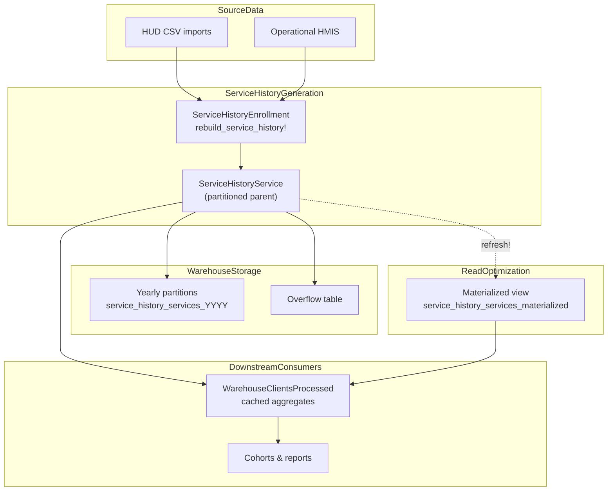

# Service History

The Service History subsystem provides a flattened, day-by-day representation of a client's journey through various programs. It is a primary source for many reports and data analysis.

## Key Models

-   **`ServiceHistoryEnrollment`**: Each HUD enrollment produces one or more `ServiceHistoryEnrollment` rows that mark the lifecycle of the enrollment. We always create an `entry` record and we add an `exit` record when the enrollment closes. These markers allow downstream jobs to reason about the enrollment span independently of the daily service rows.
-   **`ServiceHistoryService`**: This model stores the daily activity generated for a `ServiceHistoryEnrollment`. It represents days for both source services and synthetic days representing CLS in Street Outreach programs. This is time-series data; it is extremely large and partitioned by year to keep it manageable.
-   **`ServiceHistoryServiceMaterialized`**: Rails model backed by a materialized view that flattens the sharded `service_history_services` partitions for per-client and ad-hoc analytic queries. Historically we lean on it when time-sharded tables make targeted lookups expensive.

## Service History Generation

The `ServiceHistoryEnrollment` and its associated `ServiceHistoryService` records are generated by a background task. This process is idempotent and can be re-run safely. The core logic resides in the `rebuild_service_history!` method within the `GrdaWarehouse::Tasks::ServiceHistory::Enrollment` class.

The generation logic differs based on the program type:

-   **Night-by-Night (NBN) Programs:** A `ServiceHistoryService` record is created for each specific service date recorded in the source data (e.g., a bed night service).
-   **Entry/Exit Programs:** For programs like Entry/Exit shelters, Transitional Housing, and Permanent Housing, the system builds `ServiceHistoryService` records for each day from the client's entry date through the day before their exit date. When the entry and exit dates are the same we include that day. For ongoing enrollments, we extend the services through the latest date covered by the source export (or today, if the enrollment is managed in the operational HMIS).
  -   **Street Outreach & Contact Extrapolation:** Street Outreach projects can create synthetic daily services from contact records. When the `so_day_as_month` configuration flag is enabled—or when a project is configured to extrapolate contacts—we expand recorded contacts to fill the remainder of the month so that downstream reporting sees continuous engagement.

## Storage & Performance Considerations

 The `service_history_services` dataset is among the largest tables in the warehouse regardless of installation scale. To keep inserts fast and maintenance manageable, we physically shard it by year. PostgreSQL trigger logic (see `db/warehouse_structure.sql`) routes each new service day into the correct annual partition (`service_history_services_2000`, `service_history_services_2001`, …, `service_history_services_2050`) with an overflow table (`service_history_services_remainder`) for out-of-range data. Queries continue to reference the parent `service_history_services` relation, but PostgreSQL prunes to the relevant partitions based on date filters.

For analytic workloads that benefit from a consistent snapshot—and to avoid the cross-partition overhead of per-client lookups—we expose the `service_history_services_materialized` relation. The `GrdaWarehouse::ServiceHistoryServiceMaterialized` model manages that materialized view, including `refresh!` (to repopulate it) and `rebuild!` (to drop, recreate, and reindex). A notifier-backed `double_check_materialized_view` helper compares recent homeless dates between the live partitions and the materialized copy so we can detect drift. Future work (see ADR 0006) explores replacing daily rows with period-based ranges, which could eliminate the need for this materialized view entirely.

There are some guard rails in place so we don't generate service back to the year 100 or far into the future.

### Data Flow Overview



## When Service History Records Are Updated

Service history uses a hash-based caching mechanism to avoid unnecessary rebuilds. Each enrollment stores a `processed_as` hash that represents the state of the source data at the time the service history was last generated. The system automatically rebuilds service history when it detects that source data has changed.

### Automatic Rebuild Triggers

Service history will automatically regenerate when any of the following source data changes are detected:

-   **Enrollment data:** Entry date, project, household ID, relationship to head of household, move-in date
-   **Exit data:** Exit date, destination
-   **Service records:** Date provided, additions or deletions of service records (for Night-by-Night projects)
-   **Current Living Situations:** Information dates for Street Outreach projects that act as bed-night
-   **Client data:** Changes to the destination client (e.g., after client merges)

The hash calculation includes these fields to detect changes. When `rebuild_service_history!` is called on an enrollment, it compares the current hash with the stored `processed_as` value. If they differ, a full rebuild occurs.

### Automatic Rebuild via Daily Project Cleanup Task

A daily `ProjectCleanup` task automatically detects and fixes several types of project-related inconsistencies:

-   **ProjectType changes:** When a project's `ProjectType` changes or doesn't match service history, the task automatically invalidates all enrollments for that project to trigger a rebuild
-   **Project moves:** When a project is moved to a different organization, associated service history is invalidated and rebuilt
-   **Homeless status mismatches:** When the `homeless` or `literally_homeless` flags in service history don't match what they should be for the project's type (checked for the last 2 years), enrollments are invalidated
-   **Project name changes:** Project names in service history are automatically updated when they don't match the source

The cleanup task runs on all projects daily and then processes the invalidated enrollments.

### Manual Rebuild Process

To manually trigger a service history rebuild for specific enrollments:

```ruby
# Invalidate enrollment(s) - this clears the processed_as hash
enrollment.invalidate_source_data!

# Or invalidate all enrollments for a project
GrdaWarehouse::Hud::Enrollment.where(
  ProjectID: project_id,
  data_source_id: data_source_id
).update_all(processed_as: nil)

# Queue for reprocessing
GrdaWarehouse::Tasks::ServiceHistory::Enrollment.queue_batch_process_unprocessed!
```

For a single enrollment, you can also directly call:

```ruby
enrollment.rebuild_service_history!
```

This will force a rebuild regardless of whether the hash has changed.

## Importance for Reporting and Analysis

Because `ServiceHistoryService` creates a daily record for Entry/Exit programs, it allows complex, time-based queries to be written in a simple and efficient way. For example, to determine if a client was active on a specific date, a query only needs to check for the existence of a `ServiceHistoryService` record for that client on that date.

This flattened data structure is used for:
-   Calculating "last seen" dates.
-   Determining program occupancy on a given day.
-   Accurately calculating length of stay.
-   Reporting on client activity over time.

## Cached Service History Data (`WarehouseClientsProcessed`)

While Service History provides the day-by-day foundation, many features don't query it directly. Instead, they rely on **pre-computed aggregations** stored in the `WarehouseClientsProcessed` table for performance.

### What Gets Cached

The `WarehouseClientsProcessed` table stores aggregated metrics for each client, including:

- **`last_homeless_date`**: Most recent date with a homeless service from `ServiceHistoryService`
- **`first_homeless_date`**: First date with a homeless service
- **`homeless_days`**: Total count of days homeless
- **`last_chronic_date`**: Most recent date when client was chronically homeless
- **`days_homeless_last_three_years`**: Days homeless within the last 3 years
- **`literally_homeless_last_three_years`**: Days literally homeless within the last 3 years
- **`last_intentional_contacts`**: JSON array of the most recent intentional contacts, including:
  - Current Living Situations (CLS) from any enrollment in the last 3 years
  - CE Events from any enrollment in the last 3 years
  - Referral Events from any enrollment in the last 3 years
  - Custom services
- **`last_exit_destination`**: Most recent exit destination

### When the Cache Is Updated

The cache is updated automatically by:

1. **Daily Import Job**: `RunDailyImportsJob` automatically updates cached counts for all clients (from the past year) after service history generation completes
2. **Daily Cohort Preparation**: `Cohort.prepare_active_cohorts` runs nightly (via the `warm_cohort_cache` rake task) and updates the cache for a set of clients who are on the cohort prior to updating the cohort-level cache so it can have the most accurate information and ensure the cache has been created for the particular clients.
3. **On-Demand Jobs**:
   - `AddCohortClientsJob` updates the cache when clients are added to cohorts
   - `UpdateWarehouseClientsCachesJob` can be queued for specific client sets

**Important**: The cache update happens **after** service history is generated as part of the daily import process. For immediate updates, use `UpdateWarehouseClientsCachesJob.perform_later(client_ids: [ids])` rather than directly calling model methods.

### Features That Use Cached Data

The cached data in `WarehouseClientsProcessed` is used by:

- **Cohorts**: To determine client inactivity (checks `last_homeless_date` and `last_intentional_contacts` against the cohort's `days_of_inactivity` threshold)
- **CAS (Coordinated Access System)**: To determine if clients are actively homeless for eligibility
- **Reports**: Various reports use the cached metrics for performance
- **Client Dashboards**: Display last service dates and activity metrics

## Related Code

-   **Service History Enrollment Model:** `app/models/grda_warehouse/service_history_enrollment.rb`
-   **Service History Service Model:** `app/models/grda_warehouse/service_history_service.rb`
-   **Service History Builder Concern:** `app/models/concerns/service_history/builder.rb`
-   **Service History Generation Task:** `app/models/grda_warehouse/tasks/service_history/enrollment.rb`
    -   `rebuild_service_history!` - Main method that determines whether to rebuild or patch
    -   `calculate_hash` - Computes the hash used for change detection
    -   `invalidate_source_data!` - Clears the cached hash to force a rebuild
-   **Service History Purge Task:** `app/models/grda_warehouse/tasks/service_history/purge_for_deleted_data_sources.rb`
    -   Purges service history records for soft-deleted data sources
    -   Usage: `GrdaWarehouse::Tasks::ServiceHistory::PurgeForDeletedDataSources.call(dry_run: false)`
-   **Cached Aggregations:** `app/models/grda_warehouse/warehouse_clients_processed.rb`
    -   Stores aggregated data like `last_homeless_date`, `last_intentional_contacts`, and homeless day counts
    -   Updated automatically by `RunDailyImportsJob` after service history generation
-   **Daily Import Job:** `app/jobs/importing/run_daily_imports_job.rb`
    -   Coordinates daily data import, service history generation, and cache updates.
-   **Cache Update Job:** `app/jobs/update_warehouse_clients_caches_job.rb`
    -   Queue this job to update cached counts for specific clients: `UpdateWarehouseClientsCachesJob.perform_later(client_ids: [ids])`
    -   Uses advisory locking to prevent concurrent updates
-   **Project Cleanup Task:** `app/models/grda_warehouse/tasks/project_cleanup.rb`
    -   Runs daily to detect and fix project configuration mismatches
    -   `should_update_type?` - Detects ProjectType mismatches
    -   `fix_project_type` - Invalidates enrollments when project type changes
    -   `homeless_mismatch?` - Detects homeless status inconsistencies
    -   `invalidate_service_for_moved_projects` - Handles projects moved to different organizations
