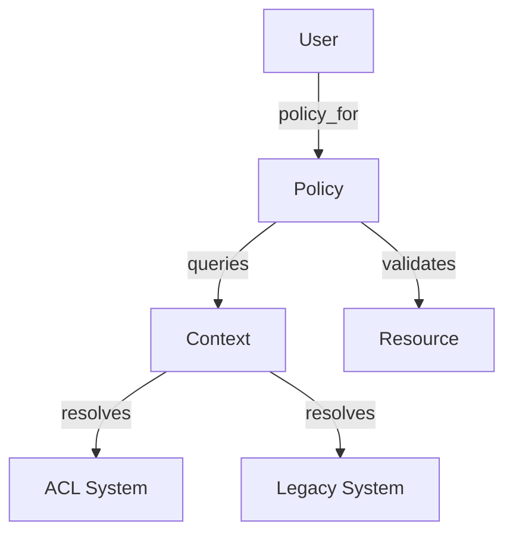

# Warehouse Auth Policies

Warehouse Auth Policies contain the business rules for determining user access to warehouse resources such as clients, projects, and data sources.

## Overview

The authorization system decouples permission checks from the underlying data models and the specific authentication mechanism (Legacy Role-based or ACL-based). Policies are initialized with a context object that resolves permissions for the current user.

## Architecture

The system consists of three main components:

- **Entry Point**: `User#policy_for(resource)` or `User#reporting_policy_for_project(project_id)` are the primary ways to obtain a policy.
- **Context Objects**: `UserAclContext` and `UserLegacyContext` encapsulate permission lookups. They provide a common interface for policies to query permissions without knowing how they are stored or resolved.
- **Policies**: Concrete classes inheriting from `BasePolicy` that define domain-specific authorization logic.

### Relationship Diagram



## Policy Implementation

Policies are located in `app/models/grda_warehouse/auth_policies/`.

- `BasePolicy`: Abstract base class providing common initialization and validation helpers.
- `ProjectPolicy`: Authorization for HUD projects.
- `SourceClientPolicy`: Authorization for HUD clients, including complex logic for ROI (Release of Information) and data sharing.
- `DataSourcePolicy`: Authorization for data sources.
- `ProjectPiiPolicy`: Specialized policy for controlling access to Personally Identifiable Information (PII) in reporting contexts.

## Usage

Policies are typically invoked through the `User` model.

```ruby
# Get a policy for a specific project
policy = current_user.policy_for(@project)
policy.can_view?
policy.can_edit?

# Get a PII policy for reporting
pii_policy = current_user.reporting_policy_for_project(project_id)
pii_policy.can_view_full_ssn?
```

### Preloading

When checking policies for multiple resources (e.g., in a list view), the context provides helpers to preload dependencies to avoid N+1 queries.

```ruby
context = current_user.policy_context
context.preload_project_dependencies(project_ids)
```

## PII Policies

Reporting contexts often use specialized PII policies (`AllowPiiPolicy`, `DenyPiiPolicy`, `ProjectPiiPolicy`). These are used to determine if sensitive client fields like full SSN or DOB should be displayed based on the user's permissions for the project associated with the report data.
