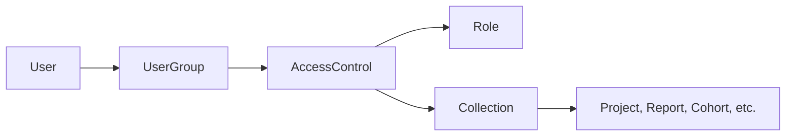

# Warehouse Permissions

The warehouse uses an Access Control List (ACL) system to determine what actions users can perform and which entities those actions apply to. A parallel legacy system exists and is being phased out.

## Core Concepts

The ACL system answers two questions for every permission check:

1. **What can this user do?** (defined by Roles)
2. **Which entities does it apply to?** (defined by Collections)

These are joined through an `AccessControl`, which binds a `Role`, a `Collection`, and a `UserGroup` into a single grant.

## Models

### AccessControl

`app/models/access_control.rb`

The central join record. Each row connects exactly one Role, one Collection, and one UserGroup. A user receives the permissions defined by the Role, scoped to the entities in the Collection, if they belong to the UserGroup.

AccessControls where all three components are system-managed are hidden from the admin UI. The `user_managed` scope filters these out for the admin interface.

### Role

`app/models/role.rb`

A Role is a set of boolean permission flags stored as columns on the `roles` table. Each flag corresponds to a named permission (e.g., `can_view_clients`, `can_edit_projects`). Permissions are defined in `Role.permissions_with_descriptions`, which also provides metadata: description, category, sub-category, and whether the permission is administrative.

Roles come in three flavors:
- **Editable** — created and managed by administrators
- **System** — auto-managed (e.g., "System User Role"); hidden from normal admin views
- **Health** — assigned via `user_roles` (the legacy join), not through AccessControls

New permissions are added by defining them in `permissions_with_descriptions` and calling `Role.ensure_permissions_exist` in a migration.

### Collection

`app/models/collection.rb`

A Collection groups the entities that a permission applies to. It holds references to entities through `GrdaWarehouse::GroupViewableEntity` (a polymorphic join table). A Collection has a `collection_type` that constrains which entity types it contains:

| `collection_type` | Allowed entity types |
|---|---|
| `Projects` | Data Sources, Organizations, Project Access Groups, CoC Codes, Projects |
| `Project Groups` | Project Groups |
| `Reports` | Reports |
| `Cohorts` | Cohorts |
| `Supplemental Data Sets` | Supplemental Data Sets |

Project-scoped rules are inclusive: a project is included if it appears directly in the Collection, or if its parent organization or data source is included.

**System Collections** (e.g., "All Data Sources", "All HMIS Reports") are auto-maintained by `Collection.maintain_system_groups`. Their entity membership is locked.

**Source-backed Collections** are created by the `EntityAccess` concern as side-effects when entities like Cohorts or ProjectGroups manage per-entity access. These are hidden from admin views.

### UserGroup

`app/models/user_group.rb`

A named set of users. Membership is tracked through `UserGroupMember` records. UserGroups connect users to AccessControls — a user receives permissions from every AccessControl linked to their UserGroups.

System UserGroups are auto-managed (e.g., "System User Group" for the system user). Source-backed UserGroups are created by `EntityAccess` for per-entity viewer/editor access.

### GroupViewableEntity

`app/models/grda_warehouse/group_viewable_entity.rb`

Polymorphic join table linking entities to Collections (and, in the legacy system, to AccessGroups). Each row associates a `(collection_id, entity_type, entity_id)` triple. Supported entity types: `GrdaWarehouse::DataSource`, `GrdaWarehouse::Hud::Organization`, `GrdaWarehouse::Hud::Project`, `GrdaWarehouse::ProjectAccessGroup`, `GrdaWarehouse::WarehouseReports::ReportDefinition`, `GrdaWarehouse::ProjectGroup`, `GrdaWarehouse::Cohort`, `GrdaWarehouse::Lookups::CocCode`, `HmisSupplemental::DataSet`.

## How Permission Checks Work

### Boolean permission flags

`User` dynamically defines `can_<permission>` and `can_<permission>?` methods for every permission in `Role.permissions`. These methods merge the boolean flags from all Roles the user holds through their AccessControls (`load_effective_permissions`). Health permissions are loaded separately through the legacy `user_roles` join.

The flag check answers "can this user do X anywhere?" without regard to entity scope.

### Entity-scoped checks

For resource-level authorization, `User#policy_for(resource)` returns a policy object from `GrdaWarehouse::AuthPolicies::`. Policies use a context object (`UserAclContext` or `UserLegacyContext`, selected by `User#using_acls?`) that resolves which entities the user can access for a given permission.

Key method: `User#collections_for_permission(permission)` returns the Collection IDs from AccessControls whose Role has the given permission enabled. Entity IDs are then resolved from those Collections.

See also: [Warehouse Auth Policies](warehouse-auth-policies.md)

### Derived permissions

`UserPermissions` (concern included by `UserConcern`) defines composite permission methods that combine multiple flags (e.g., `can_view_or_search_clients`).

## EntityAccess Concern

`app/models/concerns/entity_access.rb`

Used by `GrdaWarehouse::ProjectGroup` and `GrdaWarehouse::Cohort` to manage per-entity user access. For each entity, it auto-creates:

- A **system Collection** containing only that entity
- A **viewable UserGroup** and an **editable UserGroup**
- Corresponding **system Roles** with the appropriate permission flag
- Two **AccessControls** binding the above together

`replace_access(users, scope:)` swaps the membership of the viewer or editor UserGroup.

## Legacy System

The legacy system (marked with `START_ACL` / `END_ACL` comments throughout the codebase) uses a different path:

- `User` → `UserRole` → `Role` (direct role assignment, no UserGroup intermediary)
- `User` → `AccessGroupMember` → `AccessGroup` → `GroupViewableEntity` (entity scoping without AccessControl)

`AccessGroup` (`app/models/access_group.rb`) is the legacy equivalent of `Collection`. `UserRole` (`app/models/user_role.rb`) directly joins users to roles.

`User#using_acls?` (defined in `UserConcern`) checks `permission_context == 'acls'` to determine which path to use. The legacy path is being removed; `AccessGroup`, `UserRole`, and `AccessGroupMember` are deprecated.

## Cache Invalidation

The `UserPermissionCache` concern is included by `AccessControl`, `Collection`, `UserGroup`, and `Role`. Any save on these models calls `User.clear_cached_permissions`, which invalidates all cached user permission data. Individual user permission state (`@permissions`, `@ids_for_relations`, etc.) is stored as instance variables and reset per-request.

## Admin Interface

Permission management is under `Admin::` controllers:

| Controller | Manages | Required permission |
|---|---|---|
| `Admin::AccessControlsController` | AccessControl records | `can_edit_users` |
| `Admin::CollectionsController` | Collections and their entities | `can_edit_collections` |
| `Admin::UserGroupsController` | UserGroups and membership | `can_edit_users` |
| `Admin::RolesController` | Roles and permission flags | `can_edit_roles` |

Super-admin permissions (`can_edit_roles`, `can_edit_users`, `can_manage_config`, `can_manage_sessions`, `can_edit_collections`) are flagged separately and grant access to these administrative areas.

## HMIS Permissions

The HMIS front-end (`drivers/hmis/`) uses a structurally similar but separate permissions system with its own `Hmis::AccessControl`, `Hmis::UserAccessControl`, and `Hmis::Role` models. See `drivers/hmis/doc/PERMISSIONS.md`.
