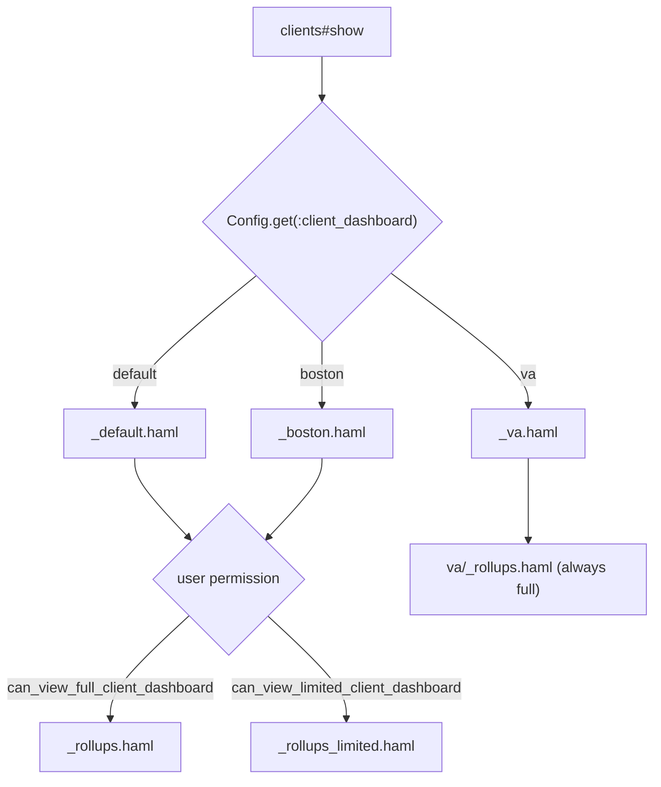

# Client Dashboards

The client dashboard is the page rendered at `/clients/:id` — the summary view a user sees for an individual client. Which sections appear is controlled by two independent settings: an **installation-level layout** (which visual "brand" of dashboard to use) and a **per-role detail level** (whether a given user sees the full dashboard or a reduced one).

## Two Independent Axes

| Axis | Controlled by | Values |
|---|---|---|
| Layout / brand | `GrdaWarehouse::Config` app setting `client_dashboard` | `default`, `boston`, `va` |
| Detail level | Role permission flags | `can_view_full_client_dashboard`, `can_view_limited_client_dashboard` |

The app renders the appropriate client dashboard based on the combination of layout and detail-level.  **NOTE: The VA layout does not make a distinction between limited and full client dashboard.**



## Layout Selection (Config)

`GrdaWarehouse::Config.get(:client_dashboard)` returns a symbol (`:default`, `:boston`, or `:va`), set via the **Client Display** section of the admin config UI (`app/views/admin/configs/_client_display.haml`) and enumerated in `GrdaWarehouse::Config.available_client_dashboards` (`app/models/grda_warehouse/config.rb`).

`ClientAccessControl::Clients#show` (`drivers/client_access_control/app/views/client_access_control/clients/show.haml`) renders that value directly as a partial name:

```haml
= render GrdaWarehouse::Config.get(:client_dashboard).to_s
```

Adding a new brand means adding a new value to `available_client_dashboards` and a matching top-level partial in `drivers/client_access_control/app/views/client_access_control/clients/`.

## Detail Level Selection (Role Permissions)

Each of the `default` and `boston` brand partials makes the same choice:

```haml
- if can_view_full_client_dashboard?
  = render 'client_access_control/clients/rollups'
- elsif can_view_limited_client_dashboard?
  = render 'client_access_control/clients/rollups_limited'
```

(the `boston` brand renders `boston/rollups` / `boston/rollups_limited` instead).

`can_view_full_client_dashboard` and `can_view_limited_client_dashboard` are Role permission flags defined in `Role.permissions_with_descriptions` (`app/models/role.rb`), both tagged `single_choice_category: 'client_dashboard'`. That tag makes them mutually exclusive in the role-editing UI — a role grants one or the other, never both. A user's effective permission is the union across all their roles, so it's still possible (through multiple roles) for a user to hold both, in which case the full dashboard wins.

`can_view_some_client_dashboard?` (`UserPermissions` concern) is `can_view_full_client_dashboard? || can_view_limited_client_dashboard?` and gates access to the dashboard at all — enforced by `require_can_view_some_client_dashboard!` on `show`, `service_range`, `rollup`, and `image` in both `ClientsController` and `ClientAccessControl::ClientsController`.

**The `va` brand does not check permissions at all** — `_va.haml` always renders `va/_rollups.haml` regardless of full/limited permission. There is no `va/_rollups_limited.haml`. Any installation using the `va` layout must still grant `can_view_full_client_dashboard` or `can_view_limited_client_dashboard` (to pass the `require_can_view_some_client_dashboard!` gate) but the content shown is the same either way.

## Rollup Sections Are Lazy-Loaded

Within either variant, each section is a placeholder div/article with a `data-partial` attribute:

```haml
.rollup{data: {partial: :demographics}}
  %h3 Demographics
```

`ClientShowPages#rollup` (`app/controllers/concerns/client_show_pages.rb`, included by both `ClientsController` and `ClientAccessControl::ClientsController`) serves these via AJAX at `GET /clients/:id/rollup/:partial`. The action checks `partial` against a hardcoded allowlist of `/clients/rollup/*` partial paths before rendering — this prevents arbitrary partial rendering from user input. Adding a new rollup section requires adding its partial path to the allowlist in that concern, in addition to creating the partial itself under `app/views/clients/rollup/`.

## Where Things Live

| Concern | Location |
|---|---|
| Config value + admin UI | `app/models/grda_warehouse/config.rb`, `app/views/admin/configs/_client_display.haml` |
| Brand partials (`_default`, `_boston`, `_va`) | `drivers/client_access_control/app/views/client_access_control/clients/` |
| Full/limited rollup partials | `.../clients/_rollups.haml`, `.../clients/_rollups_limited.haml` (and `boston/`, `va/` subdirs) |
| Permission flags | `app/models/role.rb` (`can_view_full_client_dashboard`, `can_view_limited_client_dashboard`) |
| Combined permission + controller gate | `app/models/concerns/user_permissions.rb`, `ClientShowPages` / `ClientAccessControl::ClientsController` |
| Individual rollup partial allowlist + AJAX endpoint | `app/controllers/concerns/client_show_pages.rb` |
