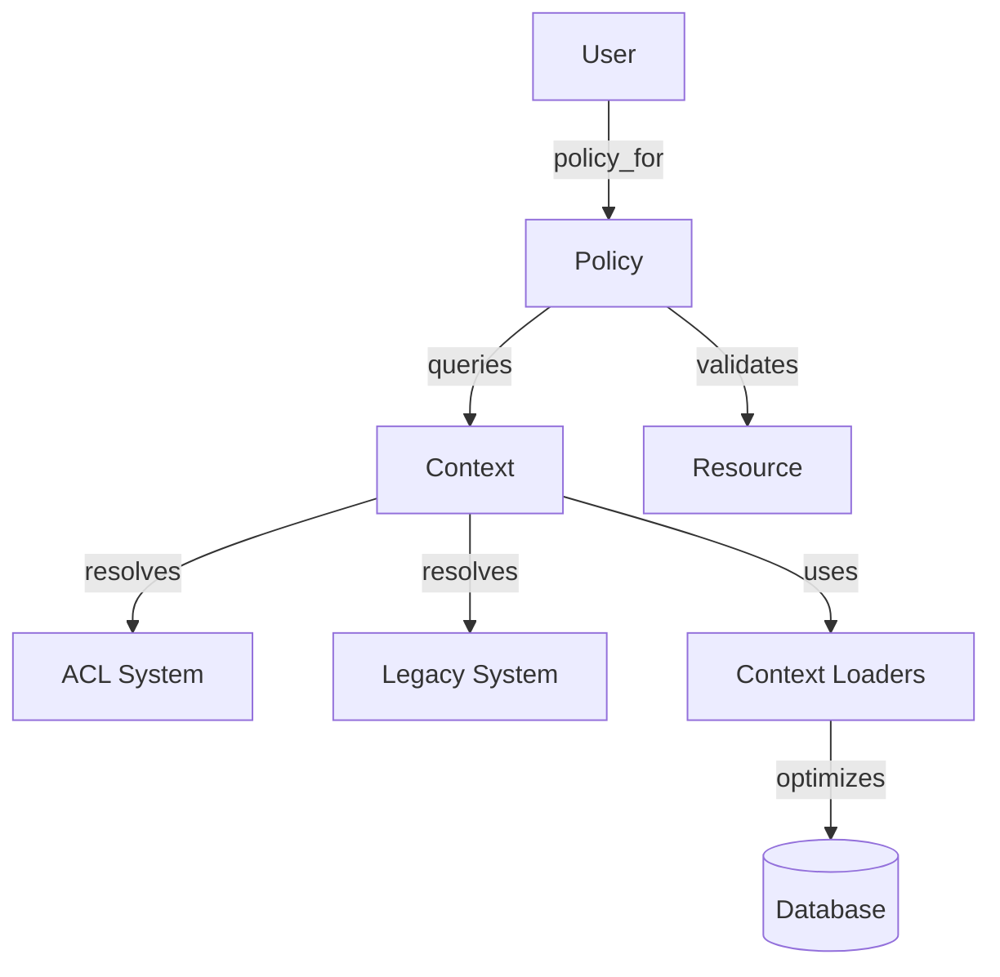

# Warehouse Auth Policies

Warehouse Auth Policies contain the business rules for determining user access to warehouse resources such as clients, projects, and data sources.

## Overview

The authorization system decouples permission checks from the underlying data models and the specific authentication mechanism (Legacy Role-based or ACL-based). Policies are initialized with a context object that resolves permissions for the current user.

## Architecture

The system consists of three main components:

- **Entry Point**: `User#policy_for(resource)` or `User#reporting_policy_for_project(project_id)` are the primary ways to obtain a policy.
- **Context Objects**: `UserAclContext` and `UserLegacyContext` encapsulate permission lookups. They provide a common interface for policies to query permissions without knowing how they are stored or resolved.
- **Context Loaders**: Specialized objects (e.g., `ClientRoiLoader`) that provide cached data loading for policies to avoid N+1 queries.
- **Policies**: Concrete classes inheriting from `BasePolicy` that define domain-specific authorization logic.

### Relationship Diagram



## Policy Implementation

Policies are located in `app/models/grda_warehouse/auth_policies/`.

- `BasePolicy`: Abstract base class providing common initialization and validation helpers.
- **Resource Policies**: for warehouse resources (e.g., `ProjectPolicy`, `SourceClientPolicy`, `DataSourcePolicy`).
- **Specialized Policies**: optimized for controlling access to sensitive data in reporting contexts (e.g., `ProjectPiiPolicy`).

## Usage

Policies are typically invoked through the `User` model.

```ruby
# Get a policy for a specific project
policy = current_user.policy_for(@project)
policy.can_view?
policy.can_edit?

# Get a PII policy for reporting
pii_policy = current_user.reporting_policy_for_project(project_id)
pii_policy.can_view_full_ssn?
```

### Preloading

When checking policies for multiple resources (e.g., in a list view), the context provides helpers to preload dependencies to avoid N+1 queries.

```ruby
context = current_user.policy_context

# Preload resource permissions
context.preload_some_dependencies(resource_ids)

# Preload through a context loader
context.some_loader.preload(resource_ids)
```

## PII Redaction

`GrdaWarehouse::PiiProvider` (`app/models/grda_warehouse/pii_provider.rb`) mediates name, SSN, DOB, photo, and HIV status display for a client, given a duck-typed `policy:` object (any object implementing `can_view_name?`, `can_view_full_ssn?`, `can_view_full_dob?`, `can_view_photo?`, `can_view_hiv_status?`, `can_view?`). Nearly every PII display path in the app — the client dashboard, HUD report drilldowns/exports (APR, CAPER, HOPWA CAPER, PIT, SPM, PATH, HMIS Data Quality Tool), and cohort grids — resolves a policy object and asks it these questions before showing a value.

### HMIS client restriction

An HMIS source client marked restricted (see [HMIS Restricted Records](../hmis/hmis-restricted-records.md)) is treated as an absolute PII block in the warehouse: `GrdaWarehouse::PiiProvider.restrict(policy, restricted:)` wraps any resolved policy in a `RestrictedPolicy` that forces every PII predicate to `false`, regardless of what the underlying policy would otherwise grant. There is no warehouse-side override permission — the only way to restore visibility is for HMIS staff to unmark the client.

Restriction status is looked up by destination client id, batched per-request via `GrdaWarehouse::AuthPolicies::ContextLoaders::ClientRestrictionLoader` (memoized on `UserBaseContext` as `client_restricted?`/`preload_client_restriction_dependencies`, the same pattern as `ClientRoiLoader`). `User#reporting_policy_for_project` accepts an optional `client_id:` to apply this wrap; omitting it (every call site not explicitly wired for restriction) leaves behavior completely unchanged.

One narrow edge case: when a report row has no `project_id` at all, `reporting_policy_for_project` returns the pre-existing `AllowPiiPolicy` fallback unaffected by restriction — this predates the restriction feature and is not expected to occur for real restricted clients, since they always come from HMIS enrollment data.

### Known limitations

Coverage is bounded by what actually calls into `PiiProvider`/the `reporting_policy_for_*` methods. The following do not honor restriction, and continue to show a restricted client's real PII:

- Non-`HudReports` warehouse exports gated by the app-wide `GrdaWarehouse::Config.get(:include_pii_in_detail_downloads)` boolean (e.g. `app/models/grda_warehouse/warehouse_reports/youth/export.rb`, `outflow_report.rb`, `non_alpha_names/index.xlsx.axlsx`) — a single install-wide toggle, unrelated to per-client restriction.
- `ApplicationHelper#ssn`/`#dob_or_age` — gate only on the viewer's general permission on an already-extracted raw value, with no per-client hook (used outside report/dashboard/cohort contexts, e.g. client edit forms).
- `analytics.client_piis` (Superset) — a completely open Scenic view with no access control in this codebase; any gating lives in the separate `superset-sync` repository's row-level security config.
- The global `User#can_view_hiv_status?` role permission (distinct from `PiiProvider`'s HIV redaction) — used in roughly ten places (disability rollup views, CAS export, report filters, HUD report cell/drilldown gating) with no client-level scoping at all.
- `HomelessSummaryReport`, `MaYyaReport`, `CoreDemographicsReport`, and `WarehouseReport::Outcomes` — these resolve PII policy via the same `PiiDisplay` concern but were not wired for restriction in this pass; `CoreDemographicsReport` in particular has no client identity available in its row data today and would need a query-shape change, not just a policy wrap.
