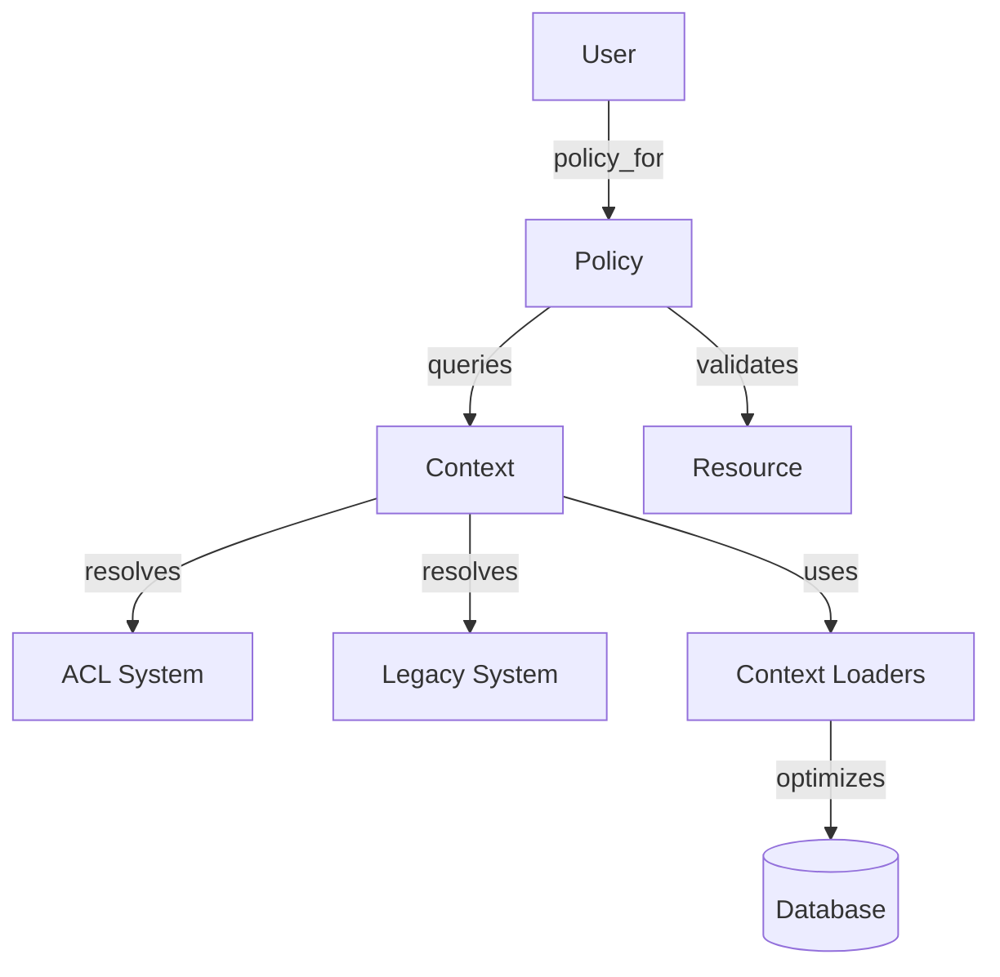

# Warehouse Auth Policies

Warehouse Auth Policies contain the business rules for determining user access to warehouse resources such as clients, projects, and data sources.

## Overview

The authorization system decouples permission checks from the underlying data models and the specific authentication mechanism (Legacy Role-based or ACL-based). Policies are initialized with a context object that resolves permissions for the current user.

## Architecture

The system consists of three main components:

- **Entry Point**: `User#policy_for(resource)` or `User#reporting_policy_for_project(project_id)` are the primary ways to obtain a policy.
- **Context Objects**: `UserAclContext` and `UserLegacyContext` encapsulate permission lookups. They provide a common interface for policies to query permissions without knowing how they are stored or resolved.
- **Context Loaders**: Specialized objects (e.g., `ClientRoiLoader`) that provide cached data loading for policies to avoid N+1 queries.
- **Policies**: Concrete classes inheriting from `BasePolicy` that define domain-specific authorization logic.

### Relationship Diagram



## Policy Implementation

Policies are located in `app/models/grda_warehouse/auth_policies/`.

- `BasePolicy`: Abstract base class providing common initialization and validation helpers.
- **Resource Policies**: for warehouse resources (e.g., `ProjectPolicy`, `SourceClientPolicy`, `DataSourcePolicy`).
- **Specialized Policies**: optimized for controlling access to sensitive data in reporting contexts (e.g., `ProjectPiiPolicy`).

## Usage

Policies are typically invoked through the `User` model.

```ruby
# Get a policy for a specific project
policy = current_user.policy_for(@project)
policy.can_view?
policy.can_edit?

# Get a PII policy for reporting
pii_policy = current_user.reporting_policy_for_project(project_id)
pii_policy.can_view_full_ssn?
```

### Preloading

When checking policies for multiple resources (e.g., in a list view), the context provides helpers to preload dependencies to avoid N+1 queries.

```ruby
context = current_user.policy_context

# Preload resource permissions
context.preload_some_dependencies(resource_ids)

# Preload through a context loader
context.some_loader.preload(resource_ids)
```

## PII Provider Instantiation

`GrdaWarehouse::PiiProvider` is built a few different ways depending on whether a policy already exists and whether restriction still needs to be applied.

`Client#pii_provider(user:)` is the standard entry point for a single client shown in isolation (e.g. the client dashboard). It resolves the user's policy for the client and applies restriction in one call.

```ruby
pii = client.pii_provider(user: current_user)
```

`Client#project_pii_provider(project:, user:, mode:)` is the entry point for project-scoped reporting, where `User#reporting_policy_for_project` already wraps the resolved policy with `PiiProvider.restrict`.

```ruby
pii = client.project_pii_provider(project: project, user: current_user, mode: :browse)
```

`GrdaWarehouse::PiiProvider.new(client, policy: GrdaWarehouse::PiiProvider.restrict(allow_policy, restricted: ...))` is used instead of `client.pii_provider(user:)` when the policy isn't sourced from resolving a `User` against the client. This occurs when a `CohortPiiPolicy` or `AllowPiiPolicy` is applied per row of a cohort or bulk report, or when restriction must be preloaded and checked across many rows rather than recomputed per client.

```ruby
policy = GrdaWarehouse::PiiProvider.restrict(
  GrdaWarehouse::AuthPolicies::CohortPiiPolicy.new(user: current_user),
  restricted: current_user.policy_context.client_restricted?(client_id),
)
pii = GrdaWarehouse::PiiProvider.new(client, policy: policy)
```

Most HUD report drilldowns and exports (APR, HOPWA CAPER, PIT, SPM, PATH, HMIS Data Quality Tool) don't have a live `Client` record, they render a denormalized, per-report `HudReports::ReportClientBase` subclass row snapshotted when the report ran. Instead of using the client PII provider they call `User#reporting_policy_for_project(project_id:, mode:, client_id:)` and pass the resulting policy to that row's own `#display_value`, which fans it out per column into `PiiProvider.viewable_name`/`viewable_ssn`/`viewable_dob`/`viewable_hiv_status`, without ever constructing a `PiiProvider` instance.

```ruby
pii_policy = current_user.reporting_policy_for_project(project_id: client.project_id, client_id: client.destination_client_id_for_pii)
client.display_value(:first_name, pii_policy: pii_policy)
```

`GrdaWarehouse::PiiProvider.from_attributes(policy:, first_name:, last_name:, middle_name:, dob:, ssn:, image:)` is used when there's no AR client record to wrap. For a plucked hash row a `PiiProviderRecordAdapter` is used so the same `policy`-driven redaction can be applied.

```ruby
policy = GrdaWarehouse::PiiProvider.restrict(GrdaWarehouse::AuthPolicies::CohortPiiPolicy.new(user: current_user), restricted: restricted)
provider = GrdaWarehouse::PiiProvider.from_attributes(policy: policy, first_name: c[:FirstName], last_name: c[:LastName], dob: c[:DOB], ssn: c[:SSN])
```

## PII Redaction

`GrdaWarehouse::PiiProvider` (`app/models/grda_warehouse/pii_provider.rb`) mediates name, SSN, DOB, photo, and HIV status display for a client, given a duck-typed `policy:` object (any object implementing `can_view_name?`, `can_view_full_ssn?`, `can_view_partial_ssn?`, `can_view_full_dob?`, `can_view_photo?`, `can_view_hiv_status?`, `can_view?`). Most PII display paths in the app, including the client dashboard, HUD report drilldowns/exports (APR, CAPER, HOPWA CAPER, PIT, SPM, PATH, HMIS Data Quality Tool), and cohort grids, and the `HomelessSummaryReport`, `MaYyaReport`, `WarehouseReport::Outcomes`, and `CoreDemographicsReport` warehouse reports, resolve a policy object and ask it these questions before showing a value.

`can_view_partial_ssn?` gates the masked (`XXX-XX-1234`) SSN, distinct from `can_view_full_ssn?`'s unmasked one. It is `true` for every policy except a restricted client's. Restriction means no SSN at all, matching `Hmis::AuthPolicies::HmisClientPolicy::Instance#can_view_partial_ssn?`.

### HMIS client restriction

An HMIS source client marked restricted (see [HMIS Restricted Records](../hmis/hmis-restricted-records.md)) is treated as a PII block in the warehouse: `GrdaWarehouse::PiiProvider.restrict(policy, restricted:)` wraps any resolved policy in a `RestrictedPolicy` that forces every PII predicate to `false`, regardless of what the underlying policy would grant. There is no warehouse-side override permission; the only way to restore visibility is for HMIS staff to unmark the client. A `RestrictedRecord` placed directly on the destination client id (there is no UI for this today, but the polymorphic `restrictable_id` allows it) restricts the same way.

**Loading strategy.** Restriction are expected to be applied infrequently and is not a bulk visibility mechanism. `GrdaWarehouse::AuthPolicies::ContextLoaders::RestrictedClientLoader` loads the full set of restricted client ids the first time a lookup occurs. This process uses three bounded queries. The data is memoized on `UserBaseContext`, which is memoized on `User#policy_context`. This ensures a request or background job only performs the load one time. The methods `client_restricted?` and `restricted?` function as a standard Set membership test.

**Per-request snapshot** The set of restricted clients is memoized on the `User` instance for the life of a request or job.  Client's who are marked restricted during a long-running task (HMIS CSV export, or similar) will remain unrestricted in that export.

**Not bounded data source.** HMIS's `restricted_ids_in_data_source` is limited to the data in a single data source on the HMIS front-end.  When we extend the client restriction to the warehouse, we restrict any related source and destination record.

### Search

Restricted clients are also excluded from every warehouse-side client search path by name or SSN — window/admin search, the client-edit merge-candidate search, the new-client duplicate check, cohort "Add Client to Cohort" search, `potential_matches`, the chronic/HUD-chronic report name filters, and the Coordinated Entry client proxy search. DOB search and exact-ID/PersonalID lookup are unaffected, matching the general rule that restriction blocks PII display and search-by-PII, not record access.

`GrdaWarehouse::Hud::Client.hmis_restricted_source_client_ids` computes the excluded id set (both source and destination ids, since restriction is tracked per source client but some search scopes can return destination rows). `ClientSearch#text_searcher` (`app/models/concerns/client_search.rb`, shared by `GrdaWarehouse::Hud::Client` and `Hmis::Hud::Client`) takes this set through an optional `exclude_ids_for_name_and_ssn:` keyword, applied only to the SSN-exact-match and free-text name-matching branches; the keyword defaults to `nil`; `Hmis::Hud::Client`'s own search methods never pass it, so `Hmis::Hud::Client.searchable_to` (see [HMIS Restricted Records](../hmis/hmis-restricted-records.md)) is unaffected by this mechanism. `GrdaWarehouse::Hud::Client.strict_search` excludes restricted destination clients from its final result set entirely, since its 3-of-4-criteria match can never be satisfied by DOB alone. The one search path that doesn't go through `text_searcher` — the new-client duplicate check (`ClientController#look_for_existing_match`) — applies the same exclusion directly to its SSN and name clauses.

### OP Analytics and Superset `analytics.client_piis`

The Scenic view `analytics.client_piis` (`db/views/analytics_client_piis_v02.sql`) enforces PII redaction for HMIS Restricted clients.  The view joins `hmis_restricted_records` and replaces `FirstName`, `MiddleName`, `LastName`, `NameSuffix`, and `SSN` with the literal `'Redacted'` when an active restriction row exists for the source client (`restrictable_type = 'Hmis::Hud::Client'`, `restrictable_id` matching the source `Client` id, `deleted_at IS NULL`). `DOB` is not redacted in this view so that the transformations can calculate age. Row-level security in the `superset-sync` repository governs which clients a given Superset user can query.

### HMIS CSV Export

`Export::RestrictedClientPiiTransform` (`app/models/export/restricted_client_pii_transform.rb`) is a Kiba transform appended last in the FY2022/2024/2026 client exporters' `Client.transforms` (`drivers/hmis_csv_twenty_twenty_{two,four,six}/app/models/hmis_csv_twenty_twenty_*/exporter/client.rb`). For a restricted client's row, it replaces `FirstName`, `MiddleName`, `LastName`, and `NameSuffix` with `GrdaWarehouse::PiiProvider::REDACTED` and blanks `SSN`, setting `SSNDataQuality` to 99 so the column stays import-valid. `DOB` is left untouched, matching `analytics.client_piis`.

Hashed (`hash_status == 4`) and faked (`faked_pii`) exports are **not** redacted — the transform returns the row unchanged in either case. A SHA-256 hash of a restricted client's name/SSN is already irreversible, and a faked value can't be reversed without access to the database that still holds the real PII, so redacting on top of either would add no protection.

### Known limitations

Coverage is bounded by what actually calls into `PiiProvider`/the `reporting_policy_for_*` methods. The following do not honor restriction, and continue to show a restricted client's real PII:

- `drivers/ma_reports/app/models/ma_reports/csg_engage/report_components/household_member.rb` — external state submission; a product decision on how (or whether) to redact restricted clients there is pending.
- `ApplicationHelper#ssn`/`#dob_or_age`, used by the ad-hoc upload review (`app/views/ad_hoc_data_sources/uploads/show.haml`) for unmatched rows — that workflow needs the real name, SSN, and DOB to let staff match a row by hand.
- Hashed and faked HMIS CSV exports (see "HMIS CSV Export" above) are not redacted — the hash is irreversible on its own, and a faked value is only reversible with access to the source database.
- Aggregate `can_view_hiv_status?` gates (`filter_base`, `push_clients_to_cas`, `disability_summary`, HUD PIT/DQ cells, `ce_performance` populations) — they gate counts, not a named client's row, so restriction doesn't apply. The per-client disability rollup views (`clients/rollup/_disabilities`, `clients/rollup/_disability_types`) and the CAS readiness forms do honor restriction.
- `warehouse_reports/cas/non_hmis_clients` renders raw candidate name/SSN/DOB from an external CAS import with no warehouse client id to gate on — these rows aren't yet linked to any warehouse identity, so there's no restriction to check.

### Report detail rows

Two conventions cover restriction-aware PII display in report detail/support views, chosen by row shape:

- **Array rows aligned to a header list** (a plucked/hash row, headers decide which positions are PII): `WarehouseReports::PiiDetailRows#redact_pii_in_row(row, headers:, user:, mode:, client_id_index: 0, project_id: nil)` (`app/models/concerns/warehouse_reports/pii_detail_rows.rb`) redacts `First Name`/`Last Name`/`DOB`/`SSN` columns in place and returns a new row, given the warehouse client id at `client_id_index`.
- **Per-row report models** (a report's own `Client`/`Enrollment` AR record): a `detail_value(key, user:, mode:)` instance method, memoizing a `PiiProvider` per `[record, mode]`, returns the redacted value for PII keys and the raw attribute otherwise.
