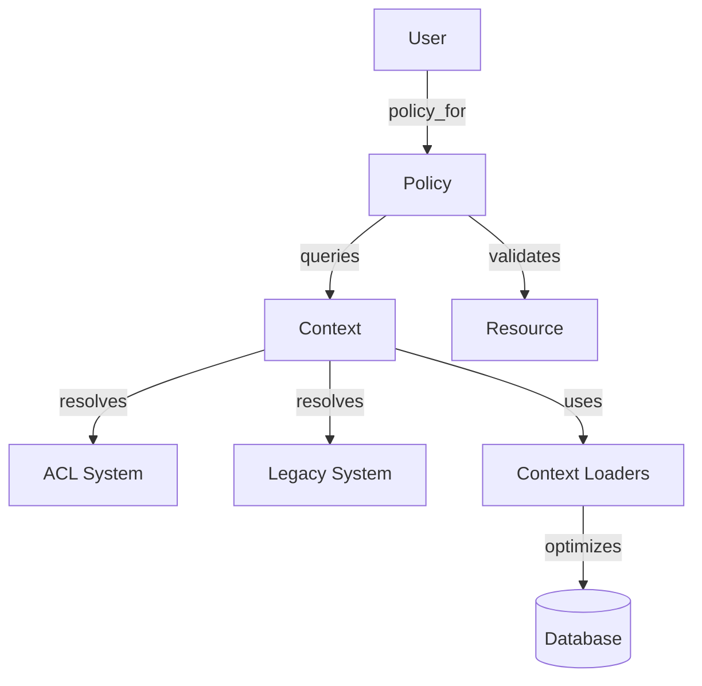

# Warehouse Auth Policies

Warehouse Auth Policies contain the business rules for determining user access to warehouse resources such as clients, projects, and data sources.

## Overview

The authorization system decouples permission checks from the underlying data models and the specific authentication mechanism (Legacy Role-based or ACL-based). Policies are initialized with a context object that resolves permissions for the current user.

## Architecture

The system consists of three main components:

- **Entry Point**: `User#policy_for(resource)` or `User#reporting_policy_for_project(project_id)` are the primary ways to obtain a policy.
- **Context Objects**: `UserAclContext` and `UserLegacyContext` encapsulate permission lookups. They provide a common interface for policies to query permissions without knowing how they are stored or resolved.
- **Context Loaders**: Specialized objects (e.g., `ClientRoiLoader`) that provide cached data loading for policies to avoid N+1 queries.
- **Policies**: Concrete classes inheriting from `BasePolicy` that define domain-specific authorization logic.

### Relationship Diagram



## Policy Implementation

Policies are located in `app/models/grda_warehouse/auth_policies/`.

- `BasePolicy`: Abstract base class providing common initialization and validation helpers.
- **Resource Policies**: for warehouse resources (e.g., `ProjectPolicy`, `SourceClientPolicy`, `DataSourcePolicy`).
- **Specialized Policies**: optimized for controlling access to sensitive data in reporting contexts (e.g., `ProjectPiiPolicy`).

## Usage

Policies are typically invoked through the `User` model.

```ruby
# Get a policy for a specific project
policy = current_user.policy_for(@project)
policy.can_view?
policy.can_edit?

# Get a PII policy for reporting
pii_policy = current_user.reporting_policy_for_project(project_id)
pii_policy.can_view_full_ssn?
```

### Preloading

When checking policies for multiple resources (e.g., in a list view), the context provides helpers to preload dependencies to avoid N+1 queries.

```ruby
context = current_user.policy_context

# Preload resource permissions
context.preload_some_dependencies(resource_ids)

# Preload through a context loader
context.some_loader.preload(resource_ids)
```

## PII Redaction

`GrdaWarehouse::PiiProvider` (`app/models/grda_warehouse/pii_provider.rb`) mediates name, SSN, DOB, photo, and HIV status display for a client, given a duck-typed `policy:` object (any object implementing `can_view_name?`, `can_view_full_ssn?`, `can_view_partial_ssn?`, `can_view_full_dob?`, `can_view_photo?`, `can_view_hiv_status?`, `can_view?`). Nearly every PII display path in the app — the client dashboard, HUD report drilldowns/exports (APR, CAPER, HOPWA CAPER, PIT, SPM, PATH, HMIS Data Quality Tool), and cohort grids — resolves a policy object and asks it these questions before showing a value.

`can_view_partial_ssn?` gates the masked (`XXX-XX-1234`) SSN, distinct from `can_view_full_ssn?`'s unmasked one. It is `true` for every policy except a restricted client's — restriction means no SSN at all, matching `Hmis::AuthPolicies::HmisClientPolicy::Instance#can_view_partial_ssn?`.

### HMIS client restriction

An HMIS source client marked restricted (see [HMIS Restricted Records](../hmis/hmis-restricted-records.md)) is treated as an absolute PII block in the warehouse: `GrdaWarehouse::PiiProvider.restrict(policy, restricted:)` wraps any resolved policy in a `RestrictedPolicy` that forces every PII predicate to `false`, regardless of what the underlying policy would otherwise grant. There is no warehouse-side override permission — the only way to restore visibility is for HMIS staff to unmark the client. A `RestrictedRecord` placed directly on the destination client id (there's no UI for this today, but the polymorphic `restrictable_id` doesn't prevent it) restricts the same way.

**Loading strategy.** Restriction is documented as "for the occasional client whose record needs extra protection, not a bulk visibility mechanism" — so rather than looking up restriction per batch of ids (the earlier design), `GrdaWarehouse::AuthPolicies::ContextLoaders::RestrictedClientLoader` loads the *entire* restricted-client id set once, in three bounded queries, the first time any lookup is made. It's memoized on `UserBaseContext` (itself memoized on `User#policy_context`), so a request or background job pays the load at most once. `client_restricted?`/`restricted?` then become a plain Set membership test — no preloading step is needed anywhere, unlike `preload_project_dependencies`. A source id, a destination id, and an *unmerged* source id (one with no `warehouse_clients` row at all) all answer correctly, because the loader expands the raw `Hmis::RestrictedRecord` ids by one hop across `warehouse_clients` to their destination and back out to sibling source ids. Soft-deleted `warehouse_clients` rows are excluded from that expansion, matching how the destination side of the old per-client query filtered via `acts_as_paranoid`.

`User#reporting_policy_for_project` accepts an optional `client_id:` to apply this wrap; omitting it (every call site not explicitly wired for restriction) leaves behavior completely unchanged. When a report row has no `project_id` at all, `reporting_policy_for_project` still returns the pre-existing `AllowPiiPolicy` fallback (predates the restriction feature), but wraps it with the same restriction check applied to every other path — a restricted `client_id` still forces PII off even without a `project_id`.

**Per-request snapshot, deliberately not kept fresh.** Because the loaded set is memoized on the `User` instance for the life of the request/job, a client restricted mid-request may still have already-read data reflect the old state (e.g. mid-export). This is intentional: a client in an earlier batch of the same export would have been included regardless of when the toggle happened, so re-checking partway through buys nothing but the appearance of coverage. There is no `reload!`/cache-busting hook, unlike HMIS's own `clear_client_restriction_cache!` (`hmis/auth_policies/user_context.rb`) — that one exists because an HMIS mutation can mark a client restricted mid-request; nothing in the warehouse writes restriction, so there's no equivalent need.

**Cannot bound by data source.** Unlike HMIS's `restricted_ids_in_data_source`, the warehouse loader cannot scope its query to a single data source — the merge graph linking source clients to a destination is inherently cross-data-source, and restricting the query would silently miss siblings merged from elsewhere.

### Known limitations

Coverage is bounded by what actually calls into `PiiProvider`/the `reporting_policy_for_*` methods. The following do not honor restriction, and continue to show a restricted client's real PII:

- Non-`HudReports` warehouse exports gated by the app-wide `GrdaWarehouse::Config.get(:include_pii_in_detail_downloads)` boolean (e.g. `app/models/grda_warehouse/warehouse_reports/youth/export.rb`, `outflow_report.rb`, `non_alpha_names/index.xlsx.axlsx`) — a single install-wide toggle, unrelated to per-client restriction.
- `ApplicationHelper#ssn`/`#dob_or_age` — gate only on the viewer's general permission on an already-extracted raw value, with no per-client hook (used outside report/dashboard/cohort contexts, e.g. client edit forms).
- `analytics.client_piis` (Superset) — a completely open Scenic view with no access control in this codebase; any gating lives in the separate `superset-sync` repository's row-level security config.
- The global `User#can_view_hiv_status?` role permission (distinct from `PiiProvider`'s HIV redaction) — used in roughly ten places (disability rollup views, CAS export, report filters, HUD report cell/drilldown gating) with no client-level scoping at all.
- `HomelessSummaryReport`, `MaYyaReport`, `CoreDemographicsReport`, and `WarehouseReport::Outcomes` — these resolve PII policy via the same `PiiDisplay` concern but were not wired for restriction in this pass; `CoreDemographicsReport` in particular has no client identity available in its row data today and would need a query-shape change, not just a policy wrap.
