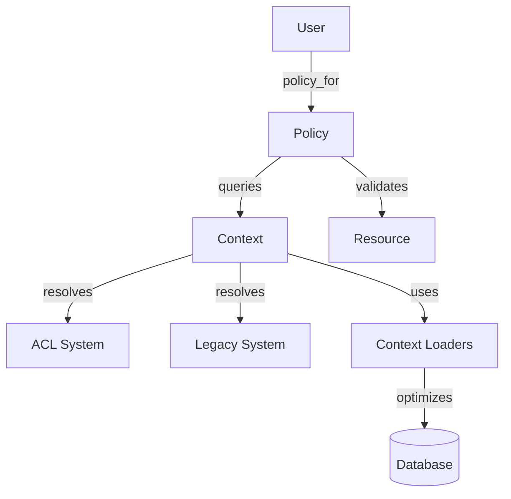

# Warehouse Auth Policies

Warehouse Auth Policies contain the business rules for determining user access to warehouse resources such as clients, projects, and data sources.

Implementation details (query shapes, loader internals, key files, and patterns not to repeat) are in the domain pack: [Warehouse policies](../../domain-pack/authorization/warehouse-policies.md) and [PII and restricted clients](../../domain-pack/warehouse/pii-and-restricted-clients.md).

## Overview

The authorization system decouples permission checks from the underlying data models and the specific authentication mechanism (Legacy Role-based or ACL-based). Policies are initialized with a context object that resolves permissions for the current user.

## Architecture

The system consists of four main components:

- **Entry Point**: `User#policy_for(resource)` or `User#reporting_policy_for_project(project_id)` are the primary ways to obtain a policy.
- **Context Objects**: `UserAclContext` and `UserLegacyContext` encapsulate permission lookups. They provide a common interface for policies to query permissions without knowing how they are stored or resolved.
- **Context Loaders**: objects owned by the context that load and cache the data policies need, so checking many records doesn't cause N+1 queries.
- **Policies**: Concrete classes inheriting from `BasePolicy` that define domain-specific authorization logic.

### Relationship Diagram


```mermaid
graph TD
    User -->|policy_for| Policy
    Policy -->|queries| Context
    Context -->|resolves| ACLs[ACL System]
    Context -->|resolves| Legacy[Legacy System]
    Context -->|uses| Loaders[Context Loaders]
    Loaders -->|optimizes| DB[(Database)]
    Policy -->|validates| Resource
```

## Policy Implementation

Policies are located in `app/models/grda_warehouse/auth_policies/`.

- `BasePolicy`: Abstract base class providing common initialization and validation helpers.
- **Resource Policies**: for warehouse resources (e.g., `ProjectPolicy`, `SourceClientPolicy`, `DataSourcePolicy`).
- **Specialized Policies**: optimized for controlling access to sensitive data in reporting contexts (e.g., `ProjectPiiPolicy`).

## Usage

Policies are typically invoked through the `User` model.

```ruby
# Get a policy for a specific project
policy = current_user.policy_for(@project)
policy.can_view?
policy.can_edit?

# Get a PII policy for reporting
pii_policy = current_user.reporting_policy_for_project(project_id)
pii_policy.can_view_full_ssn?
```

### Preloading

Before checking policies, PII, or restriction across a list of clients, call `preload_client_dependencies` once with the list. It accepts source or destination ids, widens them to each whole warehouse identity, and loads everything a client policy or PII check reads in a small, fixed number of queries.

```ruby
context = current_user.policy_context
context.preload_client_dependencies(client_ids)
```

For project-keyed report rows, where there's no client list, use `preload_project_dependencies(project_ids)`.

Single-client pages such as the client dashboard need no preload; `DestinationClientPolicy` preloads its own client.

When a context falls back to one-at-a-time lookups for more than a handful of distinct clients, it raises in development and test and sends a Sentry warning in staging and production. The fix is a preload where the list is loaded, not a higher threshold.

## PII Provider Instantiation

`GrdaWarehouse::PiiProvider` is built a few different ways depending on whether a policy already exists and whether restriction still needs to be applied.

`Client#pii_provider(user:)` is the standard entry point for a single client shown on its own (e.g. the client dashboard). It resolves the user's policy for the client and applies restriction.

```ruby
pii = client.pii_provider(user: current_user)
```

`Client#project_pii_provider` is the entry point for project-scoped reporting, where `User#reporting_policy_for_project` has already applied restriction.

```ruby
pii = client.project_pii_provider(project: project, user: current_user, mode: :browse)
```

Build the provider yourself, wrapping the policy with `PiiProvider.restrict`, when the policy doesn't come from resolving the user against the client — for example a cohort or bulk report that applies one policy to every row.

```ruby
policy = GrdaWarehouse::PiiProvider.restrict(
  GrdaWarehouse::AuthPolicies::CohortPiiPolicy.new(user: current_user),
  restricted: current_user.policy_context.client_restricted?(client_id),
)
pii = GrdaWarehouse::PiiProvider.new(client, policy: policy)
```

HUD report drilldowns and exports render the report's own snapshotted client rows rather than a live `Client`. They get a policy from `User#reporting_policy_for_project` and pass it to the row's `#display_value`, which redacts per column without building a provider.

```ruby
pii_policy = current_user.reporting_policy_for_project(project_id: client.project_id, client_id: client.destination_client_id_for_pii)
client.display_value(:first_name, pii_policy: pii_policy)
```

When there's no client record at all (plucked columns or a hash row), use `GrdaWarehouse::PiiProvider.from_attributes(policy:, ...)` so the same policy-driven redaction applies.

## PII Redaction

`GrdaWarehouse::PiiProvider` mediates display of a client's name, SSN, DOB, photo, and HIV status. It takes any policy object that answers the `can_view_*?` PII questions and asks them before showing each value. The client dashboard, HUD report drilldowns and exports, cohort grids, and most warehouse reports display PII through it.

The masked SSN (`XXX-XX-1234`) is a separate permission from the full SSN. Every policy allows it except a restricted client's: restriction means no SSN at all, matching HMIS.

### Client restriction

Two states hide a client's PII in the warehouse:

- An HMIS client marked restricted (see [HMIS Restricted Records](../hmis/hmis-restricted-records.md)).
- A client whose warehouse identity has aged out under [Client Data Retention](client-data-retention.md).

Either one blocks PII for every warehouse user, regardless of role or permissions; there is no warehouse-side override. `current_user.policy_context.client_restricted?(client_id)` answers for both states. Visibility returns when HMIS staff unmark the client, or when the identity has new activity and the next retention run clears it.

Restriction applies to the whole warehouse identity. HMIS restriction is limited to a single data source on the HMIS front end, but in the warehouse a restriction on any source client hides the destination and every other source merged into it.

Hidden status is looked up a page of clients at a time, never loaded whole, so code that checks restriction for a list of clients must preload first (see [Preloading](#preloading)).

The answer is a snapshot for the life of a request or job. A client restricted or marked inactive while a long-running export is in progress stays visible in that export.

Fragment caches that render a client's PII must include `client_restricted?(client_id)` in their cache key, so restricting or marking a client busts that client's fragments.

### Search

Hidden clients are excluded from every warehouse-side client search by name or SSN. Search by DOB and lookup by exact warehouse id or PersonalID still find them: restriction blocks PII display and search by PII, not access to the record.

New search code that matches on name or SSN should go through `Client.text_search`, or add `GrdaWarehouse::HiddenClients.not_hidden(column)` to its query. HMIS front-end search has its own restriction handling (see [HMIS Restricted Records](../hmis/hmis-restricted-records.md)) and is not affected.

Pass `user:` to limit results to `Client.searchable_to(user)`. `text_search` checks visibility against its matches only, because building a user's whole searchable set takes seconds for users who can see most clients.

### OP Analytics and Superset `analytics.client_piis`

The `analytics.client_piis` view redacts name and SSN for the same hidden clients, computed in SQL. DOB is not redacted so that the transformations can calculate age. Row-level security in the `superset-sync` repository governs which clients a given Superset user can query.

### HMIS CSV Export

HMIS CSV exports redact hidden clients in `Client.csv`: `FirstName`, `MiddleName`, `LastName`, and `NameSuffix` are replaced with the redacted placeholder, and `SSN` is blanked with `SSNDataQuality` set to 99 so the file still imports. `DOB` is left untouched, matching `analytics.client_piis`.

Hashed and faked exports are **not** redacted. A hash of a restricted client's name or SSN is already irreversible, and a faked value can't be reversed without access to the database that holds the real PII, so redacting either would add no protection.

### Known limitations

Redaction only covers code that goes through `PiiProvider` or the `reporting_policy_for_*` methods. These still show a hidden client's real PII:

- CSG Engage state submission — a product decision on how, or whether, to redact there is pending.
- Ad hoc upload review, for rows that haven't been matched — staff need the real name, SSN, and DOB to match a row by hand.
- Aggregate HIV-status permission checks in reports and filters — they gate counts, not a named client's row. The per-client disability views and CAS readiness forms do honor restriction.
- The CAS non-HMIS clients report — its rows come from a CAS import and aren't linked to a warehouse client yet, so there's no restriction to check.

### Report detail rows

Two conventions cover restriction-aware PII in report detail views, chosen by row shape:

- **Array rows aligned to a header list**: `WarehouseReports::PiiDetailRows#redact_pii_in_row` redacts the name, DOB, and SSN columns, given the position of the warehouse client id in the row.
- **Per-row report models** (a report's own client or enrollment record): a `detail_value(key, user:, mode:)` method returns the redacted value for PII keys and the raw attribute otherwise.
