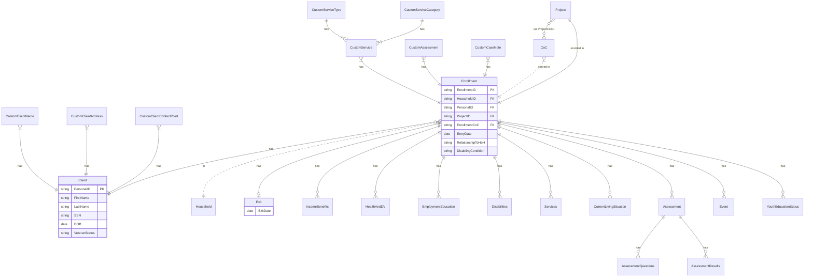
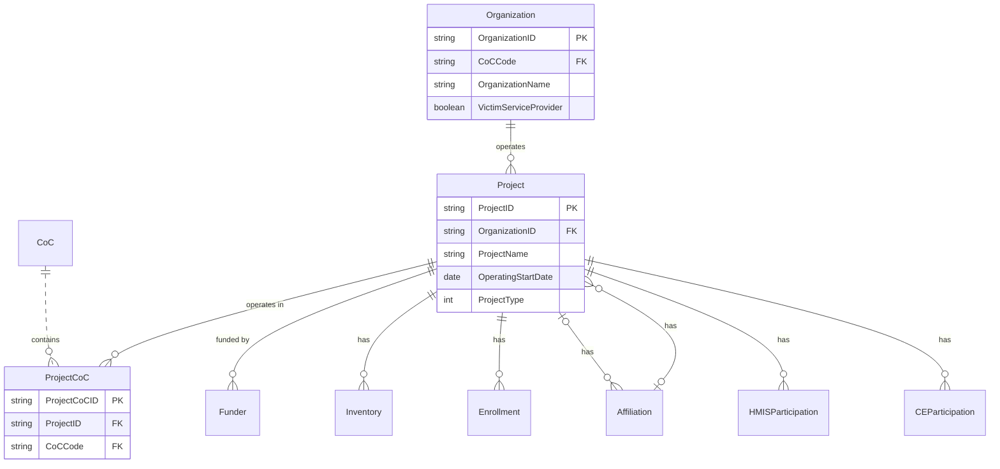

# HMIS HUD CSV data model

Based on:
HMIS CSV FORMAT Specifications FY2024
VERSION 1.4

## Key Relationships

* One Organization can have many Projects
* One Project can have many Enrollments
* One Client can have many Enrollments
* Each Enrollment is tied to exactly one Project and one Client
* Each Enrollment can have multiple associated services, assessments, and other records

## Enrollment ERD

Note "CoC" and "Household" are not formally defined but are implied or virtual entities

## Project ERD

