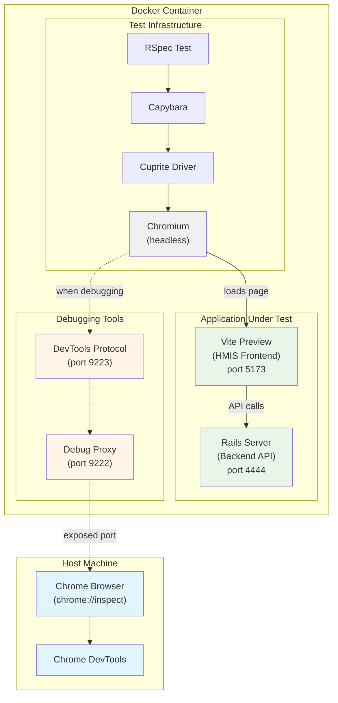

# E2E Testing for HMIS

We have end-to-end tests located in [drivers/hmis/spec/system/hmis](spec/system/hmis).
This guide covers how to run and develop E2E tests locally.

## Background and Testing Philosophy

The goal of these tests is to catch regressions, especially in the UI. The tests use [Capybara](https://github.com/teamcapybara/capybara), which allows us to test our [frontend](https://github.com/greenriver/hmis-frontend/) using our existing factories to mock the backend models. This means these tests are testing both UI and API behavior.

Since E2E tests are expensive -- slow to run and fiddly to write/update -- we should avoid testing parts of the interface where we anticipate major redesign or other churn, and we should avoid using E2E tests to test logic that could be tested more efficiently in another way. For example, we would use an E2E test to verify that form validation messages are displayed appropriately to the user, but we would not write E2E tests exercising all the different validations on every field; this kind of logic should be tested using an API or model test.

## Architecture Overview



**Key Components:**
- **RSpec + Capybara + Cuprite**: Test framework that controls the browser
- **Chromium**: Headless browser that executes the tests
- **Vite Preview**: Serves the compiled HMIS frontend (port 5173)
- **Rails Server**: Backend GraphQL API (port 4444)
- **Debug Proxy**: Exposes Chromium's DevTools for inspection (port 9222 → 9223)

## Develop E2E Tests Locally

1. Open a Docker shell.
    ```bash
    docker compose run --rm \
      --env CHROME_DEBUGGING_PORT=${CHROME_DEBUGGING_PORT:-9223} \
      --env CHROME_DEBUGGING_PROXY_PORT=${CHROME_DEBUGGING_PROXY_PORT:-9222} \
      --publish ${CHROME_DEBUGGING_PROXY_PORT:-9222}:${CHROME_DEBUGGING_PROXY_PORT:-9222} \
      shell  # `dcr shell --publish ...` if you have that alias
    ```

2. In the Docker shell, run the `run_hmis_system_tests` script, indicating the branch of the `hmis-frontend` repo you want to test. The `--dev` flag keeps the frontend server running in the foreground for development.

    ```bash
    BRANCH_NAME=release-X ./bin/run_hmis_system_tests.sh --dev
    ```

    You can specify multiple fallback branches separated by colons, although this is mostly used in CI to guess at the right branch:
    ```bash
    BRANCH_NAME=my-feature-branch:main ./bin/run_hmis_system_tests.sh --dev
    ```

3. In a new terminal tab, enter the same Docker _container_ where you are running the frontend (opening a new shell session):
    ```bash
    docker exec -it $(docker ps -aqf "name=^hmis-warehouse-shell-run" | head -1) /bin/bash
    ```
    Note: If that doesn't work for you, get the Container ID from `docker ps` and pass that instead of the `$()` clause.

4. Run the rspec test(s) in that container:
    ```bash
    DISABLE_SPRING=1 HOSTNAME=`hostname` RUN_SYSTEM_TESTS=true RAILS_ENV=test CAPYBARA_APP_HOST="http://$HOSTNAME:5173" rspec -f d -P "drivers/hmis/spec/system/hmis/ce/unit_management_spec.rb"
    ```
    Note: `CAPYBARA_APP_HOST` is set to the container's internal hostname to ensure Capybara can connect to the Vite server.


## Debugging

The `debug` helper, defined in [spec/support/e2e_tests.rb](../../spec/support/e2e_tests.rb), has two modes:

- **Browser Inspection**: Add `debug` on its own line. The test will pause execution, allowing you to inspect the page in a browser. See [Interactive Browser Session](#interactive-browser-session) for details.
- **Ruby REPL**: Add `debug(binding)`. This will open a `pry` (or `irb`) session for interactive debugging within the test's execution context.


### Interactive Browser Session

To inspect the page in a browser while debugging, you can run the test with the `CHROME_DEBUGGING_PORT` environment variable. This allows you to connect to the Chromium instance running inside the Docker container.

1.  Set the `CHROME_DEBUGGING_PORT` in your `.env.local` file or export it in your shell:
    ```bash
    export CHROME_DEBUGGING_PORT=9223
    ```

2.  Run your test as usual. When the `debug` statement is hit, you'll see a message in the console with a URL.

3.  In your host Chrome browser, open `chrome://inspect`. The paused pages should appear automatically under "Remote Target"—click "inspect" to attach Chrome DevTools to the live session.

    Note: The proxy defaults to port 9222 (Chrome's default discovery port), which is `CHROME_DEBUGGING_PORT - 1`. If you need to use a different port (e.g., due to conflicts), set `CHROME_DEBUGGING_PROXY_PORT` explicitly and add that target manually in `chrome://inspect`.


### Other Debugging Tips
- Use `print page.body` to print the page contents at a given point

## Run Full E2E Test Suite Locally

This script is designed to be run as part of a CI pipeline. It clones the frontend repo into a temporary directory, serves the frontend using yarn preview, runs the system tests against that frontend, and then shuts everything down and cleans up after the tests finish running.

1. Open a Docker shell (use the same command from [Develop E2E Tests Locally](#develop-e2e-tests-locally) above, or just `docker compose run --rm shell` if you don't need debugging).

2. In the Docker shell, run the `run_hmis_system_tests` script, indicating the branch of the `hmis-frontend` repo you want to test:
    ```bash
    BRANCH_NAME=branch-name-to-test ./bin/run_hmis_system_tests.sh
    ```

    The script supports fallback branches (useful for testing feature branches that might not exist in all repos):
    ```bash
    BRANCH_NAME=my-feature-branch:main ./bin/run_hmis_system_tests.sh
    ```
