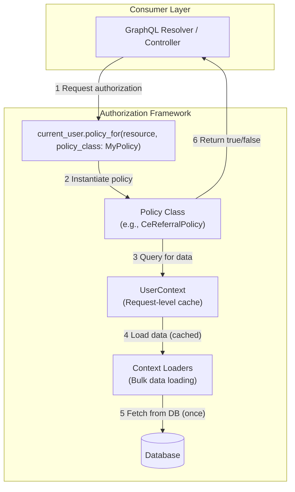

# HMIS Authorization Policy Architecture

The goal of the authorization policy is to centralize authorization logic, making it more explicit, maintainable, and performant.

This pattern is inspired by gems like Pundit but is custom-built for our specific needs, particularly around efficient data loading in a complex domain.

## Core Components

### 1. **Policy Classes**
- **Location**: `drivers/hmis/app/models/hmis/auth_policies/`
- **Purpose**: Contains the core authorization logic for specific resources
- **Convention**: Each policy answers boolean questions like `can_view?`, `can_create?`, `can_perform?`

**Example Policy:**
```ruby
class Hmis::AuthPolicies::CeReferralPolicy < Hmis::AuthPolicies::BasePolicy
  def can_view?
    return true if project_permissions.include?(:can_view_referrals)
    # Additional rules...
  end

  def can_perform?(step:)
    return true if project_permissions.include?(:can_perform_any_referral_tasks)
    # Check if assigned to this specific step...
  end
end
```

### 2. **UserContext** (Request-Level Cache)
- **Location**: `drivers/hmis/app/models/hmis/auth_policies/user_context.rb`
- **Purpose**: Facade that provides authorization data to policies with heavy memoization
- **Key Feature**: Context is shared across policies

**What it provides:**
```ruby
context.project_permissions(project_id)  # => Set of permissions for a project
context.assigned_referral_step_ids           # => Set of step IDs user is assigned to
context.potential_permissions                # => All permissions user could have
```

### 3. **Context Loaders**
- **Location**: `drivers/hmis/app/models/hmis/auth_policies/context_loaders/`
- **Purpose**: Efficient batch loading of authorization data from the database
- **Examples**:
  - `HmisProjectAccessGroupLoader` - loads access groups for projects
  - `CeReferralAssignmentLoader` - loads referral assignments for users

### 4. **Consumers** (GraphQL/Controllers)
- **Location**: GraphQL Resolvers, Controllers, etc.
- **Usage**: Call `user.policy_for(resource, policy_class: MyPolicy)` then check permissions

## Architecture Flow



## Usage Patterns

### Basic Authorization Check
```ruby
# In a GraphQL mutation
def resolve(referral_id:)
  referral = Hmis::Ce::Referral.find(referral_id)
  access_denied! unless policy_for(referral, policy_class: Hmis::AuthPolicies::CeReferralPolicy).can_view?
  # ... continue with business logic
end
```

### Class-Level Authorization
```ruby
# Check if user can perform any staff assignments
def staff_assignments
  return Hmis::StaffAssignment.none unless policy_for(Hmis::StaffAssignment, policy_class: Hmis::AuthPolicies::StaffAssignmentPolicy).can_index?
  # ... return assignments
end
```

### Complex Authorization with Context
```ruby
# Authorization that depends on multiple factors
def can_create_referral?(client:)
  return false unless client.data_source_id == user.hmis_data_source_id
  return false unless context.project_role_permissions(opportunity.project_id).include?(:can_start_referrals)
  true
end
```

## Adding a New Policy

1. **Create the policy class:**
```ruby
# drivers/hmis/app/models/hmis/auth_policies/my_resource_policy.rb
class Hmis::AuthPolicies::MyResourcePolicy < Hmis::AuthPolicies::BasePolicy
  def can_view?
    # your logic here
  end

  protected

  def validate_resource!(arg) = ensure_arg_type!(arg, Hmis::MyResource)
end
```

2. **Write tests:**
```ruby
# spec/models/hmis/auth_policies/my_resource_policy_spec.rb
RSpec.describe Hmis::AuthPolicies::MyResourcePolicy do
  let(:user) { create(:hmis_user) }
  let(:resource) { create(:my_resource) }
  let(:policy) { user.policy_for(resource, policy_class: Hmis::AuthPolicies::MyResourcePolicy) }

  it 'allows viewing with proper permissions' do
    create_access_control(user, resource, with_permission: [:can_view_my_resource])
    expect(policy.can_view?).to be true
  end
end
```

## Performance Considerations

- **Memoization**: All expensive operations are memoized at the UserContext level
- **Bulk Loading**: Context can support preloading pages of records to avoid N+1 queries
- **Request Scope**: UserContext is created once per request and reused
