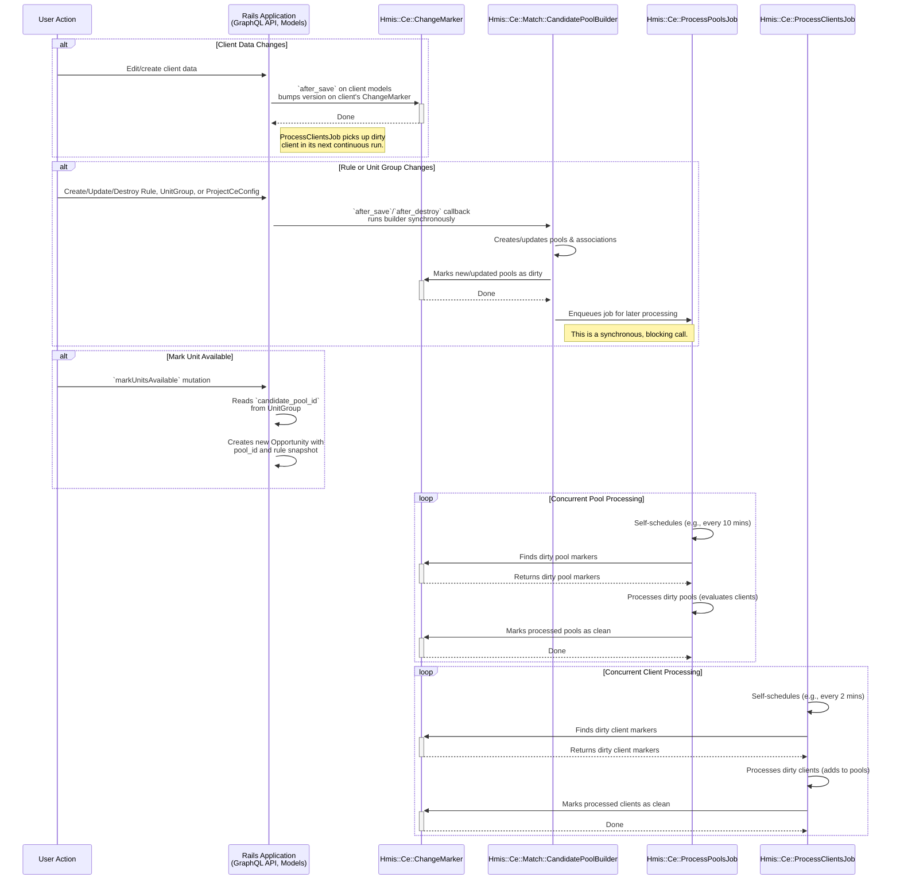

# Coordinated Entry (CE) Change Tracking System

The change tracking system for Coordinated Entry (CE) efficiently processes client and housing opportunity updates for eligibility and prioritization.

## System Overview

The change tracking system addresses the performance challenges of full reprocessing by implementing an incremental update mechanism. Instead of re-evaluating all clients and candidate pools whenever data changes, this system identifies only the records that have been modified ("dirty" records) and processes them in batches.

This is achieved through a versioning system managed by the `Hmis::Ce::ChangeMarker` model and two specialized self-scheduling background jobs that continuously process these changes in parallel. Pool maintenance is handled reactively through model callbacks, ensuring the system is always in a consistent state.

### Core Components

- **`Hmis::Ce::ChangeMarker`**: A polymorphic model that tracks the state of other records (currently `GrdaWarehouse::Hud::Client` and `Hmis::Ce::Match::CandidatePool`). It uses `current_version` and `processed_version` to determine if a record is "dirty."
- **`Hmis::Ce::Match::CandidatePoolBuilder`**: A service object that serves as the main component for maintaining candidate pools. It is triggered synchronously by model callbacks and a daily Rake task to create pools, associate them with `UnitGroup`s, and manage stale flags on `Opportunity` records.
- **`Hmis::Ce::ProcessPoolsJob`**: A self-scheduling job that processes dirty candidate pools on the long-running queue. It is enqueued by the `CandidatePoolBuilder` or the nightly Rake task.
- **`Hmis::Ce::ProcessClientsJob`**: A self-scheduling job that processes dirty clients on the short-running queue for fast updates. It uses non-blocking per-pool locks to coordinate with the pool processor.
- **`Hmis::MarkClientAsDirtyBehavior`**: A concern included in various HUD models to automatically mark a client as dirty whenever their data is saved.
- **`Hmis::Ce::Match::UnitGroupRuleResolver` & `Hmis::Ce::Match::CandidatePoolRepository`**: Service classes used by the builder to resolve rule hierarchies and manage the persistence of candidate pools.

### Event Triggers and Actions

The following table summarizes the key events that trigger actions within the CE system:

| Event/Trigger                                            | Synchronous Actions                                                                                                                                                                                            | Asynchronous Actions (Background Jobs)                                                              |
| -------------------------------------------------------- | -------------------------------------------------------------------------------------------------------------------------------------------------------------------------------------------------------------- | --------------------------------------------------------------------------------------------------- |
| **Client data is updated** (via API or other tasks)      | The `MarkClientAsDirtyBehavior` concern increments the `current_version` on the client's `ChangeMarker` record.                                                                                                | `ProcessClientsJob` is continuously running and will pick up the dirty marker in its next batch.    |
| **`Rule` or `UnitGroup` is created/updated/destroyed**   | An ActiveRecord callback acquires a lock and runs `CandidatePoolBuilder.call`. The builder creates/updates pools, associates them with unit groups, and marks any newly created pools as dirty.                 | `CandidatePoolBuilder` enqueues `ProcessPoolsJob` to evaluate the newly dirtied pools.              |
| **`markUnitsAvailable` mutation is called**              | A new `Opportunity` is created. It immediately inherits its `candidate_pool_id` and a historical snapshot of the `assignment_rules` from its parent `UnitGroup`.                                                 | None directly. The associated pool is processed by `ProcessPoolsJob` when it is marked dirty.     |
| **Nightly Cron Task** (`grda_warehouse:hourly_maintenance`) | The Rake task acquires a maintenance lock and runs `CandidatePoolBuilder.call(force_reprocessing: true)`. This rebuilds all pool associations and marks all existing `CandidatePool` records as dirty. | The builder enqueues `ProcessPoolsJob` to re-evaluate all pools. The cron also ensures `ProcessClientsJob` is running. |

### Workflow

The following diagram illustrates the flow of data from a user action to final processing:

### Key Concepts

#### 1. Dirty Tracking and Versioning

A record is considered **dirty** if its `current_version` is greater than its `processed_version` in the `hmis_ce_change_markers` table.

- **`current_version`**: Incremented each time a change occurs on the tracked record.
- **`processed_version`**: Updated to match `current_version` after the processing jobs have finished processing the record.

This ensures that any changes made while a job is running will be picked up in the next processing cycle.

#### 2. Concurrent Processing via Specialized Self-Scheduling Jobs

The CE system uses two specialized jobs that run concurrently for optimal performance:

**`Hmis::Ce::ProcessPoolsJob` (Pool Processing)**
- Runs on the long-running queue with longer intervals (e.g., 10 minutes)
- Handles computationally expensive pool processing operations (evaluating all clients against a pool's rules)
- Uses exclusive advisory locks on individual pools to prevent concurrent access
- When a pool is locked by this job, client processing will skip it gracefully

**`Hmis::Ce::ProcessClientsJob` (Client Processing)**
- Runs on the default queue with shorter intervals (e.g., 2 minutes) for fast updates
- Processes client eligibility changes quickly (evaluating a single client against all pools)
- Uses non-blocking advisory locks - skips pools that are busy being processed
- Provides low-latency updates for client-matching scenarios

**Coordination & Safety**
- Both jobs use job-level advisory locks to prevent multiple instances of the same job
- Per-pool advisory locks coordinate access between the two jobs safely
- Both jobs include data integrity safeguards to ensure all records have change markers
- Self-scheduling: jobs re-enqueue themselves with configurable delays after batch completion
- Cron calls `enqueue_if_not_already_running` periodically to ensure jobs remain active

#### 3. Integration with Application Models

The `Hmis::MarkClientAsDirtyBehavior` concern is the primary mechanism for flagging client changes. It is included in HUD models that, when updated, should trigger a re-evaluation of the client's eligibility

When a record with this concern is saved, an `after_save` callback triggers `Hmis::Ce::ChangeMarker.upsert_or_bump_version`, which either creates a new marker or increments the `current_version` of an existing one.

`Hmis::Ce::Match::Rule`, `Hmis::UnitGroup` and `Hmis::ProjectCeConfig` models use `after_*` callbacks to synchronously run the `CandidatePoolBuilder` to ensure pool data is always consistent with the latest rules and configuration.

#### 4. Client Deduplication & Cleanup Integration

The `GrdaWarehouse::Tasks::ClientCleanup` and `IdentifyDuplicates` tasks are responsible for consolidating source client records into a single destination client. After this consolidation, they mark the affected destination client as dirty. This is a critical step, as the CE matching process runs against these unified destination client records, not the original source HMIS clients.

#### 5. Relationship with Daily Full Refresh

The incremental change tracking system works alongside the existing daily full refresh mechanism:

- **Incremental Processing**: The `ProcessPoolsJob` and `ProcessClientsJob` run frequently to process only dirty records, providing near real-time updates with optimal performance through concurrent processing.
- **Daily Full Refresh**: A nightly Rake task runs the `CandidatePoolBuilder` to rebuild all candidate pools and marks them all dirty, serving as a comprehensive backup and catch-all for any missed changes.
