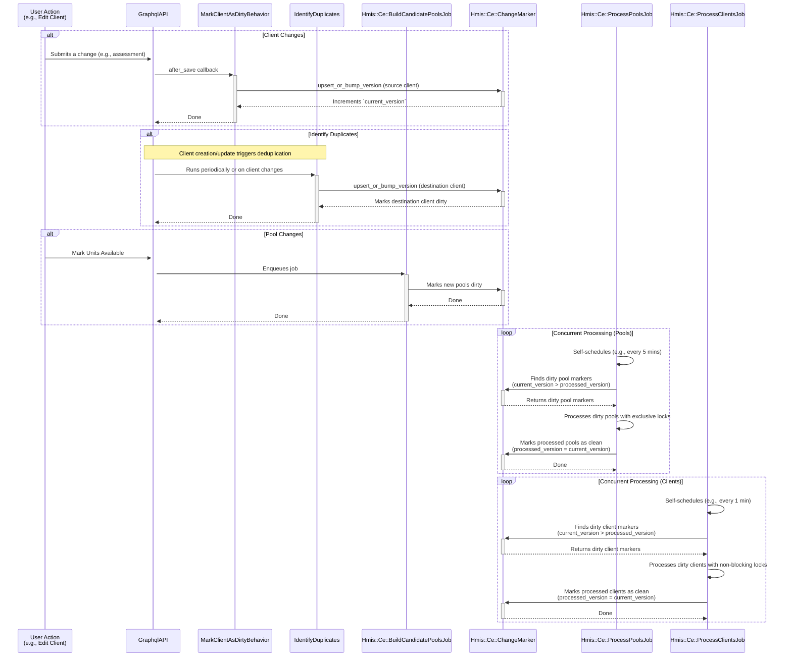

# Coordinated Entry (CE) Change Tracking System

The change tracking system for Coordinated Entry (CE) efficiently processes client and housing opportunity updates for eligibility and prioritization.

## System Overview

The change tracking system addresses the performance challenges of full reprocessing by implementing an incremental update mechanism. Instead of re-evaluating all clients and candidate pools whenever data changes, this system identifies only the records that have been modified ("dirty" records) and processes them in batches.

This is achieved through a versioning system managed by the `Hmis::Ce::ChangeMarker` model and two specialized self-scheduling background jobs that continuously process these changes in parallel for optimal performance.

### Core Components

- **`Hmis::Ce::ChangeMarker`**: A polymorphic model that tracks the state of other records (currently `GrdaWarehouse::Hud::Client` and `Hmis::Ce::Match::CandidatePool`). It uses `current_version` and `processed_version` to determine if a record is "dirty."
- **`Hmis::Ce::ProcessPoolsJob`**: A self-scheduling job that processes dirty candidate pools on the long-running queue. It uses per-pool advisory locks to coordinate with the client processor.
- **`Hmis::Ce::ProcessClientsJob`**: A self-scheduling job that processes dirty clients on the short-running queue for fast updates. It uses non-blocking per-pool locks to coordinate with the pool processor.
- **`Hmis::Ce::BuildCandidatePoolsJob`**: A job triggered by actions like marking units available. It creates or updates candidate pools and marks them as dirty for processing.
- **`Hmis::MarkClientAsDirtyBehavior`**: A concern included in various HUD models to automatically mark a client as dirty whenever their data is saved.

## Workflow

The following diagram illustrates the flow of data from a user action to final processing:

### Key Concepts

#### 1. Dirty Tracking and Versioning

A record is considered **dirty** if its `current_version` is greater than its `processed_version` in the `hmis_ce_change_markers` table.

- **`current_version`**: Incremented each time a change occurs on the tracked record.
- **`processed_version`**: Updated to match `current_version` after the processing jobs have finished processing the record.

This ensures that any changes made while a job is running will be picked up in the next processing cycle.

#### 2. Concurrent Processing via Specialized Self-Scheduling Jobs

The CE system uses two specialized jobs that run concurrently for optimal performance:

**`Hmis::Ce::ProcessPoolsJob` (Pool Processing)**
- Runs on the long-running queue with longer intervals (e.g., 5 minutes)
- Handles computationally expensive pool processing operations
- Uses exclusive advisory locks on individual pools to prevent concurrent access
- When a pool is locked by this job, client processing will skip it gracefully

**`Hmis::Ce::ProcessClientsJob` (Client Processing)**
- Runs on the default queue with shorter intervals (e.g., 1 minute) for fast updates
- Processes client eligibility changes quickly without waiting for pool processing
- Uses non-blocking advisory locks - skips pools that are busy being processed
- Provides low-latency updates for client-matching scenarios

**Coordination & Safety**
- Both jobs use job-level advisory locks to prevent multiple instances of the same job
- Per-pool advisory locks coordinate access between the two jobs safely
- Both jobs include data integrity safeguards to ensure all records have change markers
- Self-scheduling: jobs re-enqueue themselves with configurable delays after batch completion
- Cron calls `enqueue_if_not_already_running` periodically to ensure jobs remain active

#### 3. Integration with Application Models

The `Hmis::MarkClientAsDirtyBehavior` concern is the primary mechanism for flagging client changes. It is included in HUD models that, when updated, should trigger a re-evaluation of the client's eligibility

When a record with this concern is saved, an `after_save` callback triggers `Hmis::Ce::ChangeMarker.upsert_or_bump_version`, which either creates a new marker or increments the `current_version` of an existing one.

#### 4. Client Deduplication Integration

The `GrdaWarehouse::Tasks::IdentifyDuplicates` task flags changes to destination clients. When clients are created or updated, this task manages the updating the destination clients. Afterwards client `IdentifyDuplicates` marks the affected destination clients as dirty. This is necessary as CE matches on destination client records, not source HMIS clients.

#### 5. Relationship with Daily Full Refresh

The incremental change tracking system works alongside the existing daily full refresh mechanism:

- **Incremental Processing**: The `ProcessPoolsJob` and `ProcessClientsJob` run frequently to process only dirty records, providing near real-time updates with optimal performance through concurrent processing.
- **Daily Full Refresh**: The `BuildCandidatePoolsJob` runs daily to rebuild all candidate pools, serving as a comprehensive backup and catch-all for any missed changes.
