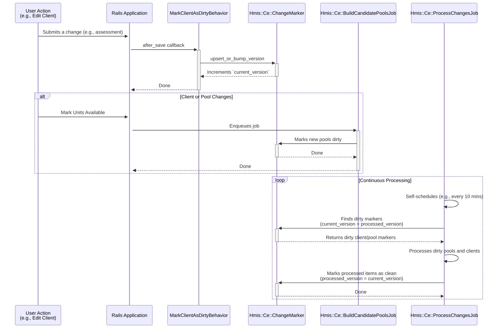

# Coordinated Entry (CE) Change Tracking System

The change tracking system for Coordinated Entry (CE) efficiently processes client and housing opportunity updates for eligibility and prioritization.

## System Overview

The change tracking system addresses the performance challenges of full reprocessing by implementing an incremental update mechanism. Instead of re-evaluating all clients and candidate pools whenever data changes, this system identifies only the records that have been modified ("dirty" records) and processes them in batches.

This is achieved through a versioning system managed by the `Hmis::Ce::ChangeMarker` model and a self-scheduling background job, `Hmis::Ce::ProcessChangesJob`, which continuously processes these changes.

### Core Components

- **`Hmis::Ce::ChangeMarker`**: A polymorphic model that tracks the state of other records (currently `GrdaWarehouse::Hud::Client` and `Hmis::Ce::Match::CandidatePool`). It uses `current_version` and `processed_version` to determine if a record is "dirty."
- **`Hmis::Ce::ProcessChangesJob`**: A self-scheduling job that runs continuously to process dirty records. It uses an advisory lock to prevent concurrent runs.
- **`Hmis::Ce::BuildCandidatePoolsJob`**: A job triggered by actions like marking units available. It creates or updates candidate pools and marks them as dirty for processing.
- **`Hmis::MarkClientAsDirtyBehavior`**: A concern included in various HUD models to automatically mark a client as dirty whenever their data is saved.

## Workflow

The following diagram illustrates the flow of data from a user action to final processing:

### Key Concepts

#### 1. Dirty Tracking and Versioning

A record is considered **dirty** if its `current_version` is greater than its `processed_version` in the `hmis_ce_change_markers` table.

- **`current_version`**: Incremented each time a change occurs on the tracked record.
- **`processed_version`**: Updated to match `current_version` after the `ProcessChangesJob` has finished processing the record.

This ensures that any changes made while a job is running will be picked up in the next processing cycle.

#### 2. Continuous Processing via Self-Scheduling Job

The `Hmis::Ce::ProcessChangesJob` is designed to run continuously without relying on a frequent cron schedule.

- When the job finishes a batch, it re-enqueues itself with a configurable delay (e.g., 10 minutes).
- Cron calls `enqueue_if_not_already_running` periodically to ensure that the job is always enqueued.
- An advisory guarantees that only one instance of the job can execute at a time, preventing race conditions.

#### 3. Integration with Application Models

The `Hmis::MarkClientAsDirtyBehavior` concern is the primary mechanism for flagging client changes. It is included in any `Hmis::Hud` model that, when updated, should trigger a re-evaluation of the client's eligibility.

When a record with this concern is saved, an `after_save` callback triggers `Hmis::Ce::ChangeMarker.upsert_or_bump_version`, which either creates a new marker or increments the `current_version` of an existing one.
