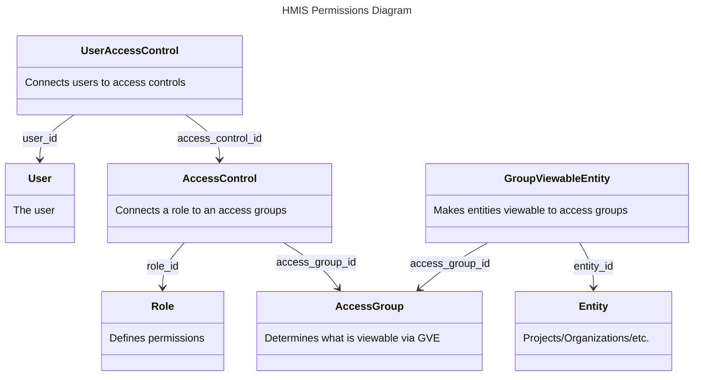

# Permissions Base

When checking if a user has permission on a given entity, each type of entity refers to a permissions base that must be a type of entity referenced by `GroupViewableEntity`. The logic for determining the permissions base is defined in  ` Hmis::EntityAccessLoaderFactory`. These are the entity types allowed as permissions bases:

- `Hmis::Hud::Project`
- `Hmis::Hud::Organization`
- `GrdaWarehouse::DataSource`
- `GrdaWarehouse::ProjectAccessGroup`

Once the permissions base is determined, the permission check involves determining whether the user is connected to an `AccessControl` that meets the following conditions:

- Connects to an `AccessGroup` where the given permissions base entity is visible, i.e. a group that has `GroupViewableEntity` entries that include the permissions base
- Connects to a `Role` that grants the desired permission

## Examples

### Check if a user can edit client details

User must be connected to an `AccessControl` that meets the following conditions:

1. Must be connected to an `AccessGroup` that meets any of these conditions:
    - Has a `GroupViewableEntity` that directly references any of the projects that the client is connected to via their enrollments
    - Has a `GroupViewableEntity` that directly references an `Organization` that includes any of the projects that the client is connected to via their enrollments
    - Has a `GroupViewableEntity` that directly references a `DataSource` that includes any of the projects that the client is connected to via their enrollments
    - Has a `GroupViewableEntity` that directly references a `ProjectAccessGroup` that includes any of the projects that the client is connected to via their enrollments
    - Has a `GroupViewableEntity` that directly references a `DataSource` that the client is connected to directly
2. Must be connected to a `Role` for which the `can_edit_enrollments` permission is `true`

# Viewability

General viewability is determined both by `GroupViewableEntity` (via `AccessGroup`) and `Role`. A given entity is viewable if it is either **directly viewable** or **indirectly viewable** to a user.

An entity is **directly viewable** to a user if the following is true:

1. The entity is directly referenced by a `GroupViewableEntity` that is connected to an `AccessGroup` that the user is also connected to (via `AccessControl`).
2. The `AccessGroup` mentioned above is also connected to a `Role` (again via `AccessControl`) that grants one of the [viewable permissions](https://github.com/greenriver/hmis-warehouse/blob/0323d1fdf86ea39b0dfa45ba5fab3da4220c75ec/drivers/hmis/app/models/hmis/role.rb#L32)

An entity is **indirectly viewable** if one of its parent entities is **directly viewable** to the user. For example:

- A `Project` is viewable if the `Organization` it belongs to is directly viewable to the user
- A `Project` is viewable if the `DataSource` it belongs to is directly viewable to the user
- A `Project` is viewable if a `ProjectAccessGroup` it belongs to is directly viewable to the user
- An `Organization` is viewable if the `DataSource` it belongs to is directly viewable to the user

## Conventions

1. The `User#viewable_x` scopes only return entities that are **directly** viewable to the user. These are usually used only to build the `viewable_by` scopes for various entities
2. The `Entity.viewable_by(user)` scopes return entities that are either **directly** or **inderectly** viewable to the user. This is what should be used in most cases to get all entities a user can see.

For example, you should use `User.viewable_projects` to get all projects that are directly connected to a user (i.e. have direct `GroupViewableEntity` entries for that project as described above). You should use `Project.viewable_by(user)` to get all projects that the user can view.

### Other permissions

If you need other permissions than just the viewable ones, you can use these scopes:

- `User#entities_with_permissions(model, *permissions, **kwargs)` will get all directly viewable entities with the given permissions.
- `Entity.with_access(user, *permissions, **kwargs)` will get all directly and indirectly viewable entities with the given permissions. This is one you should typically use. *Note that only `Hmis::Hud::Project` has this scope currently*

#### Allowed kwargs

| arg         | value       | default | required | notes |
| ----------- | ----------- | ------- | -------- | ----- |
| `mode`      | `'any'` or `'all'` | `'any'` | no | Whether to check for the presence of any of these permissions or all of these permissions
