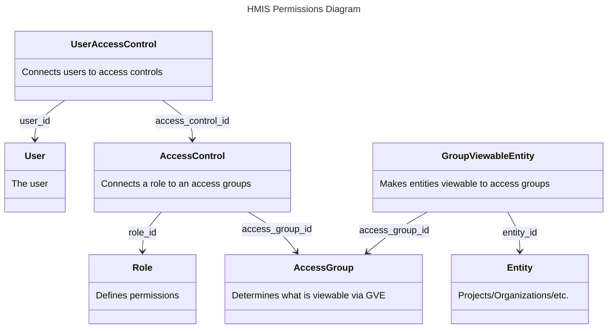

```mermaid
---
title: HMIS Permissions Diagram
---
classDiagram
    UserAccessControl --> User : user_id
    UserAccessControl --> AccessControl : access_control_id
    AccessControl --> Role : role_id
    AccessControl --> AccessGroup : access_group_id
    GroupViewableEntity --> AccessGroup : access_group_id
    GroupViewableEntity --> Entity : entity_id

    class User{
      The user
    }
    class UserAccessControl{
      Connects users to access controls
    }
    class AccessGroup{
      Determines what is viewable via GVE
    }
    class AccessControl{
      Connects a role to an access groups
    }
    class GroupViewableEntity{
      Makes entities viewable to access groups
    }
    class Entity {
      Projects/Organizations/etc.
    }
    class Role{
      Defines permissions
    }
```
