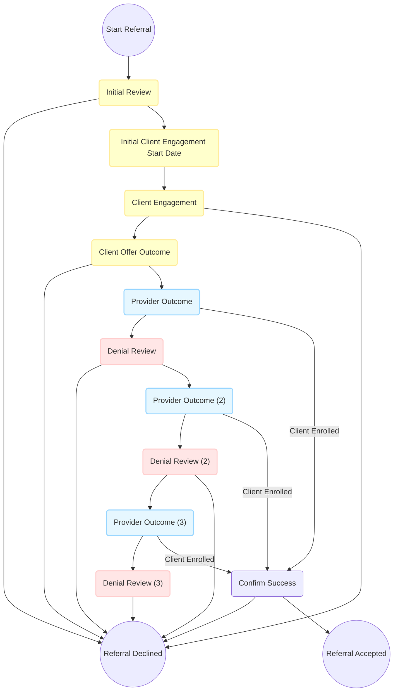
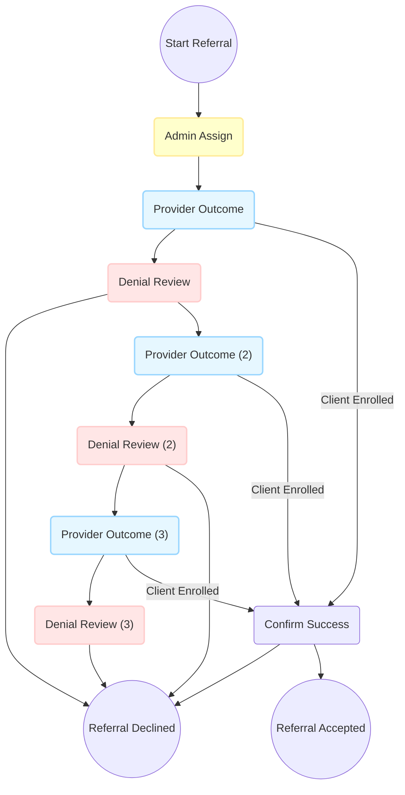

# Ac CE Workflows

## Overview
This directory contains utilities and workflow definitions specific to the AC implementation of Coordinated Entry (CE) workflows.

### Workflow Templates
- **Housing Workflow**: Handles referrals for housing opportunities, including multiple stages of client engagement, provider outcomes, and denial reviews.
- **Admin Assign Workflow**: Supports direct referrals to non-housing programs. This template shares common steps with the housing workflow (provider outcome and denial review process).

### Usage
These workflows are generated using the `AcWorkflowBuilder` utility class.

These workflows expect client-specific forms to be available.

The forms can be loaded with `CLIENT=client rails driver:hmis:seed_definitions` or `HmisUtil::JsonForms.new(env_key: 'client').seed_record_form_definitions(roles: [:CE_REFERRAL_STEP])`

### Housing Workflow
This is a simplified diagram of the housing workflow. To see the full generated diagram, run the AcWorkflowBuilder.

### Admin Assign Workflow (Direct Referrals to non-Housing Programs)
This is a simplified diagram of the admin assign workflow. To see the full generated diagram, run the AcWorkflowBuilder.
