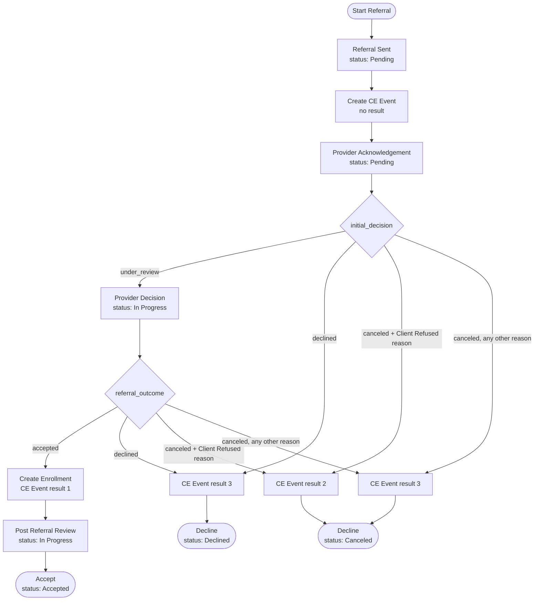

# AZ CE Workflows

## Overview
This directory contains utilities and workflow definitions specific to the AZ installation of Coordinated Entry (CE) workflows.

### Workflow Templates
- **MC Direct Referral**: Four sequential tasks (Referral Sent → Provider Acknowledgement → Provider Decision → Post Referral Review), with CE Event create/update, decline reasons, and enrollment on accept.

### Usage
These workflows are generated and updated using the `CeWorkflows::Az::WorkflowBuilder` utility class.

**CAUTION:** Building these workflows deletes existing referrals and opportunities associated with the templates. Do not run in production after the first time.

These workflows expect client-specific forms to be available. The forms live under `form_data/az/ce_referral_steps/`. Load them with:

```bash
CLIENT=az rails driver:hmis:seed_definitions
```

or:

```ruby
HmisUtil::JsonForms.new(env_key: 'az', data_source_id: 1).seed_record_form_definitions(roles: [:CE_REFERRAL_STEP])
```

Then recreate the template:

```bash
rails driver:hmis:ce_define_az_workflows
```

After creating, attach the template on unit groups via `direct_referral_workflow_template_identifier = 'mc_direct_referral'`.

### MC Direct Referral Workflow

Forms:

| Form identifier | Task | Swimlane |
|---|---|---|
| `mc_direct_referral_send_referral` | Referral Sent | CE Team |
| `mc_direct_referral_provider_acknowledgement` | Provider Acknowledgement | Provider |
| `mc_direct_referral_provider_decision` | Provider Decision | Provider |
| `mc_direct_referral_post_referral_review` | Post Referral Review | Provider |



The CE Event result on a decline comes from the reason the provider picks, not from the Declined vs
Canceled decision: any `Client Refused:*` reason reports client rejected (2), everything else
reports provider rejected (3).

The Acknowledgement and Decision forms each offer two reason pick lists — `declined_reason` (2
options) and `canceled_reason` (14 options) — so the provider only ever sees the reasons valid for
the decision they made. `set_referral_decline_reason` reads a single hardcoded link ID, so each form
also carries a hidden `decline_reason` item that autofills from whichever list was answered. The
gateways route on `canceled_reason` directly, which makes a client-rejected result unreachable from
a Declined decision. The reason list lives in `CeWorkflows::Az::WorkflowBuilder::DECLINE_REASONS`;
a spec asserts the form pick lists match it.

Provider Decision = Accepted enrolls the client as Incomplete and closes the CE Event as successful,
but leaves the referral open. Post Referral Review always ends the referral as Accepted once
submitted, regardless of the Successful answer -- acceptance already happened at Provider Decision, so
Successful only tracks post-acceptance problems for reporting.

#### Updates

**Form definition updates**: Forms are managed in version control under `form_data/az/ce_referral_steps/`. Modify them in source control and re-seed.

**Workflow template updates**: See `CeWorkflows::Az::WorkflowBuilder` and `ce_define_az_workflows.rake`. Each local run deletes and recreates the template and associated referral data.
